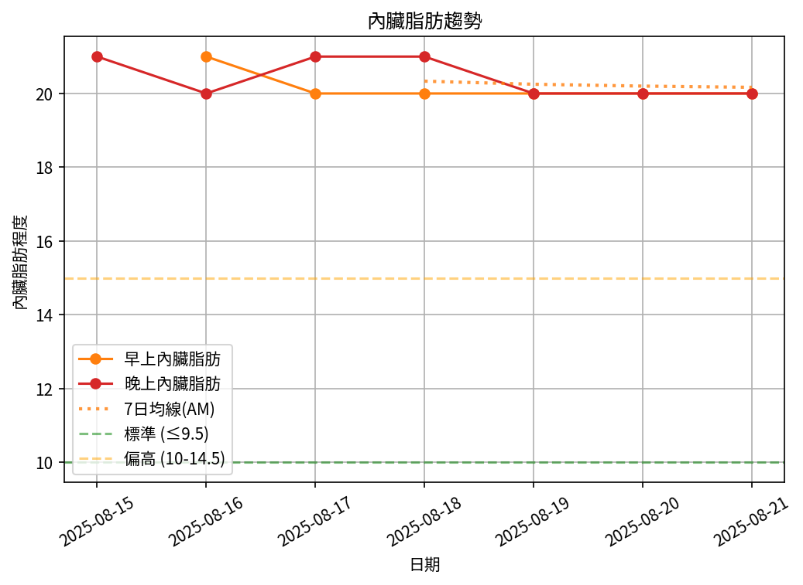

# 📊 減重週報（2025-CW01）

**週期：2025/08/15 ～ 2025/08/21**  

---

## 📈 體重與體脂紀錄

| 日期         |   早上體重 (kg) |   晚上體重 (kg) |   早上體脂 (%) |   晚上體脂 (%) |   早上內臟脂肪 |   晚上內臟脂肪 |
|:-------------|----------------:|----------------:|---------------:|---------------:|---------------:|---------------:|
| 08/15 (週五) |          nan    |           109.6 |         nan    |           29   |            nan |             21 |
| 08/16 (週六) |          109    |           108.2 |          30.3  |           27.9 |             21 |             20 |
| 08/17 (週日) |          108.1  |           109   |          30.6  |           28.8 |             20 |             21 |
| 08/18 (週一) |          107.95 |           108.8 |          30.55 |           27.9 |             20 |             21 |
| 08/19 (週二) |          108.1  |           108.2 |          30.3  |           29.5 |             20 |             20 |
| 08/20 (週三) |          107.5  |           108   |          30.5  |           27.7 |             20 |             20 |
| 08/21 (週四) |          107    |           106.8 |          30.4  |           28.9 |             20 |             20 |

---

## 📊 趨勢圖

---

## 📌 本週統計

- 體重（AM）：109.0 → 107.0 kg  (**-2.0 kg**), 週平均 107.9 kg  
- 體重（PM）：109.6 → 106.8 kg  (**-2.8 kg**), 週平均 108.4 kg  
- 體重（AM+PM 平均）：108.2 kg  

- 體脂（AM）：30.3% → 30.4%  (**0.1%**), 週平均 30.4%  
- 體脂（PM）：29.0% → 28.9%  (**-0.1%**), 週平均 28.5%  
- 體脂（AM+PM 平均）：29.5%  

- 內臟脂肪（AM）：21.0 → 20.0  (**-1.0**), 週平均 20.2  
- 內臟脂肪（PM）：21.0 → 20.0  (**-1.0**), 週平均 20.4  
- 內臟脂肪（AM+PM 平均）：20.3  
  💡 *標準：≤9.5，偏高：10-14.5，過高：≥15*  

- 紀錄天數：7 天

---

## ✅ 建議
- 維持 **高蛋白 (每公斤 1.6–2.0 g)** 與 **每週 2–3 次阻力訓練**  
- 飲水 **≥ 3 L/天**（依活動量調整）  
- 若每週下降 > 2.5 kg，建議微調熱量或與醫師討論  
