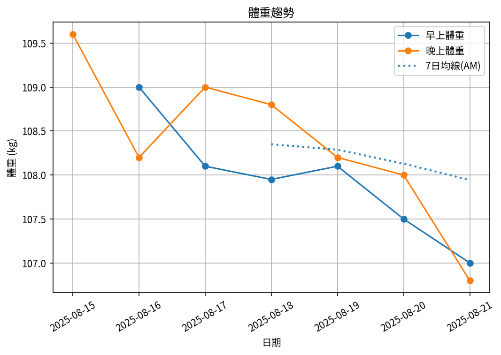
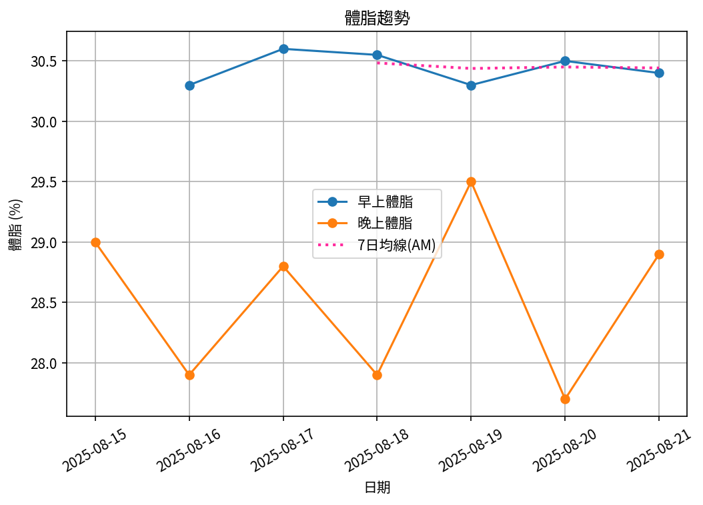

# 📊 減重週報（2025-CW01)

**週期：2025/08/15 ～ 2025/08/21**  

---

## 📈 體重與體脂紀錄

| 日期         |   早上體重 (kg) |   晚上體重 (kg) |   早上體脂 (%) |   晚上體脂 (%) |   早上內臟脂肪 |   晚上內臟脂肪 |   早上骨骼肌 (%) |   晚上骨骼肌 (%) |
|:-------------|----------------:|----------------:|---------------:|---------------:|---------------:|---------------:|-----------------:|-----------------:|
| 08/15 (週五) |          nan    |           109.6 |         nan    |           29   |            nan |             21 |            nan   |             29.6 |
| 08/16 (週六) |          109    |           108.2 |          30.3  |           27.9 |             21 |             20 |             28.9 |             30.3 |
| 08/17 (週日) |          108.1  |           109   |          30.6  |           28.8 |             20 |             21 |             28.7 |             29.8 |
| 08/18 (週一) |          107.95 |           108.8 |          30.55 |           27.9 |             20 |             21 |             28.7 |             30.3 |
| 08/19 (週二) |          108.1  |           108.2 |          30.3  |           29.5 |             20 |             20 |             28.9 |             29.4 |
| 08/20 (週三) |          107.5  |           108   |          30.5  |           27.7 |             20 |             20 |             28.8 |             30.4 |
| 08/21 (週四) |          107    |           106.8 |          30.4  |           28.9 |             20 |             20 |             28.8 |             29.8 |

---

## 📊 趨勢圖

---

## 📌 本週統計

- 體重（AM）：109.0 → 107.0 kg  (**-2.0 kg**), 週平均 107.9 kg  
- 體重（PM）：109.6 → 106.8 kg  (**-2.8 kg**), 週平均 108.4 kg  
- 體重（AM+PM 平均）：108.2 kg  

- 體脂（AM）：30.3% → 30.4%  (**0.1%**), 週平均 30.4%  
- 體脂（PM）：29.0% → 28.9%  (**-0.1%**), 週平均 28.5%  
- 體脂（AM+PM 平均）：29.5%  

- 內臟脂肪（AM）：21.0 → 20.0  (**-1.0**), 週平均 20.2  
- 內臟脂肪（PM）：21.0 → 20.0  (**-1.0**), 週平均 20.4  
- 內臟脂肪（AM+PM 平均）：20.3  
  💡 *標準：≤9.5，偏高：10-14.5，過高：≥15*  

- 骨骼肌（AM）：28.9% → 28.8%  (**-0.1%**), 週平均 28.8%  
- 骨骼肌（PM）：29.6% → 29.8%  (**0.2%**), 週平均 29.9%  
- 骨骼肌（AM+PM 平均）：29.4%  

- 脂肪重量（AM）：33.0 → 32.5 kg  (**-0.5 kg**), 週平均 32.9 kg  
- 脂肪重量（PM）：31.8 → 30.9 kg  (**-0.9 kg**), 週平均 30.9 kg  
- 脂肪重量（AM+PM 平均）：31.9 kg  

- 骨骼肌重量（AM）：31.5 → 30.8 kg  (**-0.7 kg**), 週平均 31.1 kg  
- 骨骼肌重量（PM）：32.4 → 31.8 kg  (**-0.6 kg**), 週平均 32.4 kg  
- 骨骼肌重量（AM+PM 平均）：31.8 kg  

- 紀錄天數：7 天

---

## ✅ 建議
- 維持 **高蛋白 (每公斤 1.6–2.0 g)** 與 **每週 2–3 次阻力訓練**  
- 飲水 **≥ 3 L/天**（依活動量調整）  
- 若每週下降 > 2.5 kg，建議微調熱量或與醫師討論  

---

## 🧪 組成品質（近28天）

- 脂肪/體重 下降比例：25%（需留意）  
- 體重變化：-2.0 kg，脂肪重量變化：-0.5 kg（AM）  

---

## 🎯 KPI 目標與進度 (本週)

- 體重：目標 -0.8 kg  
  - 由 109.0 → 目標 108.2 kg  | 進度 [████████████████████] 100%  
- 體脂率（AM）：目標 -0.4 個百分點  
  - 由 30.3% → 目標 29.9%  | 進度 [█████░░░░░░░░░░░░░░░] 25%  
- 內臟脂肪（AM）：目標 -0.5  
  - 由 21.0 → 目標 20.5  | 進度 [████████████████████] 100%  
- 骨骼肌重量（AM）：目標 ≥ 持平  | 變化 -0.7 kg  | 進度 [░░░░░░░░░░░░░░░░░░░░] 0%  
- 體重達標 ETA：~10.0 週（2025-10-30）  
- 體脂率達標 ETA（AM）：~54.3 週（2026-09-05）  
- 脂肪重量達標 ETA：~33.0 週（2026-04-09）  

---

## 🧠 本期數據分析與總結

- ✅ 體重：2.0 kg 下降（AM）
- ✅ 內臟脂肪：1.0 降低（AM）
- ✅ 脂肪重量：-0.5 kg（AM）
- ⚠️ 骨骼肌重量下降：0.7 kg，建議調整赤字與訓練恢復。
- ⚠️ 組成品質偏低（脂肪/體重 < 40%），建議提高蛋白與阻力訓練，減少過大赤字。

- 下一步：蛋白 1.8–2.2 g/kg、每週 3–4 次阻力訓練、穩定睡眠與步數，維持每週 -0.5～-0.8 kg。
