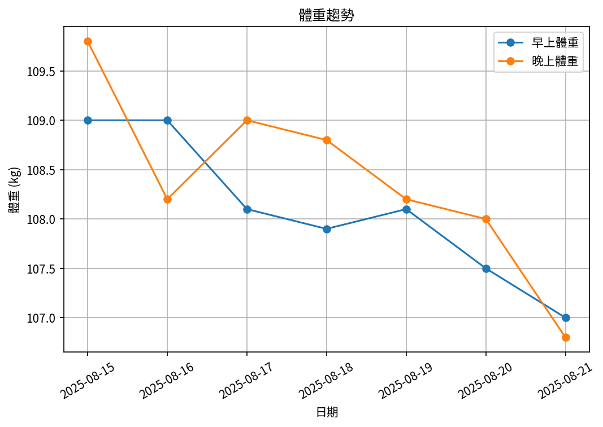

# 📊 減重週報（2025-CW01）

**週期：2025/08/15 ～ 2025/08/21**  

---

## 📈 體重與體脂紀錄

| 日期         |   早上體重 (kg) |   晚上體重 (kg) |   早上體脂 (%) |   晚上體脂 (%) |
|:-------------|----------------:|----------------:|---------------:|---------------:|
| 08/15 (週五) |           109   |           109.8 |          nan   |           29   |
| 08/16 (週六) |           109   |           108.2 |           30.3 |           27.9 |
| 08/17 (週日) |           108.1 |           109   |           30.6 |           28.8 |
| 08/18 (週一) |           107.9 |           108.8 |           30.7 |           27.9 |
| 08/19 (週二) |           108.1 |           108.2 |           30.3 |           29.5 |
| 08/20 (週三) |           107.5 |           108   |           30.5 |           27.7 |
| 08/21 (週四) |           107   |           106.8 |           30.4 |           27   |

---

## 📊 趨勢圖

---

## 📌 本週統計

- 體重（AM）：109.0 → 107.0 kg  (**-2.0 kg**), 週平均 108.1 kg  
- 體重（PM）：109.8 → 106.8 kg  (**-3.0 kg**), 週平均 108.4 kg  
- 體重（AM+PM 平均）：108.2 kg  

- 體脂（AM）：30.3% → 30.4%  (**0.1%**), 週平均 30.5%  
- 體脂（PM）：29.0% → 27.0%  (**-2.0%**), 週平均 28.3%  
- 體脂（AM+PM 平均）：29.4%  

- 紀錄天數：7 天

---

## ✅ 建議
- **體重下降幅度**  
  - 早上體重一週減少 **2.0 kg**（屬於快速但尚可接受範圍）。  
  - 晚上體重減少 **3.0 kg**，幅度偏快，可能包含較多水分流失。  
  👉 下週建議**放慢速度**，目標控制在 **-0.5 ～ -1.5 kg/週**。

- **體脂變化**  
  - 早上體脂幾乎持平（30.3% → 30.4%），顯示體脂下降有限，需更重視**肌肉保留**。  
  - 晚上體脂下降 2%，但受水分影響大。  
  👉 請持續觀察 **早上體脂** 作為主要指標。

- **飲食**  
  - 維持 **高蛋白攝取 (1.6–2.0 g/kg，約 175–220 g/日)**，避免在快速減重中流失肌肉。  
  - 若發現早上體重連續 2 週 > 2.5 kg 降幅，考慮**增加 100–200 kcal/日**，優先來自蛋白質或複合性澱粉。

- **運動**  
  - 建議每週 **2–3 次阻力訓練**，涵蓋腿、胸、背、肩大肌群，每次 30–45 分鐘。  
  - 搭配中低強度有氧（如快走/腳踏車 20–30 分鐘），幫助心肺與能量消耗。

- **水分與副作用管理**  
  - 維持 **≥ 3 L/日** 飲水量，分散小口喝，必要時補充電解質。  
  - 留意是否有噁心、便祕、頭暈等 GLP-1 常見副作用；若持續或加劇，應諮詢醫師。

- **量測習慣**  
  - 建議以 **早上空腹、如廁後** 的體重與體脂為主要追蹤依據；晚上數據波動僅供參考。