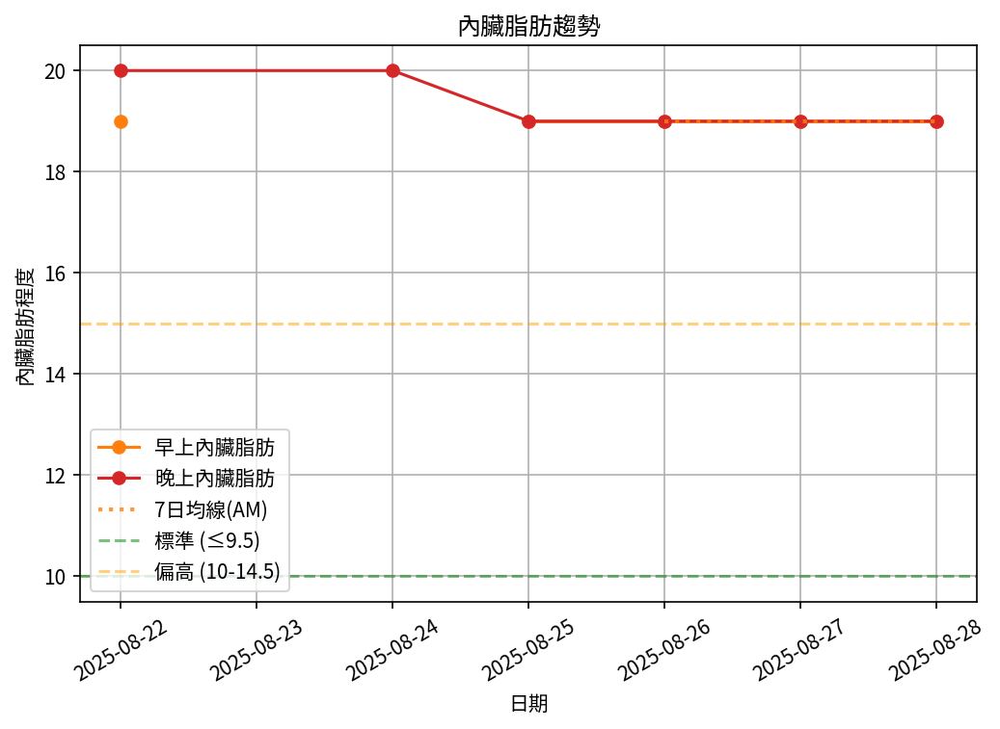

# 📊 減重週報（2025-CW02）

**週期：2025/08/22 ～ 2025/08/28**  

---

## 📈 體重與體脂紀錄

| 日期         |   早上體重 (kg) |   晚上體重 (kg) |   早上體脂 (%) |   晚上體脂 (%) |   早上內臟脂肪 |   晚上內臟脂肪 |
|:-------------|----------------:|----------------:|---------------:|---------------:|---------------:|---------------:|
| 08/22 (週五) |           106.2 |          106.9  |           30.4 |           28.4 |             19 |             20 |
| 08/24 (週日) |           nan   |          106.75 |          nan   |           28.3 |            nan |             20 |
| 08/25 (週一) |           105.8 |          106.2  |           30.6 |           27.4 |             19 |             19 |
| 08/26 (週二) |           105.6 |          106.05 |           30.1 |           28.9 |             19 |             19 |
| 08/27 (週三) |           105.2 |          105.9  |           30   |           28.3 |             19 |             19 |
| 08/28 (週四) |           104.8 |          105.5  |           30.4 |           27.9 |             19 |             19 |

---

## 📊 趨勢圖

---

## 📌 本週統計

- 體重（AM）：106.2 → 104.8 kg  (**-1.4 kg**), 週平均 105.5 kg  
- 體重（PM）：106.9 → 105.5 kg  (**-1.4 kg**), 週平均 106.2 kg  
- 體重（AM+PM 平均）：105.9 kg  

- 體脂（AM）：30.4% → 30.4%  (**0.0%**), 週平均 30.3%  
- 體脂（PM）：28.4% → 27.9%  (**-0.5%**), 週平均 28.2%  
- 體脂（AM+PM 平均）：29.2%  

- 內臟脂肪（AM）：19.0 → 19.0  (**0.0**), 週平均 19.0  
- 內臟脂肪（PM）：20.0 → 19.0  (**-1.0**), 週平均 19.3  
- 內臟脂肪（AM+PM 平均）：19.2  
  💡 *標準：≤9.5，偏高：10-14.5，過高：≥15*  

- 紀錄天數：6 天

---

## ✅ 建議
- 維持 **高蛋白 (每公斤 1.6–2.0 g)** 與 **每週 2–3 次阻力訓練**  
- 飲水 **≥ 3 L/天**（依活動量調整）  
- 若每週下降 > 2.5 kg，建議微調熱量或與醫師討論  
