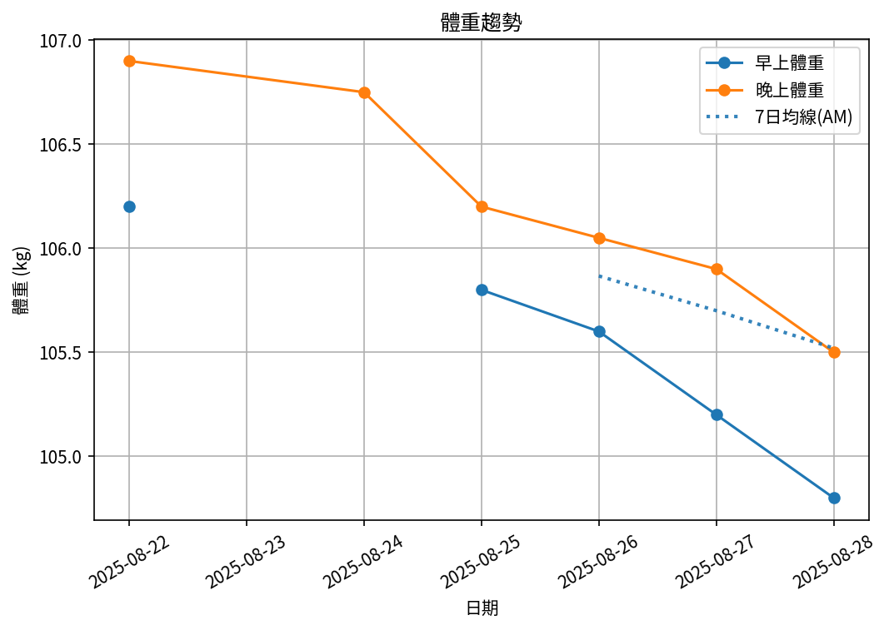

# 📊 減重週報（2025-CW02)

**週期：2025/08/22 ～ 2025/08/28**  

---

## 📈 體重與體脂紀錄

| 日期         |   早上體重 (kg) |   晚上體重 (kg) |   早上體脂 (%) |   晚上體脂 (%) |   早上內臟脂肪 |   晚上內臟脂肪 |   早上骨骼肌 (%) |   晚上骨骼肌 (%) |
|:-------------|----------------:|----------------:|---------------:|---------------:|---------------:|---------------:|-----------------:|-----------------:|
| 08/22 (週五) |           106.2 |          106.9  |           30.4 |           28.4 |             19 |             20 |             28.9 |             30.1 |
| 08/24 (週日) |           nan   |          106.75 |          nan   |           28.3 |            nan |             20 |            nan   |             30.2 |
| 08/25 (週一) |           105.8 |          106.2  |           30.6 |           27.4 |             19 |             19 |             28.6 |             30.7 |
| 08/26 (週二) |           105.6 |          106.05 |           30.1 |           28.9 |             19 |             19 |             29.1 |             29.8 |
| 08/27 (週三) |           105.2 |          105.9  |           30   |           28.3 |             19 |             19 |             29.1 |             30.2 |
| 08/28 (週四) |           104.8 |          105.5  |           30.4 |           27.9 |             19 |             19 |             28.9 |             30.5 |

---

## 📊 趨勢圖

---

## 📌 本週統計

- 體重（AM）：106.2 → 104.8 kg  (**-1.4 kg**), 週平均 105.5 kg  
- 體重（PM）：106.9 → 105.5 kg  (**-1.4 kg**), 週平均 106.2 kg  
- 體重（AM+PM 平均）：105.9 kg  

- 體脂（AM）：30.4% → 30.4%  (**0.0%**), 週平均 30.3%  
- 體脂（PM）：28.4% → 27.9%  (**-0.5%**), 週平均 28.2%  
- 體脂（AM+PM 平均）：29.2%  

- 內臟脂肪（AM）：19.0 → 19.0  (**0.0**), 週平均 19.0  
- 內臟脂肪（PM）：20.0 → 19.0  (**-1.0**), 週平均 19.3  
- 內臟脂肪（AM+PM 平均）：19.2  
  💡 *標準：≤9.5，偏高：10-14.5，過高：≥15*  

- 骨骼肌（AM）：28.9% → 28.9%  (**0.0%**), 週平均 28.9%  
- 骨骼肌（PM）：30.1% → 30.5%  (**0.4%**), 週平均 30.2%  
- 骨骼肌（AM+PM 平均）：29.6%  

- 脂肪重量（AM）：32.3 → 31.9 kg  (**-0.4 kg**), 週平均 32.0 kg  
- 脂肪重量（PM）：30.4 → 29.4 kg  (**-0.9 kg**), 週平均 30.0 kg  
- 脂肪重量（AM+PM 平均）：31.0 kg  

- 骨骼肌重量（AM）：30.7 → 30.3 kg  (**-0.4 kg**), 週平均 30.5 kg  
- 骨骼肌重量（PM）：32.2 → 32.2 kg  (**0.0 kg**), 週平均 32.1 kg  
- 骨骼肌重量（AM+PM 平均）：31.3 kg  

- 紀錄天數：6 天

---

## ✅ 建議
- 維持 **高蛋白 (每公斤 1.6–2.0 g)** 與 **每週 2–3 次阻力訓練**  
- 飲水 **≥ 3 L/天**（依活動量調整）  
- 若每週下降 > 2.5 kg，建議微調熱量或與醫師討論  

---

## 🧪 組成品質（近28天）

- 脂肪/體重 下降比例：30%（需留意）  
- 體重變化：-1.4 kg，脂肪重量變化：-0.4 kg（AM）  

---

## 🎯 KPI 目標與進度 (本週)

- 體重：目標 -0.8 kg  
  - 由 106.2 → 目標 105.4 kg  | 進度 [████████████████████] 100%  
- 體脂率（AM）：目標 -0.4 個百分點  
  - 由 30.4% → 目標 30.0%  | 進度 [░░░░░░░░░░░░░░░░░░░░] 0%  
- 內臟脂肪（AM）：目標 -0.5  
  - 由 19.0 → 目標 18.5  | 進度 [░░░░░░░░░░░░░░░░░░░░] 0%  
- 骨骼肌重量（AM）：目標 ≥ 持平  | 變化 -0.4 kg  | 進度 [░░░░░░░░░░░░░░░░░░░░] 0%  
- 體重達標 ETA：~15.9 週（2025-12-17）  
- 脂肪重量達標 ETA：~45.0 週（2026-07-09）  

---

## 🧠 本期數據分析與總結

- ✅ 體重：1.4 kg 下降（AM）
- ✅ 脂肪重量：-0.4 kg（AM）
- ⚠️ 骨骼肌重量下降：0.4 kg，建議調整赤字與訓練恢復。
- ⚠️ 組成品質偏低（脂肪/體重 < 40%），建議提高蛋白與阻力訓練，減少過大赤字。

- 下一步：蛋白 1.8–2.2 g/kg、每週 3–4 次阻力訓練、穩定睡眠與步數，維持每週 -0.5～-0.8 kg。
