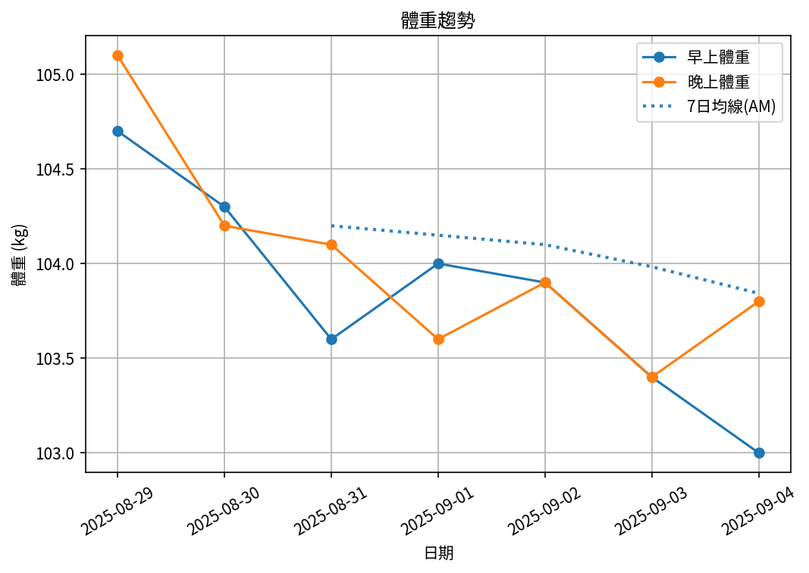

# 📊 減重週報（2025-CW03)

**週期：2025/08/29 ～ 2025/09/04**  

---

## 📈 體重與體脂紀錄

| 日期         |   早上體重 (kg) |   晚上體重 (kg) |   早上體脂 (%) |   晚上體脂 (%) |   早上內臟脂肪 |   晚上內臟脂肪 |   早上骨骼肌 (%) |   晚上骨骼肌 (%) |
|:-------------|----------------:|----------------:|---------------:|---------------:|---------------:|---------------:|-----------------:|-----------------:|
| 08/29 (週五) |           104.7 |           105.1 |           30.3 |           28.1 |             19 |             19 |            28.95 |             30.4 |
| 08/30 (週六) |           104.3 |           104.2 |           30.2 |           27.9 |             19 |             19 |            29    |             30.5 |
| 08/31 (週日) |           103.6 |           104.1 |           30.1 |           29.4 |             18 |             19 |            29    |             29.5 |
| 09/01 (週一) |           104   |           103.6 |           30.3 |           28   |             19 |             18 |            28.9  |             30.5 |
| 09/02 (週二) |           103.9 |           103.9 |           29.7 |           27.7 |             19 |             19 |            29.4  |             30.6 |
| 09/03 (週三) |           103.4 |           103.4 |           29.9 |           28.4 |             18 |             18 |            29.2  |             30.2 |
| 09/04 (週四) |           103   |           103.8 |           29.6 |           29.5 |             18 |             18 |            29.4  |             29.5 |

---

## 📊 趨勢圖

---

## 📌 本週統計

- 體重（AM）：104.7 → 103.0 kg  (**-1.7 kg**), 週平均 103.8 kg  
- 體重（PM）：105.1 → 103.8 kg  (**-1.3 kg**), 週平均 104.0 kg  
- 體重（AM+PM 平均）：103.9 kg  

- 體脂（PM 趨勢基準）：28.1% → 29.5%  (**1.4%**), 週平均 28.4%  
- 體脂（AM 對照）：30.3% → 29.6%  (**-0.7%**), 週平均 30.0%  
- 體脂（AM+PM 平均）：29.2%  

- 內臟脂肪（AM）：19.0 → 18.0  (**-1.0**), 週平均 18.6  
- 內臟脂肪（PM）：19.0 → 18.0  (**-1.0**), 週平均 18.6  
- 內臟脂肪（AM+PM 平均）：18.6  
  💡 *標準：≤9.5，偏高：10-14.5，過高：≥15*  

- 骨骼肌（AM）：28.9% → 29.4%  (**0.4%**), 週平均 29.1%  
- 骨骼肌（PM）：30.4% → 29.5%  (**-0.9%**), 週平均 30.2%  
- 骨骼肌（AM+PM 平均）：29.6%  

- 脂肪重量（AM）：31.7 → 30.5 kg  (**-1.2 kg**), 週平均 31.2 kg  
- 脂肪重量（PM）：29.5 → 30.6 kg  (**1.1 kg**), 週平均 29.6 kg  
- 脂肪重量（AM+PM 平均）：30.4 kg  

- 骨骼肌重量（AM）：30.4 → 30.3 kg  (**-0.1 kg**), 週平均 30.2 kg  
- 骨骼肌重量（PM）：32.0 → 30.6 kg  (**-1.4 kg**), 週平均 31.4 kg  
- 骨骼肌重量（AM+PM 平均）：30.8 kg  

- 紀錄天數：7 天

---

## ✅ 建議
- 維持 **高蛋白 (每公斤 1.6–2.0 g)** 與 **每週 2–3 次阻力訓練**  
- 飲水 **≥ 3 L/天**（依活動量調整）  
- 若每週下降 > 2.5 kg，建議微調熱量或與醫師討論  

---

## 🧪 組成品質（近28天）

- 脂肪/體重 下降比例：71%（良好）  
- 體重變化：-1.7 kg，脂肪重量變化：-1.2 kg（AM）  

---

## 🧭 本期狀態解析

| 指標 | 變化量 | 對照門檻 | 判定 |
|:--|:--:|:--|:--|
| 脂肪重量 (AM) | -1.2 kg | 有效下降 ≥ 0.3 kg／週 | ⚖️ 脂肪下降（尚未達顯著） |
| 骨骼肌重量 (AM) | -0.1 kg | 有效上升 ≥ 0.2 kg／週（±0.2 kg 為誤差範圍） | ⚖️ 穩定（在誤差範圍） |

### 🔍 綜合判定

🔵 分類：**其他**
本期變化方向不明顯或存在相反趨勢，建議以 4 週趨勢為準。

---

## 🎯 KPI 目標與進度 (本週)

- 體重：目標 -0.8 kg  
  - 由 104.7 → 目標 103.9 kg  | 進度 [████████████████████] 100%  
- 體脂率（PM 趨勢基準）：目標 -0.4 個百分點  
  - 由 28.1% → 目標 27.7%  | 進度 [████████████████████] 100%  
- 內臟脂肪（AM）：目標 -0.5  
  - 由 19.0 → 目標 18.5  | 進度 [████████████████████] 100%  
- 骨骼肌重量（AM）：目標 ≥ 持平  | 變化 -0.1 kg  | 進度 [░░░░░░░░░░░░░░░░░░░░] 0%  
- 體重達標 ETA：~12.1 週（2025-11-28）  
- 體脂率達標 ETA（PM 趨勢基準）：~15.6 週（2025-12-22）  
- 脂肪重量達標 ETA：~15.0 週（2025-12-18）  

---

## 🧠 本期數據分析與總結

- ✅ 體重：1.7 kg 下降（AM）
- ✅ 體脂率：0.7 個百分點下降（AM）
- ✅ 內臟脂肪：1.0 降低（AM）
- ✅ 骨骼肌率：+0.4 個百分點（AM）
- ✅ 脂肪重量：-1.2 kg（AM）
- ⚠️ 骨骼肌重量下降：0.1 kg，建議調整赤字與訓練恢復。

- 下一步：蛋白 1.8–2.2 g/kg、每週 3–4 次阻力訓練、穩定睡眠與步數，維持每週 -0.5～-0.8 kg。
