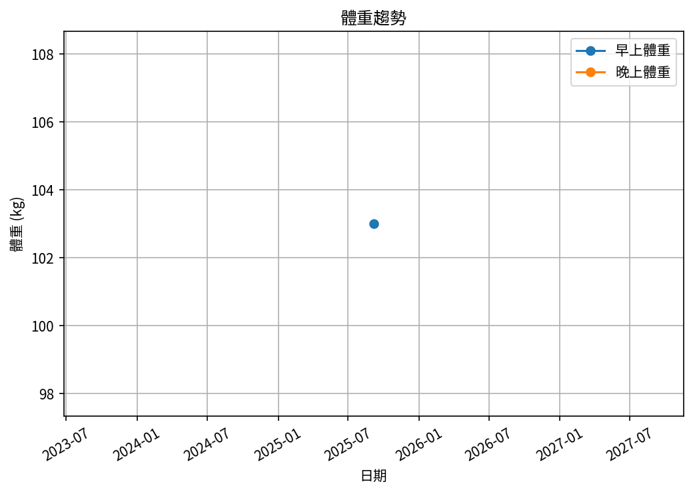
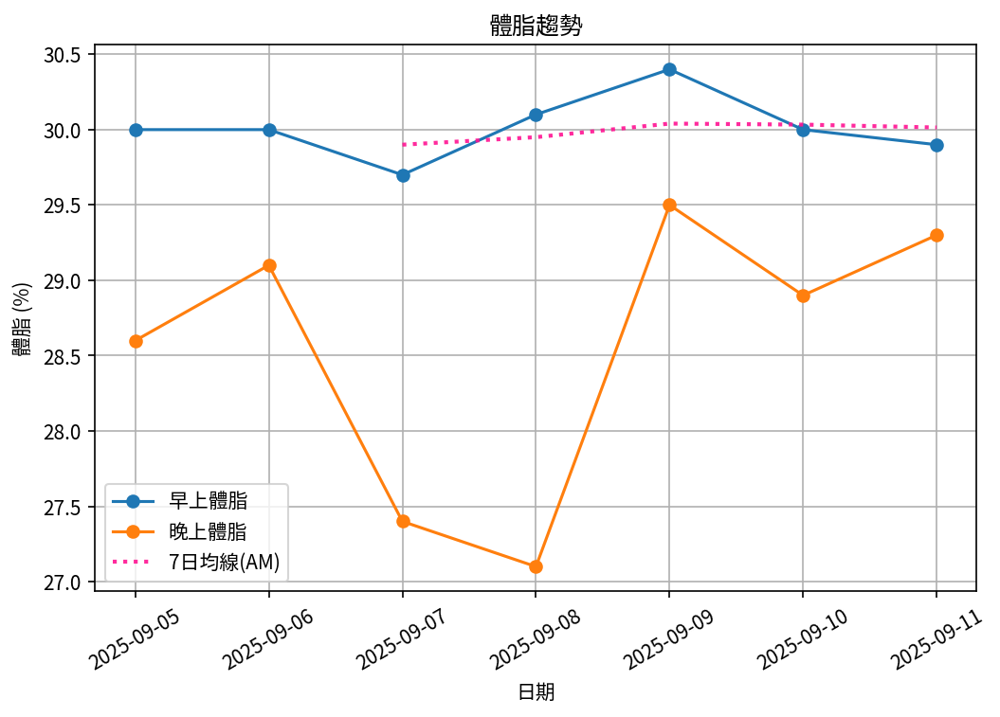
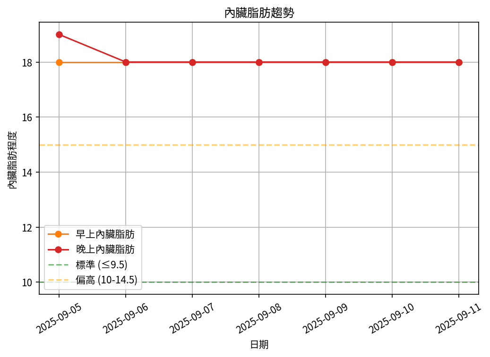
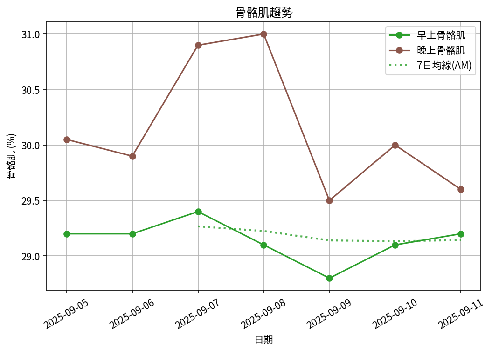

# 📊 減重週報（2025-CW04)

**週期：2025/09/05 ～ 2025/09/11**  

---

## 📈 體重與體脂紀錄

| 日期         |   早上體重 (kg) |   晚上體重 (kg) |   早上體脂 (%) |   晚上體脂 (%) |   早上內臟脂肪 |   晚上內臟脂肪 |   早上骨骼肌 (%) |   晚上骨骼肌 (%) |
|:-------------|----------------:|----------------:|---------------:|---------------:|---------------:|---------------:|-----------------:|-----------------:|
| 09/05 (週五) |           103   |           103.9 |           30   |           28.6 |             18 |             19 |             29.2 |            30.05 |
| 09/06 (週六) |           102.7 |           103.8 |           30   |           29.1 |             18 |             18 |             29.2 |            29.9  |
| 09/07 (週日) |           102.7 |           103.3 |           29.7 |           27.4 |             18 |             18 |             29.4 |            30.9  |
| 09/08 (週一) |           103.1 |           103.5 |           30.1 |           27.1 |             18 |             18 |             29.1 |            31    |
| 09/09 (週二) |           102.9 |           103.3 |           30.4 |           29.5 |             18 |             18 |             28.8 |            29.5  |
| 09/10 (週三) |           102.5 |           103.5 |           30   |           28.9 |             18 |             18 |             29.1 |            30    |
| 09/11 (週四) |           102.6 |           103   |           29.9 |           29.3 |             18 |             18 |             29.2 |            29.6  |

---

## 📊 趨勢圖

---

## 📌 本週統計

- 體重（AM）：103.0 → 102.6 kg  (**-0.4 kg**), 週平均 102.8 kg  
- 體重（PM）：103.9 → 103.0 kg  (**-0.9 kg**), 週平均 103.5 kg  
- 體重（AM+PM 平均）：103.1 kg  

- 體脂（AM）：30.0% → 29.9%  (**-0.1%**), 週平均 30.0%  
- 體脂（PM）：28.6% → 29.3%  (**0.7%**), 週平均 28.6%  
- 體脂（AM+PM 平均）：29.3%  

- 內臟脂肪（AM）：18.0 → 18.0  (**0.0**), 週平均 18.0  
- 內臟脂肪（PM）：19.0 → 18.0  (**-1.0**), 週平均 18.1  
- 內臟脂肪（AM+PM 平均）：18.1  
  💡 *標準：≤9.5，偏高：10-14.5，過高：≥15*  

- 骨骼肌（AM）：29.2% → 29.2%  (**0.0%**), 週平均 29.1%  
- 骨骼肌（PM）：30.1% → 29.6%  (**-0.4%**), 週平均 30.1%  
- 骨骼肌（AM+PM 平均）：29.6%  

- 脂肪重量（AM）：30.9 → 30.7 kg  (**-0.2 kg**), 週平均 30.9 kg  
- 脂肪重量（PM）：29.7 → 30.2 kg  (**0.5 kg**), 週平均 29.5 kg  
- 脂肪重量（AM+PM 平均）：30.2 kg  

- 骨骼肌重量（AM）：30.1 → 30.0 kg  (**-0.1 kg**), 週平均 30.0 kg  
- 骨骼肌重量（PM）：31.2 → 30.5 kg  (**-0.7 kg**), 週平均 31.2 kg  
- 骨骼肌重量（AM+PM 平均）：30.6 kg  

- 紀錄天數：7 天

---

## ✅ 建議
- 維持 **高蛋白 (每公斤 1.6–2.0 g)** 與 **每週 2–3 次阻力訓練**  
- 飲水 **≥ 3 L/天**（依活動量調整）  
- 若每週下降 > 2.5 kg，建議微調熱量或與醫師討論  

---

## 🧪 組成品質（近28天）

- 脂肪/體重 下降比例：56%（普通）  
- 體重變化：-0.4 kg，脂肪重量變化：-0.2 kg（AM）  

---

## 🧭 本期狀態解析

| 指標 | 變化量 | 對照門檻 | 判定 |
|:--|:--:|:--|:--|
| 脂肪重量 (AM) | -0.2 kg | 有效下降 ≥ 0.3 kg／週 | ⚖️ 波動/停滯 |
| 骨骼肌重量 (AM) | -0.1 kg | 有效上升 ≥ 0.2 kg／週（±0.2 kg 為誤差範圍） | ⚖️ 穩定（在誤差範圍） |

### 🔍 綜合判定

🟡 分類：**脂肪停滯**
建議檢查總熱量赤字與日常活動量，並持續追蹤 1–2 週。

---

## 🎯 KPI 目標與進度 (本週)

- 體重：目標 -0.8 kg  
  - 由 103.0 → 目標 102.2 kg  | 進度 [██████████░░░░░░░░░░] 50%  
- 體脂率（AM）：目標 -0.4 個百分點  
  - 由 30.0% → 目標 29.6%  | 進度 [█████░░░░░░░░░░░░░░░] 25%  
- 內臟脂肪（AM）：目標 -0.5  
  - 由 18.0 → 目標 17.5  | 進度 [░░░░░░░░░░░░░░░░░░░░] 0%  
- 骨骼肌重量（AM）：目標 ≥ 持平  | 變化 -0.1 kg  | 進度 [░░░░░░░░░░░░░░░░░░░░] 0%  
- 體重達標 ETA：~50.6 週（2026-08-31）  
- 體脂率達標 ETA（AM）：~90.1 週（2027-06-04）  
- 脂肪重量達標 ETA：~81.6 週（2027-04-05）  

---

## 🧠 本期數據分析與總結

- ✅ 體重：0.4 kg 下降（AM）
- ✅ 體脂率：0.1 個百分點下降（AM）
- ✅ 脂肪重量：-0.2 kg（AM）
- ⚠️ 骨骼肌重量下降：0.1 kg，建議調整赤字與訓練恢復。

- 下一步：蛋白 1.8–2.2 g/kg、每週 3–4 次阻力訓練、穩定睡眠與步數，維持每週 -0.5～-0.8 kg。
