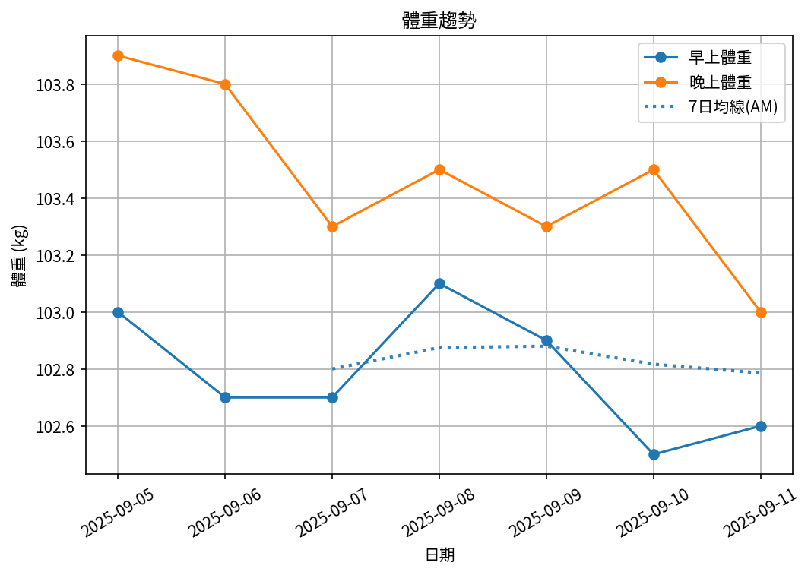

# 📊 減重週報（2025-CW04）

**週期：2025/09/05 ～ 2025/09/11**  

---

## 📈 體重與體脂紀錄

| 日期         |   早上體重 (kg) |   晚上體重 (kg) |   早上體脂 (%) |   晚上體脂 (%) |
|:-----------|------------:|------------:|-----------:|-----------:|
| 09/05 (週五) |       103   |       103.9 |       30   |       28.5 |
| 09/06 (週六) |       102.7 |       103.8 |       30   |       29.1 |
| 09/07 (週日) |       102.7 |       103.3 |       29.7 |       27.4 |
| 09/08 (週一) |       103.1 |       nan   |       30.1 |      nan   |

---

## 📊 趨勢圖

---

## 📌 本週統計

- 體重（AM）：103.0 → 103.1 kg  (**0.1 kg**), 週平均 102.9 kg  
- 體重（PM）：103.9 → 103.3 kg  (**-0.6 kg**), 週平均 103.7 kg  
- 體重（AM+PM 平均）：103.3 kg  

- 體脂（AM）：30.0% → 30.1%  (**0.1%**), 週平均 30.0%  
- 體脂（PM）：28.5% → 27.4%  (**-1.1%**), 週平均 28.3%  
- 體脂（AM+PM 平均）：29.1%  

- 紀錄天數：4 天

---

## ✅ 建議
- 維持 **高蛋白 (每公斤 1.6–2.0 g)** 與 **每週 2–3 次阻力訓練**  
- 飲水 **≥ 3 L/天**（依活動量調整）  
- 若每週下降 > 2.5 kg，建議微調熱量或與醫師討論  
