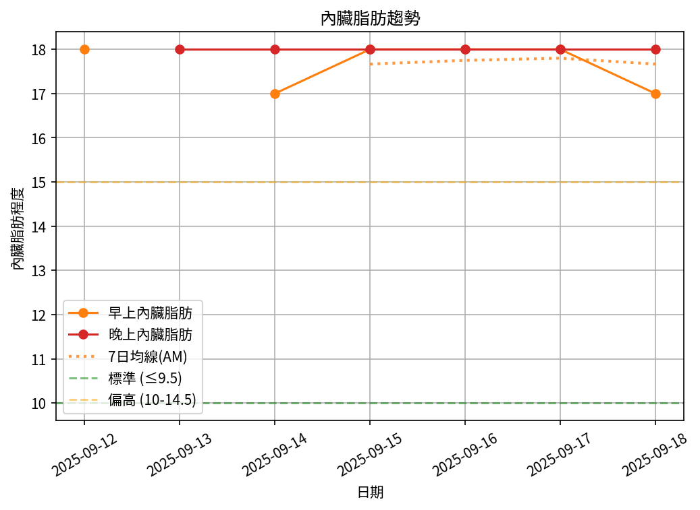

# 📊 減重週報（2025-CW05）

**週期：2025/09/12 ～ 2025/09/18**  

---

## 📈 體重與體脂紀錄

| 日期         |   早上體重 (kg) |   晚上體重 (kg) |   早上體脂 (%) |   晚上體脂 (%) |   早上內臟脂肪 |   晚上內臟脂肪 |
|:-------------|----------------:|----------------:|---------------:|---------------:|---------------:|---------------:|
| 09/12 (週五) |           102.6 |          103    |           30.2 |           29.3 |             18 |             18 |
| 09/13 (週六) |           nan   |          102.9  |          nan   |           29.2 |            nan |             18 |
| 09/14 (週日) |           101.4 |          102.6  |           29.3 |           28.3 |             17 |             18 |
| 09/15 (週一) |           102   |          nan    |           29.3 |          nan   |             18 |            nan |
| 09/16 (週二) |           102.2 |          102.65 |           29.5 |           26.9 |             18 |             18 |
| 09/17 (週三) |           102.1 |          102.5  |           29.1 |           27.7 |             18 |             18 |
| 09/18 (週四) |           101.3 |          nan    |           29.7 |          nan   |             17 |            nan |

---

## 📊 趨勢圖

---

## 📌 本週統計

- 體重（AM）：102.6 → 101.3 kg  (**-1.3 kg**), 週平均 101.9 kg  
- 體重（PM）：103.0 → 102.5 kg  (**-0.5 kg**), 週平均 102.7 kg  
- 體重（AM+PM 平均）：102.3 kg  

- 體脂（AM）：30.2% → 29.7%  (**-0.5%**), 週平均 29.5%  
- 體脂（PM）：29.3% → 27.7%  (**-1.6%**), 週平均 28.3%  
- 體脂（AM+PM 平均）：28.9%  

- 內臟脂肪（AM）：18.0 → 17.0  (**-1.0**), 週平均 17.7  
- 內臟脂肪（PM）：18.0 → 18.0  (**0.0**), 週平均 18.0  
- 內臟脂肪（AM+PM 平均）：17.8  
  💡 *標準：≤9.5，偏高：10-14.5，過高：≥15*  

- 紀錄天數：7 天

---

## ✅ 建議
- 維持 **高蛋白 (每公斤 1.6–2.0 g)** 與 **每週 2–3 次阻力訓練**  
- 飲水 **≥ 3 L/天**（依活動量調整）  
- 若每週下降 > 2.5 kg，建議微調熱量或與醫師討論  
