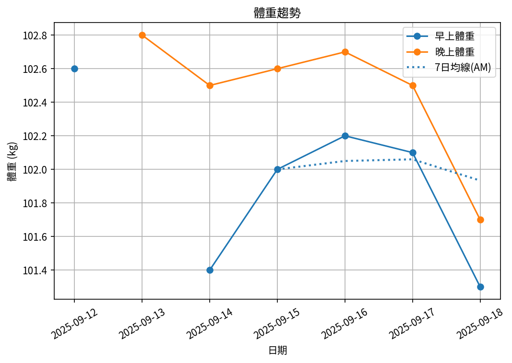

# 📊 減重週報（2025-CW05）

**週期：2025/09/12 ～ 2025/09/18**  

---

## 📈 體重與體脂紀錄

| 日期         |   早上體重 (kg) |   晚上體重 (kg) |   早上體脂 (%) |   晚上體脂 (%) |
|:-----------|------------:|------------:|-----------:|-----------:|
| 09/12 (週五) |       102.6 |       102.6 |       30.2 |       30.2 |
| 09/13 (週六) |       102.9 |       102.7 |       29.2 |       28.6 |
| 09/14 (週日) |       101.4 |       102.5 |       29.3 |       28   |
| 09/15 (週一) |       102   |       102.6 |       29.3 |       27.5 |
| 09/16 (週二) |       102.2 |       102.7 |       29.5 |       26.3 |
| 09/17 (週三) |       102.1 |       102.5 |       29.1 |       27.7 |
| 09/18 (週四) |       101.3 |       101.7 |       29.7 |       27.6 |

---

## 📊 趨勢圖

---

## 📌 本週統計

- 體重（AM）：102.6 → 101.3 kg  (**-1.3 kg**), 週平均 102.1 kg  
- 體重（PM）：102.6 → 101.7 kg  (**-0.9 kg**), 週平均 102.5 kg  
- 體重（AM+PM 平均）：102.3 kg  

- 體脂（AM）：30.2% → 29.7%  (**-0.5%**), 週平均 29.5%  
- 體脂（PM）：30.2% → 27.6%  (**-2.6%**), 週平均 28.0%  
- 體脂（AM+PM 平均）：28.7%  

- 紀錄天數：7 天

---

## ✅ 建議
- 維持 **高蛋白 (每公斤 1.6–2.0 g)** 與 **每週 2–3 次阻力訓練**  
- 飲水 **≥ 3 L/天**（依活動量調整）  
- 若每週下降 > 2.5 kg，建議微調熱量或與醫師討論  
