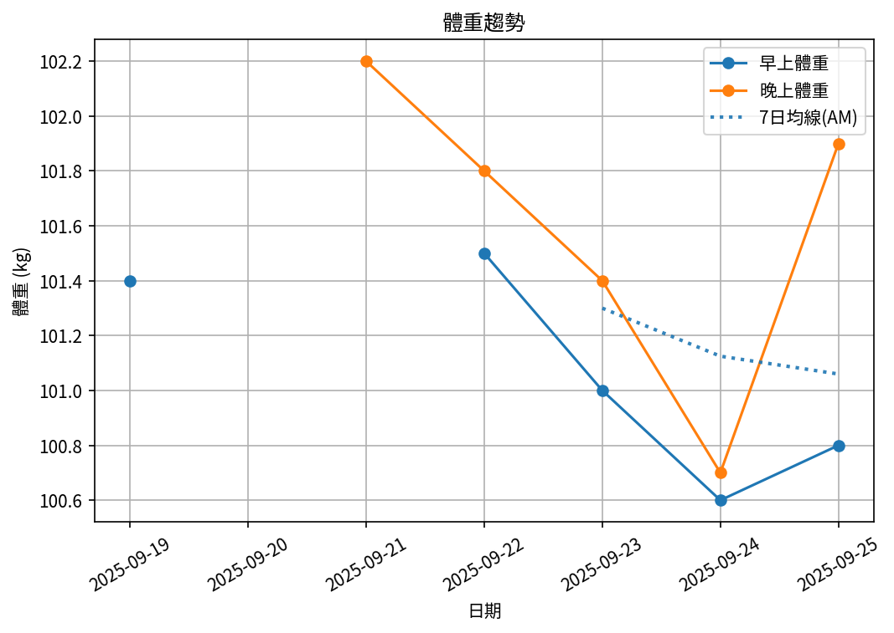

# 📊 減重週報（2025-CW06)

**週期：2025/09/19 ～ 2025/09/25**  

---

## 📈 體重與體脂紀錄

| 日期         |   早上體重 (kg) |   晚上體重 (kg) |   早上體脂 (%) |   晚上體脂 (%) |   早上內臟脂肪 |   晚上內臟脂肪 |   早上骨骼肌 (%) |   晚上骨骼肌 (%) |
|:-------------|----------------:|----------------:|---------------:|---------------:|---------------:|---------------:|-----------------:|-----------------:|
| 09/19 (週五) |           101.4 |           nan   |           29   |          nan   |             17 |            nan |             29.9 |            nan   |
| 09/21 (週日) |           nan   |           102.2 |          nan   |           26.7 |            nan |             18 |            nan   |             31.3 |
| 09/22 (週一) |           101.5 |           101.8 |           29.5 |           29.3 |             18 |             18 |             29.5 |             29.7 |
| 09/23 (週二) |           101   |           101.4 |           29.5 |           28.2 |             17 |             17 |             29.6 |             30.5 |
| 09/24 (週三) |           100.6 |           100.7 |           29.5 |           27.1 |             17 |             17 |             29.5 |             31.2 |
| 09/25 (週四) |           100.8 |           101.9 |           29.6 |           26.2 |             17 |             18 |             29.4 |             31.6 |

---

## 📊 趨勢圖

---

## 📌 本週統計

- 體重（AM）：101.4 → 100.8 kg  (**-0.6 kg**), 週平均 101.1 kg  
- 體重（PM）：102.2 → 101.9 kg  (**-0.3 kg**), 週平均 101.6 kg  
- 體重（AM+PM 平均）：101.3 kg  

- 體脂（AM）：29.0% → 29.6%  (**0.6%**), 週平均 29.4%  
- 體脂（PM）：26.7% → 26.2%  (**-0.5%**), 週平均 27.5%  
- 體脂（AM+PM 平均）：28.5%  

- 內臟脂肪（AM）：17.0 → 17.0  (**0.0**), 週平均 17.2  
- 內臟脂肪（PM）：18.0 → 18.0  (**0.0**), 週平均 17.6  
- 內臟脂肪（AM+PM 平均）：17.4  
  💡 *標準：≤9.5，偏高：10-14.5，過高：≥15*  

- 骨骼肌（AM）：29.9% → 29.4%  (**-0.5%**), 週平均 29.6%  
- 骨骼肌（PM）：31.3% → 31.6%  (**0.3%**), 週平均 30.9%  
- 骨骼肌（AM+PM 平均）：30.2%  

- 脂肪重量（AM）：29.4 → 29.8 kg  (**0.4 kg**), 週平均 29.7 kg  
- 脂肪重量（PM）：27.3 → 26.7 kg  (**-0.6 kg**), 週平均 27.9 kg  
- 脂肪重量（AM+PM 平均）：28.8 kg  

- 骨骼肌重量（AM）：30.3 → 29.6 kg  (**-0.7 kg**), 週平均 29.9 kg  
- 骨骼肌重量（PM）：32.0 → 32.2 kg  (**0.2 kg**), 週平均 31.3 kg  
- 骨骼肌重量（AM+PM 平均）：30.6 kg  

- 紀錄天數：6 天

---

## ✅ 建議
- 維持 **高蛋白 (每公斤 1.6–2.0 g)** 與 **每週 2–3 次阻力訓練**  
- 飲水 **≥ 3 L/天**（依活動量調整）  
- 若每週下降 > 2.5 kg，建議微調熱量或與醫師討論  

---

## 🧪 組成品質（近28天）

- 脂肪/體重 下降比例：0%（需留意）  
- 體重變化：-0.6 kg，脂肪重量變化：-0.0 kg（AM）  

---

## 🧭 本期狀態解析

| 指標 | 變化量 | 對照門檻 | 判定 |
|:--|:--:|:--|:--|
| 脂肪重量 (AM) | +0.4 kg | 有效下降 ≥ 0.3 kg／週 | ⚠️ 脂肪明顯上升 |
| 骨骼肌重量 (AM) | -0.7 kg | 有效上升 ≥ 0.2 kg／週（±0.2 kg 為誤差範圍） | ⚠️ 肌肉顯著下降 |

### 🔍 綜合判定

🔵 分類：**其他**
本期變化方向不明顯或存在相反趨勢，建議以 4 週趨勢為準。

---

## 🎯 KPI 目標與進度 (本週)

- 體重：目標 -0.8 kg  
  - 由 101.4 → 目標 100.6 kg  | 進度 [███████████████░░░░░] 75%  
- 體脂率（AM）：目標 -0.4 個百分點  
  - 由 29.0% → 目標 28.6%  | 進度 [████████████████████] 100%  
- 內臟脂肪（AM）：目標 -0.5  
  - 由 17.0 → 目標 16.5  | 進度 [░░░░░░░░░░░░░░░░░░░░] 0%  
- 骨骼肌重量（AM）：目標 ≥ 持平  | 變化 -0.7 kg  | 進度 [░░░░░░░░░░░░░░░░░░░░] 0%  
- 體重達標 ETA：~23.7 週（2026-03-10）  

---

## 🧠 本期數據分析與總結

- ✅ 體重：0.6 kg 下降（AM）
- ⚠️ 骨骼肌重量下降：0.7 kg，建議調整赤字與訓練恢復。
- ⚠️ 組成品質偏低（脂肪/體重 < 40%），建議提高蛋白與阻力訓練，減少過大赤字。

- 下一步：蛋白 1.8–2.2 g/kg、每週 3–4 次阻力訓練、穩定睡眠與步數，維持每週 -0.5～-0.8 kg。
