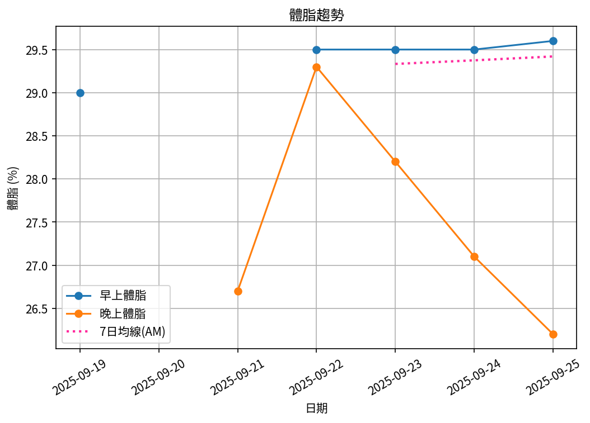

# 📊 減重週報（2025-CW06）

**週期：2025/09/19 ～ 2025/09/25**  

---

## 📈 體重與體脂紀錄

| 日期         |   早上體重 (kg) |   晚上體重 (kg) |   早上體脂 (%) |   晚上體脂 (%) |   早上內臟脂肪 |   晚上內臟脂肪 |
|:-------------|----------------:|----------------:|---------------:|---------------:|---------------:|---------------:|
| 09/19 (週五) |           101.4 |           101.7 |           29   |           27.6 |             17 |             18 |
| 09/21 (週日) |           nan   |           102.2 |          nan   |           26.7 |            nan |             18 |
| 09/22 (週一) |           101.5 |           101.8 |           29.5 |           29.3 |             18 |             18 |
| 09/23 (週二) |           101   |           101.4 |           29.5 |           28.2 |             17 |             17 |
| 09/24 (週三) |           100.6 |           100.7 |           29.5 |           27.1 |             17 |             17 |
| 09/25 (週四) |           100.8 |           101.9 |           29.6 |           26.2 |             17 |             18 |

---

## 📊 趨勢圖

---

## 📌 本週統計

- 體重（AM）：101.4 → 100.8 kg  (**-0.6 kg**), 週平均 101.1 kg  
- 體重（PM）：101.7 → 101.9 kg  (**0.2 kg**), 週平均 101.6 kg  
- 體重（AM+PM 平均）：101.3 kg  

- 體脂（AM）：29.0% → 29.6%  (**0.6%**), 週平均 29.4%  
- 體脂（PM）：27.6% → 26.2%  (**-1.4%**), 週平均 27.5%  
- 體脂（AM+PM 平均）：28.5%  

- 內臟脂肪（AM）：17.0 → 17.0  (**0.0**), 週平均 17.2  
- 內臟脂肪（PM）：18.0 → 18.0  (**0.0**), 週平均 17.7  
- 內臟脂肪（AM+PM 平均）：17.4  
  💡 *標準：≤9.5，偏高：10-14.5，過高：≥15*  

- 紀錄天數：6 天

---

## ✅ 建議
- 維持 **高蛋白 (每公斤 1.6–2.0 g)** 與 **每週 2–3 次阻力訓練**  
- 飲水 **≥ 3 L/天**（依活動量調整）  
- 若每週下降 > 2.5 kg，建議微調熱量或與醫師討論  
