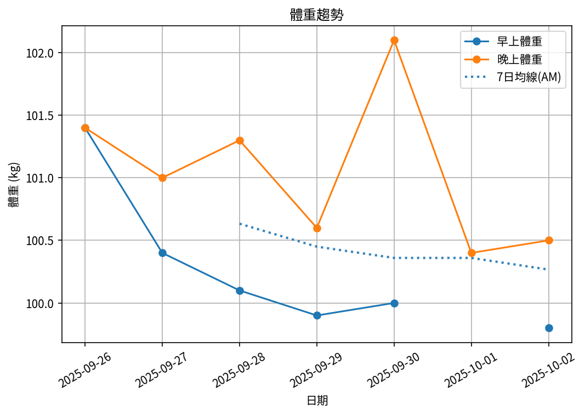
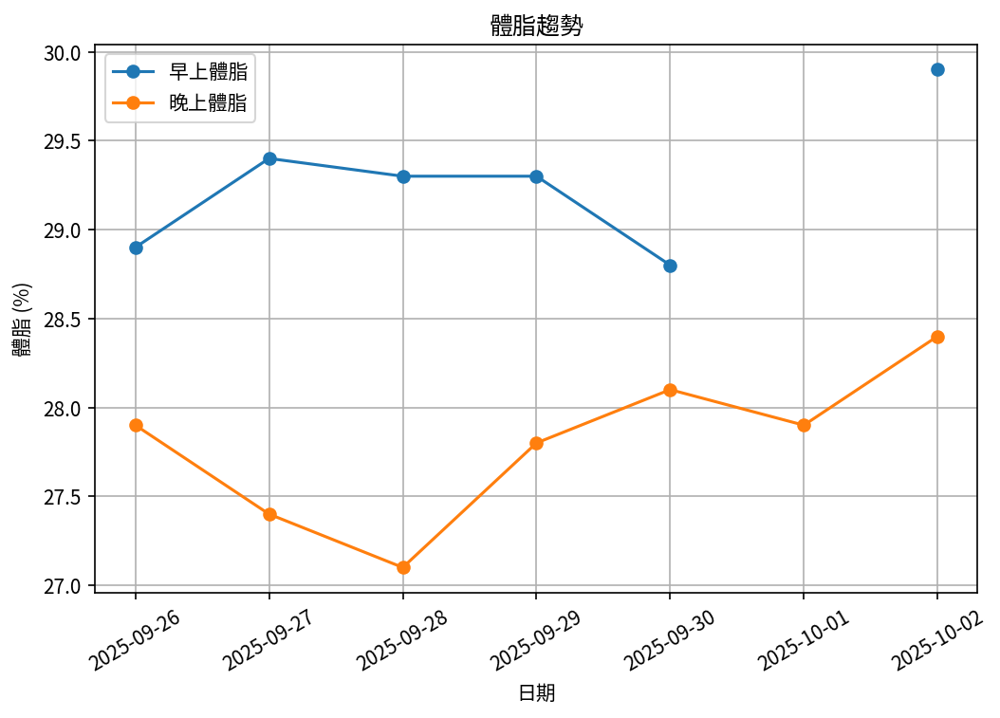
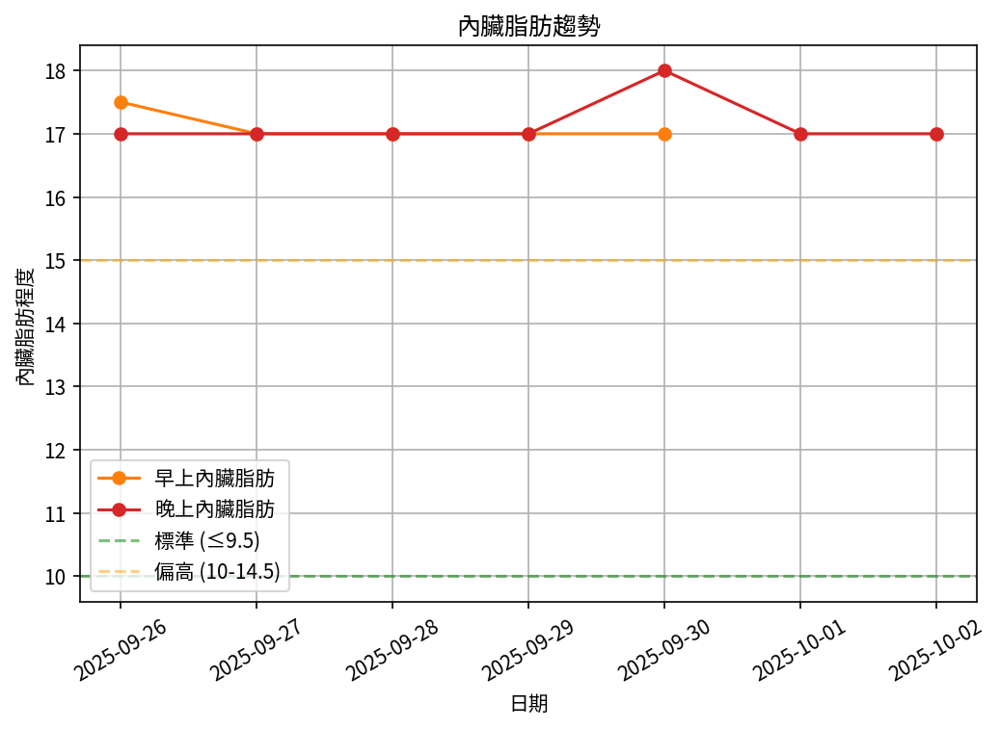
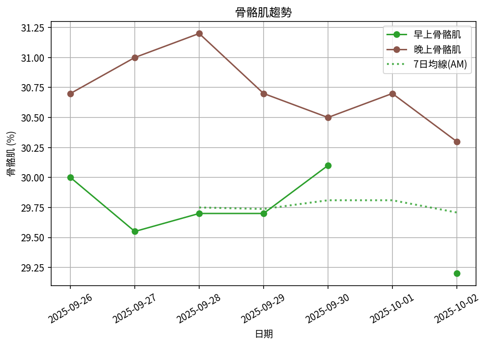

# 📊 減重週報（2025-CW07)

**週期：2025/09/26 ～ 2025/10/02**  

---

## 📈 體重與體脂紀錄

| 日期         |   早上體重 (kg) |   晚上體重 (kg) |   早上體脂 (%) |   晚上體脂 (%) |   早上內臟脂肪 |   晚上內臟脂肪 |   早上骨骼肌 (%) |   晚上骨骼肌 (%) |
|:-------------|----------------:|----------------:|---------------:|---------------:|---------------:|---------------:|-----------------:|-----------------:|
| 09/26 (週五) |           101.4 |           101.4 |           28.9 |           27.9 |           17.5 |             17 |            30    |             30.7 |
| 09/27 (週六) |           100.4 |           101   |           29.4 |           27.4 |           17   |             17 |            29.55 |             31   |
| 09/28 (週日) |           100.1 |           101.3 |           29.3 |           27.1 |           17   |             17 |            29.7  |             31.2 |
| 09/29 (週一) |            99.9 |           100.6 |           29.3 |           27.8 |           17   |             17 |            29.7  |             30.7 |
| 09/30 (週二) |           100   |           102.1 |           28.8 |           28.1 |           17   |             18 |            30.1  |             30.5 |
| 10/01 (週三) |           nan   |           100.4 |          nan   |           27.9 |          nan   |             17 |           nan    |             30.7 |
| 10/02 (週四) |            99.8 |           100.5 |           29.9 |           28.4 |           17   |             17 |            29.2  |             30.3 |

---

## 📊 趨勢圖

---

## 📌 本週統計

- 體重（AM）：101.4 → 99.8 kg  (**-1.6 kg**), 週平均 100.3 kg  
- 體重（PM）：101.4 → 100.5 kg  (**-0.9 kg**), 週平均 101.0 kg  
- 體重（AM+PM 平均）：100.7 kg  

- 體脂（AM）：28.9% → 29.9%  (**1.0%**), 週平均 29.3%  
- 體脂（PM）：27.9% → 28.4%  (**0.5%**), 週平均 27.8%  
- 體脂（AM+PM 平均）：28.5%  

- 內臟脂肪（AM）：17.5 → 17.0  (**-0.5**), 週平均 17.1  
- 內臟脂肪（PM）：17.0 → 17.0  (**0.0**), 週平均 17.1  
- 內臟脂肪（AM+PM 平均）：17.1  
  💡 *標準：≤9.5，偏高：10-14.5，過高：≥15*  

- 骨骼肌（AM）：30.0% → 29.2%  (**-0.8%**), 週平均 29.7%  
- 骨骼肌（PM）：30.7% → 30.3%  (**-0.4%**), 週平均 30.7%  
- 骨骼肌（AM+PM 平均）：30.2%  

- 脂肪重量（AM）：29.3 → 29.8 kg  (**0.5 kg**), 週平均 29.3 kg  
- 脂肪重量（PM）：28.3 → 28.5 kg  (**0.3 kg**), 週平均 28.1 kg  
- 脂肪重量（AM+PM 平均）：28.7 kg  

- 骨骼肌重量（AM）：30.4 → 29.1 kg  (**-1.3 kg**), 週平均 29.8 kg  
- 骨骼肌重量（PM）：31.1 → 30.5 kg  (**-0.7 kg**), 週平均 31.0 kg  
- 骨骼肌重量（AM+PM 平均）：30.4 kg  

- 紀錄天數：7 天

---

## ✅ 建議
- 維持 **高蛋白 (每公斤 1.6–2.0 g)** 與 **每週 2–3 次阻力訓練**  
- 飲水 **≥ 3 L/天**（依活動量調整）  
- 若每週下降 > 2.5 kg，建議微調熱量或與醫師討論  

---

## 🧪 組成品質（近28天）

- 脂肪/體重 下降比例：0%（需留意）  
- 體重變化：-1.6 kg，脂肪重量變化：-0.0 kg（AM）  

---

## 🎯 KPI 目標與進度 (本週)

- 體重：目標 -0.8 kg  
  - 由 101.4 → 目標 100.6 kg  | 進度 [████████████████████] 100%  
- 體脂率（AM）：目標 -0.4 個百分點  
  - 由 28.9% → 目標 28.5%  | 進度 [████████████████████] 100%  
- 內臟脂肪（AM）：目標 -0.5  
  - 由 17.5 → 目標 17.0  | 進度 [████████████████████] 100%  
- 骨骼肌重量（AM）：目標 ≥ 持平  | 變化 -1.3 kg  | 進度 [░░░░░░░░░░░░░░░░░░░░] 0%  
- 體重達標 ETA：~11.1 週（2025-12-19）  

---

## 🧠 本期數據分析與總結

- ✅ 體重：1.6 kg 下降（AM）
- ✅ 內臟脂肪：0.5 降低（AM）
- ⚠️ 骨骼肌重量下降：1.3 kg，建議調整赤字與訓練恢復。
- ⚠️ 組成品質偏低（脂肪/體重 < 40%），建議提高蛋白與阻力訓練，減少過大赤字。

- 下一步：蛋白 1.8–2.2 g/kg、每週 3–4 次阻力訓練、穩定睡眠與步數，維持每週 -0.5～-0.8 kg。
