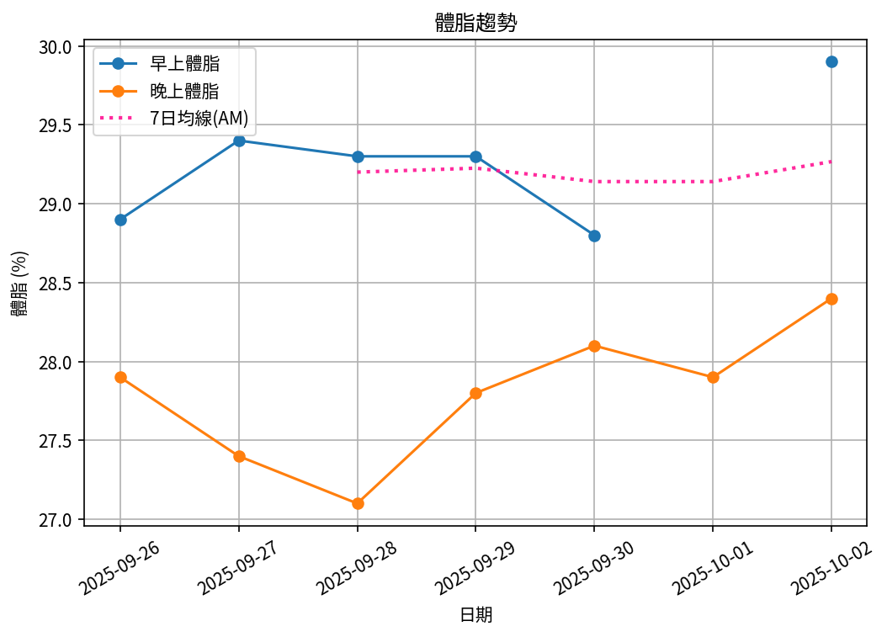
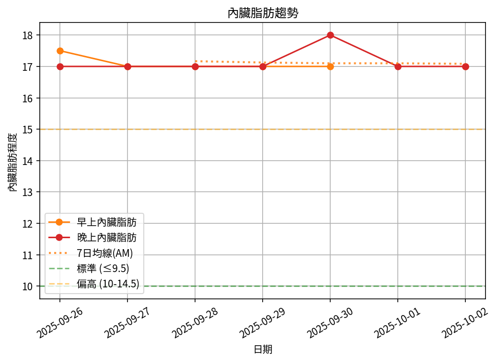

# 📊 減重週報（2025-CW07）

**週期：2025/09/26 ～ 2025/10/02**  

---

## 📈 體重與體脂紀錄

| 日期         |   早上體重 (kg) |   晚上體重 (kg) |   早上體脂 (%) |   晚上體脂 (%) |   早上內臟脂肪 |   晚上內臟脂肪 |
|:-------------|----------------:|----------------:|---------------:|---------------:|---------------:|---------------:|
| 09/26 (週五) |           101.4 |           101.4 |           28.9 |           27.9 |           17.5 |             17 |
| 09/27 (週六) |           100.4 |           101   |           29.4 |           27.4 |           17   |             17 |
| 09/28 (週日) |           100.1 |           101.3 |           29.3 |           27.1 |           17   |             17 |
| 09/29 (週一) |            99.9 |           100.6 |           29.3 |           27.8 |           17   |             17 |
| 09/30 (週二) |           100   |           102.1 |           28.8 |           28.1 |           17   |             18 |
| 10/01 (週三) |           nan   |           100.4 |          nan   |           27.9 |          nan   |             17 |
| 10/02 (週四) |            99.8 |           100.5 |           29.9 |           28.4 |           17   |             17 |

---

## 📊 趨勢圖

---

## 📌 本週統計

- 體重（AM）：101.4 → 99.8 kg  (**-1.6 kg**), 週平均 100.3 kg  
- 體重（PM）：101.4 → 100.5 kg  (**-0.9 kg**), 週平均 101.0 kg  
- 體重（AM+PM 平均）：100.7 kg  

- 體脂（AM）：28.9% → 29.9%  (**1.0%**), 週平均 29.3%  
- 體脂（PM）：27.9% → 28.4%  (**0.5%**), 週平均 27.8%  
- 體脂（AM+PM 平均）：28.5%  

- 內臟脂肪（AM）：17.5 → 17.0  (**-0.5**), 週平均 17.1  
- 內臟脂肪（PM）：17.0 → 17.0  (**0.0**), 週平均 17.1  
- 內臟脂肪（AM+PM 平均）：17.1  
  💡 *標準：≤9.5，偏高：10-14.5，過高：≥15*  

- 紀錄天數：7 天

---

## ✅ 建議
- 維持 **高蛋白 (每公斤 1.6–2.0 g)** 與 **每週 2–3 次阻力訓練**  
- 飲水 **≥ 3 L/天**（依活動量調整）  
- 若每週下降 > 2.5 kg，建議微調熱量或與醫師討論  
