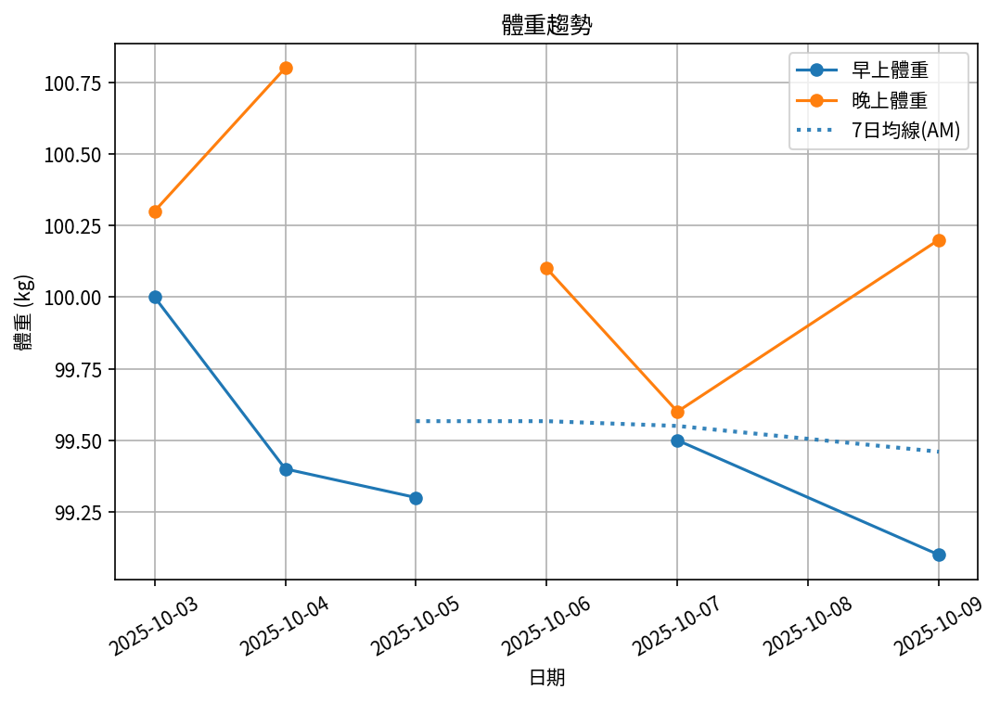
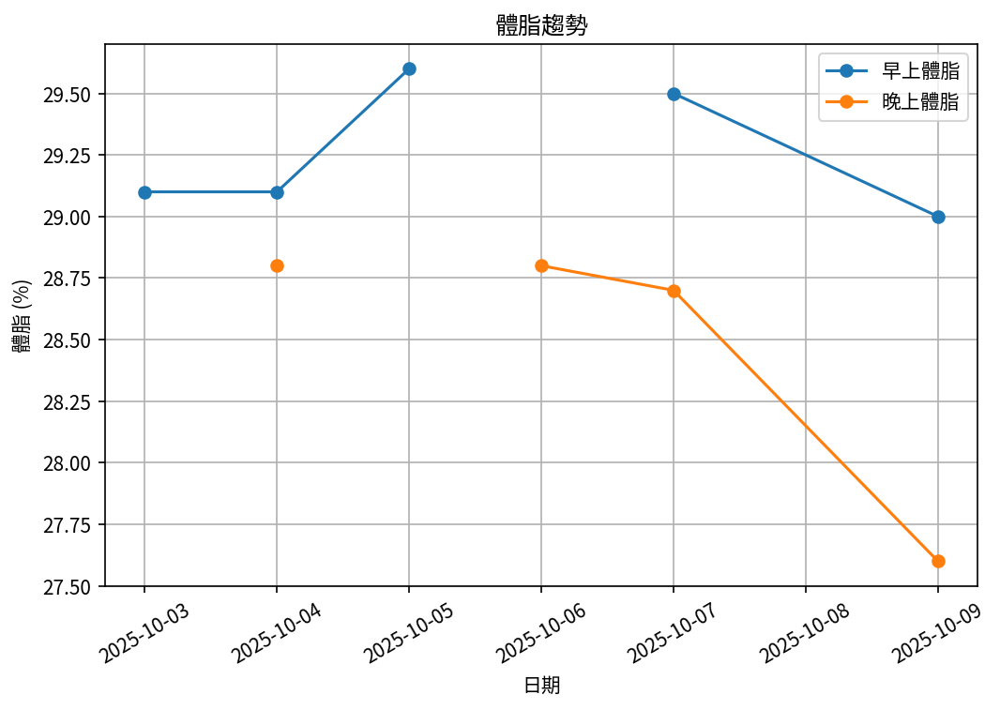
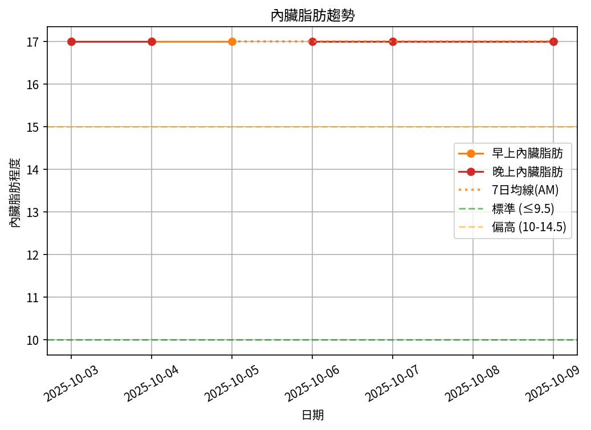
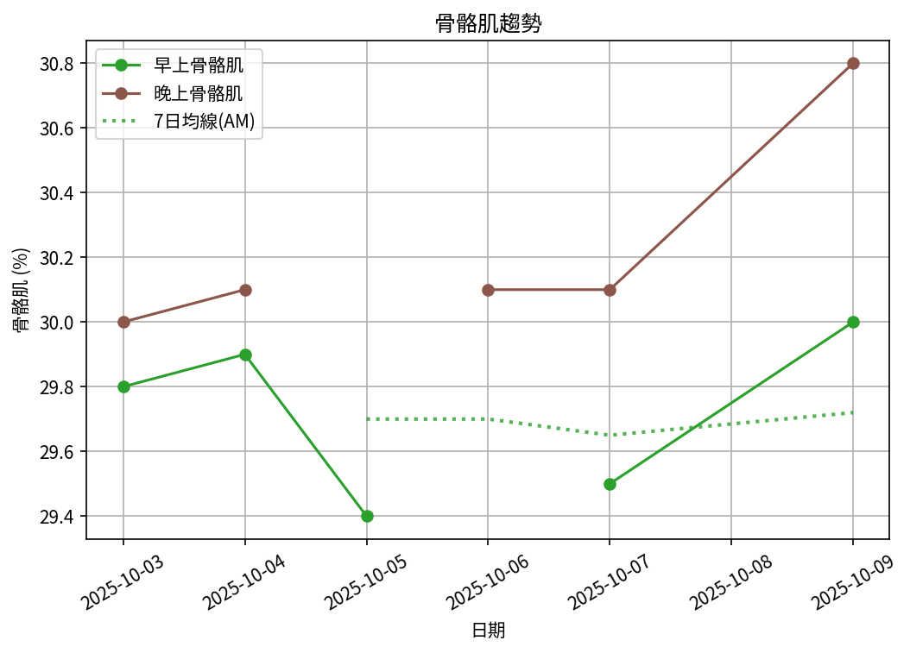

# 📊 減重週報（2025-CW08)

**週期：2025/10/03 ～ 2025/10/09**  

---

## 📈 體重與體脂紀錄

| 日期         |   早上體重 (kg) |   晚上體重 (kg) |   早上體脂 (%) |   晚上體脂 (%) |   早上內臟脂肪 |   晚上內臟脂肪 |   早上骨骼肌 (%) |   晚上骨骼肌 (%) |
|:-------------|----------------:|----------------:|---------------:|---------------:|---------------:|---------------:|-----------------:|-----------------:|
| 10/03 (週五) |           100   |           100.3 |           29.1 |           28.9 |             17 |             17 |             29.8 |             30   |
| 10/04 (週六) |            99.4 |           100.8 |           29.1 |           28.7 |             17 |             17 |             29.9 |             30.1 |
| 10/05 (週日) |            99.3 |           nan   |           29.6 |          nan   |             17 |            nan |             29.4 |            nan   |
| 10/06 (週一) |           nan   |           100.1 |          nan   |           28.8 |            nan |             17 |            nan   |             30.1 |
| 10/07 (週二) |            99.5 |            99.6 |           29.5 |           28.7 |             17 |             17 |             29.5 |             30.1 |
| 10/09 (週四) |            99.1 |           100.2 |           29   |           27.6 |             17 |             17 |             30   |             30.8 |

---

## 📊 趨勢圖

---

## 📌 本週統計

- 體重（AM）：100.0 → 99.1 kg  (**-0.9 kg**), 週平均 99.5 kg  
- 體重（PM）：100.3 → 100.2 kg  (**-0.1 kg**), 週平均 100.2 kg  
- 體重（AM+PM 平均）：99.8 kg  

- 體脂（PM 趨勢基準）：28.9% → 27.6%  (**-1.3%**), 週平均 28.5%  
- 體脂（AM 對照）：29.1% → 29.0%  (**-0.1%**), 週平均 29.3%  
- 體脂（AM+PM 平均）：28.9%  

- 內臟脂肪（AM）：17.0 → 17.0  (**0.0**), 週平均 17.0  
- 內臟脂肪（PM）：17.0 → 17.0  (**0.0**), 週平均 17.0  
- 內臟脂肪（AM+PM 平均）：17.0  
  💡 *標準：≤9.5，偏高：10-14.5，過高：≥15*  

- 骨骼肌（AM）：29.8% → 30.0%  (**0.2%**), 週平均 29.7%  
- 骨骼肌（PM）：30.0% → 30.8%  (**0.8%**), 週平均 30.2%  
- 骨骼肌（AM+PM 平均）：30.0%  

- 脂肪重量（AM）：29.1 → 28.7 kg  (**-0.4 kg**), 週平均 29.1 kg  
- 脂肪重量（PM）：29.0 → 27.7 kg  (**-1.3 kg**), 週平均 28.6 kg  
- 脂肪重量（AM+PM 平均）：28.9 kg  

- 骨骼肌重量（AM）：29.8 → 29.7 kg  (**-0.1 kg**), 週平均 29.6 kg  
- 骨骼肌重量（PM）：30.1 → 30.9 kg  (**0.8 kg**), 週平均 30.3 kg  
- 骨骼肌重量（AM+PM 平均）：29.9 kg  

- 紀錄天數：6 天

---

## ✅ 建議
- 維持 **高蛋白 (每公斤 1.6–2.0 g)** 與 **每週 2–3 次阻力訓練**  
- 飲水 **≥ 3 L/天**（依活動量調整）  
- 若每週下降 > 2.5 kg，建議微調熱量或與醫師討論  

---

## 🧪 組成品質（近28天）

- 脂肪/體重 下降比例：44%（普通）  
- 體重變化：-0.9 kg，脂肪重量變化：-0.4 kg（AM）  

---

## 🧭 本期狀態解析

| 指標 | 變化量 | 對照門檻 | 判定 |
|:--|:--:|:--|:--|
| 脂肪重量 (AM) | -0.4 kg | 有效下降 ≥ 0.3 kg／週 | ⚖️ 脂肪下降（尚未達顯著） |
| 骨骼肌重量 (AM) | -0.1 kg | 有效上升 ≥ 0.2 kg／週（±0.2 kg 為誤差範圍） | ⚖️ 穩定（在誤差範圍） |

### 🔍 綜合判定

🔵 分類：**其他**
本期變化方向不明顯或存在相反趨勢，建議以 4 週趨勢為準。

---

## 🎯 KPI 目標與進度 (本週)

- 體重：目標 -0.8 kg  
  - 由 100.0 → 目標 99.2 kg  | 進度 [████████████████████] 100%  
- 體脂率（PM 趨勢基準）：目標 -0.4 個百分點  
  - 由 28.9% → 目標 28.5%  | 進度 [████████████████████] 100%  
- 內臟脂肪（AM）：目標 -0.5  
  - 由 17.0 → 目標 16.5  | 進度 [░░░░░░░░░░░░░░░░░░░░] 0%  
- 骨骼肌重量（AM）：目標 ≥ 持平  | 變化 -0.1 kg  | 進度 [░░░░░░░░░░░░░░░░░░░░] 0%  
- 體重達標 ETA：~19.1 週（2026-02-20）  
- 體脂率達標 ETA（PM 趨勢基準）：~49.3 週（2026-09-19）  
- 脂肪重量達標 ETA：~41.1 週（2026-07-24）  

---

## 🧠 本期數據分析與總結

- ✅ 體重：0.9 kg 下降（AM）
- ✅ 體脂率：0.1 個百分點下降（AM）
- ✅ 骨骼肌率：+0.2 個百分點（AM）
- ✅ 脂肪重量：-0.4 kg（AM）
- ⚠️ 骨骼肌重量下降：0.1 kg，建議調整赤字與訓練恢復。

- 下一步：蛋白 1.8–2.2 g/kg、每週 3–4 次阻力訓練、穩定睡眠與步數，維持每週 -0.5～-0.8 kg。
