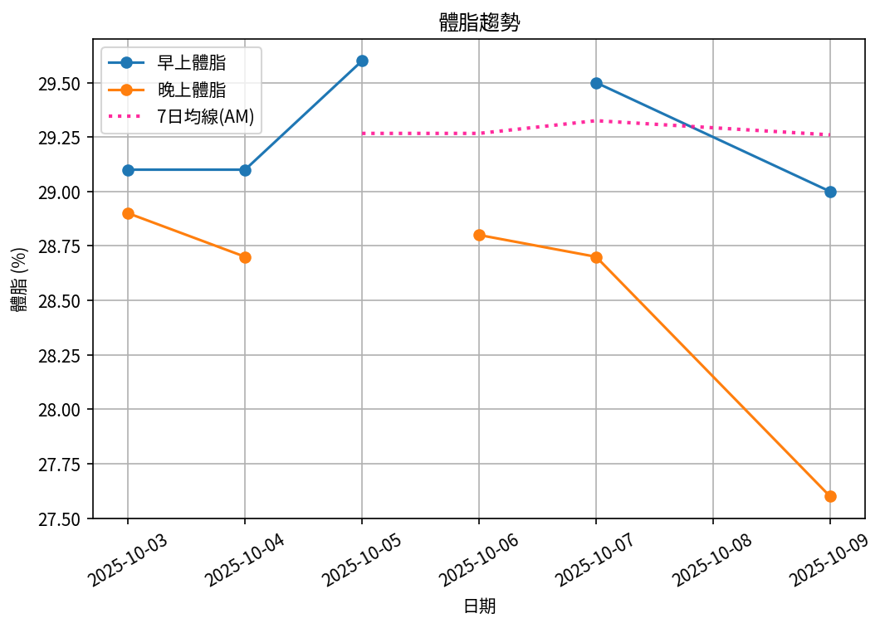

# 📊 減重週報（2025-CW08）

**週期：2025/10/03 ～ 2025/10/09**  

---

## 📈 體重與體脂紀錄

| 日期         |   早上體重 (kg) |   晚上體重 (kg) |   早上體脂 (%) |   晚上體脂 (%) |   早上內臟脂肪 |   晚上內臟脂肪 |
|:-------------|----------------:|----------------:|---------------:|---------------:|---------------:|---------------:|
| 10/03 (週五) |           100   |           100.3 |           29.1 |           28.9 |             17 |             17 |
| 10/04 (週六) |            99.4 |           100.8 |           29.1 |           28.7 |             17 |             17 |
| 10/05 (週日) |            99.3 |           nan   |           29.6 |          nan   |             17 |            nan |
| 10/06 (週一) |           nan   |           100.1 |          nan   |           28.8 |            nan |             17 |
| 10/07 (週二) |            99.5 |            99.6 |           29.5 |           28.7 |             17 |             17 |
| 10/09 (週四) |            99.1 |           100.2 |           29   |           27.6 |             17 |             17 |

---

## 📊 趨勢圖

---

## 📌 本週統計

- 體重（AM）：100.0 → 99.1 kg  (**-0.9 kg**), 週平均 99.5 kg  
- 體重（PM）：100.3 → 100.2 kg  (**-0.1 kg**), 週平均 100.2 kg  
- 體重（AM+PM 平均）：99.8 kg  

- 體脂（AM）：29.1% → 29.0%  (**-0.1%**), 週平均 29.3%  
- 體脂（PM）：28.9% → 27.6%  (**-1.3%**), 週平均 28.5%  
- 體脂（AM+PM 平均）：28.9%  

- 內臟脂肪（AM）：17.0 → 17.0  (**0.0**), 週平均 17.0  
- 內臟脂肪（PM）：17.0 → 17.0  (**0.0**), 週平均 17.0  
- 內臟脂肪（AM+PM 平均）：17.0  
  💡 *標準：≤9.5，偏高：10-14.5，過高：≥15*  

- 紀錄天數：6 天

---

## ✅ 建議
- 維持 **高蛋白 (每公斤 1.6–2.0 g)** 與 **每週 2–3 次阻力訓練**  
- 飲水 **≥ 3 L/天**（依活動量調整）  
- 若每週下降 > 2.5 kg，建議微調熱量或與醫師討論  
