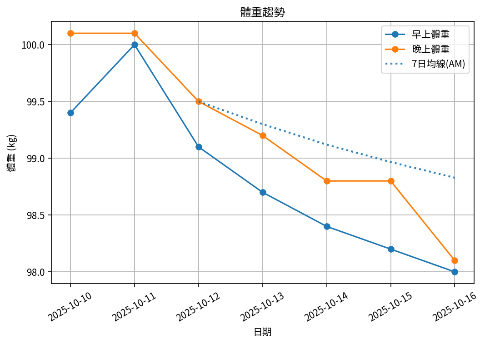
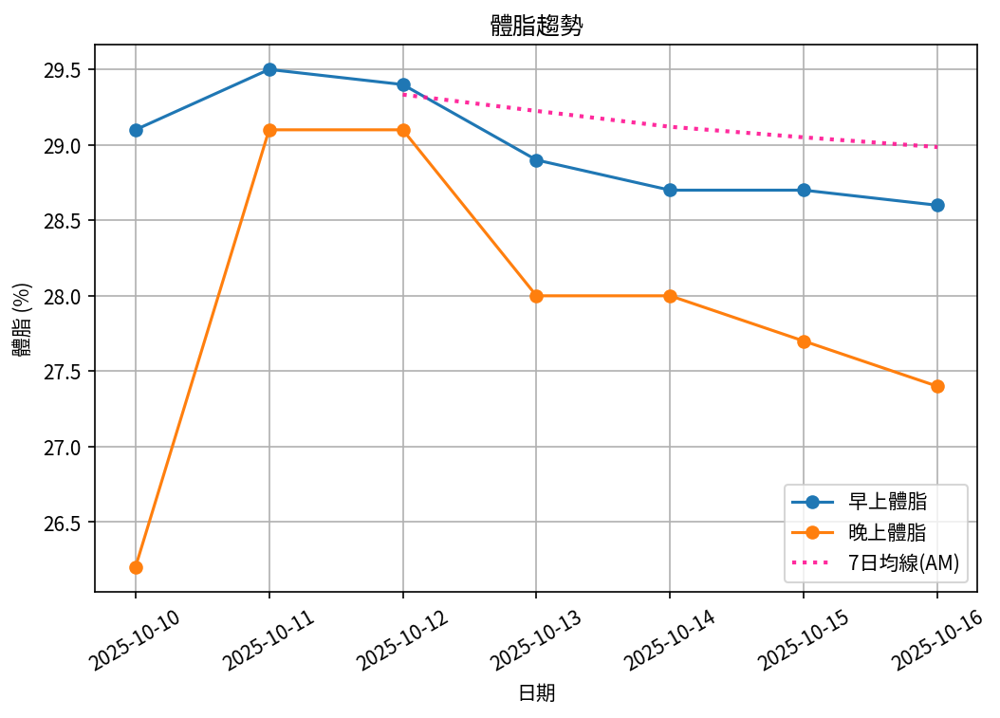
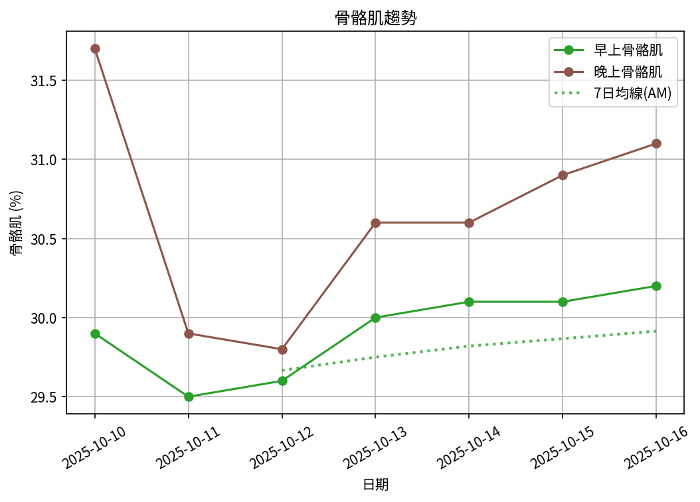

# 📊 減重週報（2025-CW09)

**週期：2025/10/10 ～ 2025/10/16**  

---

## 📈 體重與體脂紀錄

| 日期         |   早上體重 (kg) |   晚上體重 (kg) |   早上體脂 (%) |   晚上體脂 (%) |   早上內臟脂肪 |   晚上內臟脂肪 |   早上骨骼肌 (%) |   晚上骨骼肌 (%) |
|:-------------|----------------:|----------------:|---------------:|---------------:|---------------:|---------------:|-----------------:|-----------------:|
| 10/10 (週五) |            99.4 |           100.1 |           29.1 |           26.2 |             17 |             17 |             29.9 |             31.7 |
| 10/11 (週六) |           100   |           100.1 |           29.5 |           29.1 |             17 |             17 |             29.5 |             29.9 |
| 10/12 (週日) |            99.1 |            99.5 |           29.4 |           29.1 |             17 |             17 |             29.6 |             29.8 |
| 10/13 (週一) |            98.7 |            99.2 |           28.9 |           28   |             16 |             17 |             30   |             30.6 |
| 10/14 (週二) |            98.4 |            98.8 |           28.7 |           28   |             16 |             16 |             30.1 |             30.6 |
| 10/15 (週三) |            98.2 |           nan   |           28.7 |          nan   |             16 |            nan |             30.1 |            nan   |

---

## 📊 趨勢圖

---

## 📌 本週統計

- 體重（AM）：99.4 → 98.2 kg  (**-1.2 kg**), 週平均 99.0 kg  
- 體重（PM）：100.1 → 98.8 kg  (**-1.3 kg**), 週平均 99.5 kg  
- 體重（AM+PM 平均）：99.3 kg  

- 體脂（AM）：29.1% → 28.7%  (**-0.4%**), 週平均 29.0%  
- 體脂（PM）：26.2% → 28.0%  (**1.8%**), 週平均 28.1%  
- 體脂（AM+PM 平均）：28.6%  

- 內臟脂肪（AM）：17.0 → 16.0  (**-1.0**), 週平均 16.5  
- 內臟脂肪（PM）：17.0 → 16.0  (**-1.0**), 週平均 16.8  
- 內臟脂肪（AM+PM 平均）：16.6  
  💡 *標準：≤9.5，偏高：10-14.5，過高：≥15*  

- 骨骼肌（AM）：29.9% → 30.1%  (**0.2%**), 週平均 29.9%  
- 骨骼肌（PM）：31.7% → 30.6%  (**-1.1%**), 週平均 30.5%  
- 骨骼肌（AM+PM 平均）：30.2%  

- 脂肪重量（AM）：28.9 → 28.2 kg  (**-0.7 kg**), 週平均 28.8 kg  
- 脂肪重量（PM）：26.2 → 27.7 kg  (**1.4 kg**), 週平均 27.9 kg  
- 脂肪重量（AM+PM 平均）：28.4 kg  

- 骨骼肌重量（AM）：29.7 → 29.6 kg  (**-0.2 kg**), 週平均 29.6 kg  
- 骨骼肌重量（PM）：31.7 → 30.2 kg  (**-1.5 kg**), 週平均 30.4 kg  
- 骨骼肌重量（AM+PM 平均）：30.0 kg  

- 紀錄天數：6 天

---

## ✅ 建議
- 維持 **高蛋白 (每公斤 1.6–2.0 g)** 與 **每週 2–3 次阻力訓練**  
- 飲水 **≥ 3 L/天**（依活動量調整）  
- 若每週下降 > 2.5 kg，建議微調熱量或與醫師討論  

---

## 🧪 組成品質（近28天）

- 脂肪/體重 下降比例：62%（良好）  
- 體重變化：-1.2 kg，脂肪重量變化：-0.7 kg（AM）  

---

## 🧭 本期狀態解析

| 指標 | 變化量 | 對照門檻 | 判定 |
|:--|:--:|:--|:--|
| 脂肪重量 (AM) | -0.7 kg | 有效下降 ≥ 0.3 kg／週 | ⚖️ 脂肪下降（尚未達顯著） |
| 骨骼肌重量 (AM) | -0.2 kg | 有效上升 ≥ 0.2 kg／週（±0.2 kg 為誤差範圍） | ⚖️ 穩定（在誤差範圍） |

### 🔍 綜合判定

🔵 分類：**其他**
本期變化方向不明顯或存在相反趨勢，建議以 4 週趨勢為準。

---

## 🎯 KPI 目標與進度 (本週)

- 體重：目標 -0.8 kg  
  - 由 99.4 → 目標 98.6 kg  | 進度 [████████████████████] 100%  
- 體脂率（AM）：目標 -0.4 個百分點  
  - 由 29.1% → 目標 28.7%  | 進度 [████████████████████] 100%  
- 內臟脂肪（AM）：目標 -0.5  
  - 由 17.0 → 目標 16.5  | 進度 [████████████████████] 100%  
- 骨骼肌重量（AM）：目標 ≥ 持平  | 變化 -0.2 kg  | 進度 [░░░░░░░░░░░░░░░░░░░░] 0%  
- 體重達標 ETA：~11.4 週（2026-01-03）  
- 體脂率達標 ETA（AM）：~19.6 週（2026-03-01）  
- 脂肪重量達標 ETA：~18.0 週（2026-02-18）  

---

## 🧠 本期數據分析與總結

- ✅ 體重：1.2 kg 下降（AM）
- ✅ 體脂率：0.4 個百分點下降（AM）
- ✅ 內臟脂肪：1.0 降低（AM）
- ✅ 骨骼肌率：+0.2 個百分點（AM）
- ✅ 脂肪重量：-0.7 kg（AM）
- ⚠️ 骨骼肌重量下降：0.2 kg，建議調整赤字與訓練恢復。

- 下一步：蛋白 1.8–2.2 g/kg、每週 3–4 次阻力訓練、穩定睡眠與步數，維持每週 -0.5～-0.8 kg。
