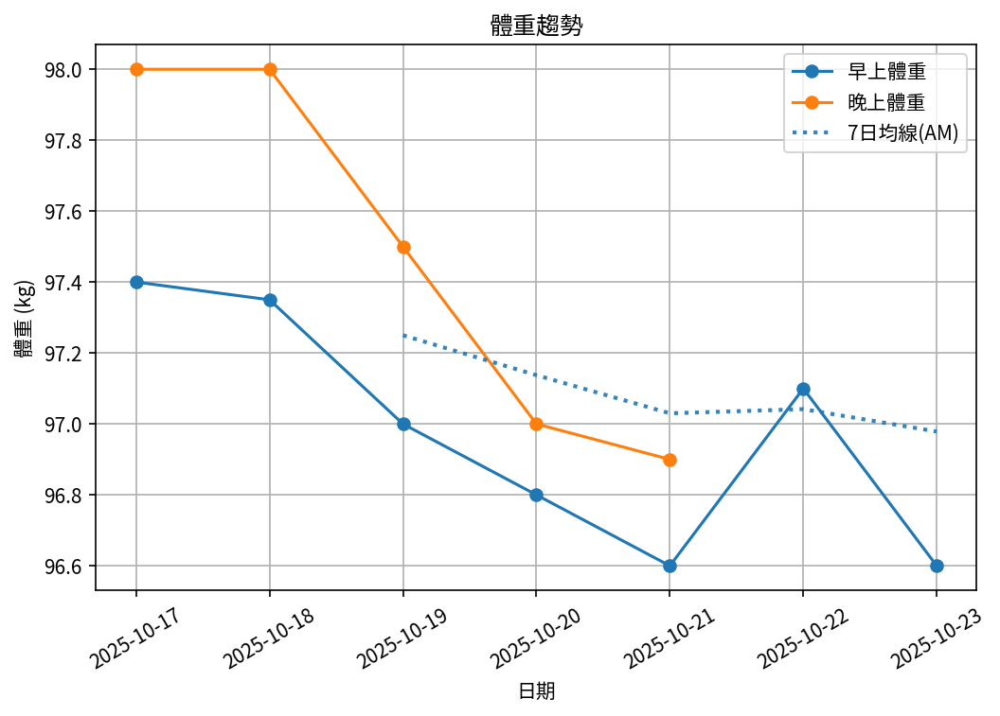
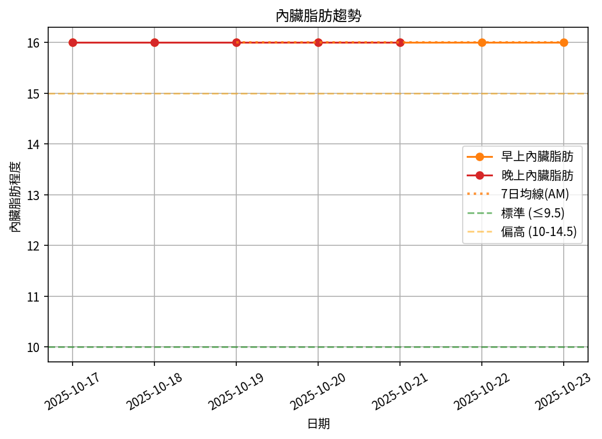

# 📊 減重週報（2025-CW10)

**週期：2025/10/17 ～ 2025/10/23**  

---

## 📈 體重與體脂紀錄

| 日期         |   早上體重 (kg) |   晚上體重 (kg) |   早上體脂 (%) |   晚上體脂 (%) |   早上內臟脂肪 |   晚上內臟脂肪 |   早上骨骼肌 (%) |   晚上骨骼肌 (%) |
|:-------------|----------------:|----------------:|---------------:|---------------:|---------------:|---------------:|-----------------:|-----------------:|
| 10/17 (週五) |           97.4  |            98   |           29.2 |           27.3 |             16 |             16 |            29.7  |             31.1 |
| 10/18 (週六) |           97.35 |            98   |           28.9 |           27.7 |             16 |             16 |            29.95 |             30.9 |
| 10/19 (週日) |           97    |            97.5 |           28.9 |           27   |             16 |             16 |            30    |             31.4 |
| 10/20 (週一) |           96.8  |            97   |           28.8 |           27.3 |             16 |             16 |            30.1  |             31.2 |
| 10/21 (週二) |           96.6  |            96.9 |           29   |           27.4 |             16 |             16 |            29.9  |             31.1 |
| 10/22 (週三) |           97.1  |           nan   |           28.6 |          nan   |             16 |            nan |            30.2  |            nan   |
| 10/23 (週四) |           96.6  |           nan   |           28.8 |          nan   |             16 |            nan |            30    |            nan   |

---

## 📊 趨勢圖

---

## 📌 本週統計

- 體重（AM）：97.4 → 96.6 kg  (**-0.8 kg**), 週平均 97.0 kg  
- 體重（PM）：98.0 → 96.9 kg  (**-1.1 kg**), 週平均 97.5 kg  
- 體重（AM+PM 平均）：97.2 kg  

- 體脂（PM 趨勢基準）：27.3% → 27.4%  (**0.1%**), 週平均 27.3%  
- 體脂（AM 對照）：29.2% → 28.8%  (**-0.4%**), 週平均 28.9%  
- 體脂（AM+PM 平均）：28.1%  

- 內臟脂肪（AM）：16.0 → 16.0  (**0.0**), 週平均 16.0  
- 內臟脂肪（PM）：16.0 → 16.0  (**0.0**), 週平均 16.0  
- 內臟脂肪（AM+PM 平均）：16.0  
  💡 *標準：≤9.5，偏高：10-14.5，過高：≥15*  

- 骨骼肌（AM）：29.7% → 30.0%  (**0.3%**), 週平均 30.0%  
- 骨骼肌（PM）：31.1% → 31.1%  (**0.0%**), 週平均 31.1%  
- 骨骼肌（AM+PM 平均）：30.6%  

- 脂肪重量（AM）：28.4 → 27.8 kg  (**-0.6 kg**), 週平均 28.0 kg  
- 脂肪重量（PM）：26.8 → 26.6 kg  (**-0.2 kg**), 週平均 26.7 kg  
- 脂肪重量（AM+PM 平均）：27.3 kg  

- 骨骼肌重量（AM）：28.9 → 29.0 kg  (**0.1 kg**), 週平均 29.1 kg  
- 骨骼肌重量（PM）：30.5 → 30.1 kg  (**-0.4 kg**), 週平均 30.4 kg  
- 骨骼肌重量（AM+PM 平均）：29.7 kg  

- 紀錄天數：7 天

---

## ✅ 建議
- 維持 **高蛋白 (每公斤 1.6–2.0 g)** 與 **每週 2–3 次阻力訓練**  
- 飲水 **≥ 3 L/天**（依活動量調整）  
- 若每週下降 > 2.5 kg，建議微調熱量或與醫師討論  

---

## 🧪 組成品質（近28天）

- 脂肪/體重 下降比例：75%（良好）  
- 體重變化：-0.8 kg，脂肪重量變化：-0.6 kg（AM）  

---

## 🧭 本期狀態解析

| 指標 | 變化量 | 對照門檻 | 判定 |
|:--|:--:|:--|:--|
| 脂肪重量 (AM) | -0.6 kg | 有效下降 ≥ 0.3 kg／週 | ⚖️ 脂肪下降（尚未達顯著） |
| 骨骼肌重量 (AM) | +0.1 kg | 有效上升 ≥ 0.2 kg／週（±0.2 kg 為誤差範圍） | ⚖️ 穩定（在誤差範圍） |

### 🔍 綜合判定

🔵 分類：**其他**
本期變化方向不明顯或存在相反趨勢，建議以 4 週趨勢為準。

---

## 🎯 KPI 目標與進度 (本週)

- 體重：目標 -0.8 kg  
  - 由 97.4 → 目標 96.6 kg  | 進度 [████████████████████] 100%  
- 體脂率（PM 趨勢基準）：目標 -0.4 個百分點  
  - 由 27.3% → 目標 26.9%  | 進度 [█████░░░░░░░░░░░░░░░] 25%  
- 內臟脂肪（AM）：目標 -0.5  
  - 由 16.0 → 目標 15.5  | 進度 [░░░░░░░░░░░░░░░░░░░░] 0%  
- 骨骼肌重量（AM）：目標 ≥ 持平  | 變化 +0.1 kg  | 進度 [████████████████████] 100%  
- 體重達標 ETA：~18.9 週（2026-03-04）  
- 體脂率達標 ETA（PM 趨勢基準）：~27.6 週（2026-05-04）  
- 脂肪重量達標 ETA：~26.1 週（2026-04-24）  

---

## 🧠 本期數據分析與總結

- ✅ 體重：0.8 kg 下降（AM）
- ✅ 體脂率：0.4 個百分點下降（AM）
- ✅ 骨骼肌率：+0.3 個百分點（AM）
- ✅ 脂肪重量：-0.6 kg（AM）

- 下一步：蛋白 1.8–2.2 g/kg、每週 3–4 次阻力訓練、穩定睡眠與步數，維持每週 -0.5～-0.8 kg。
