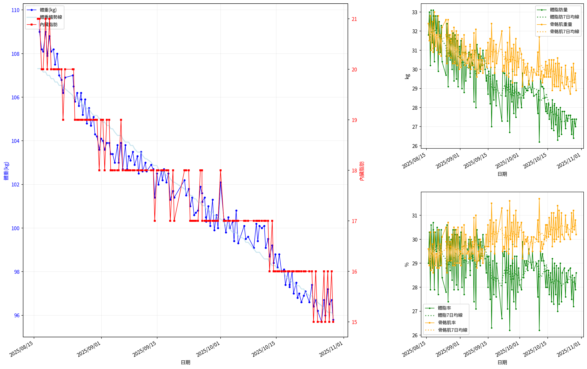
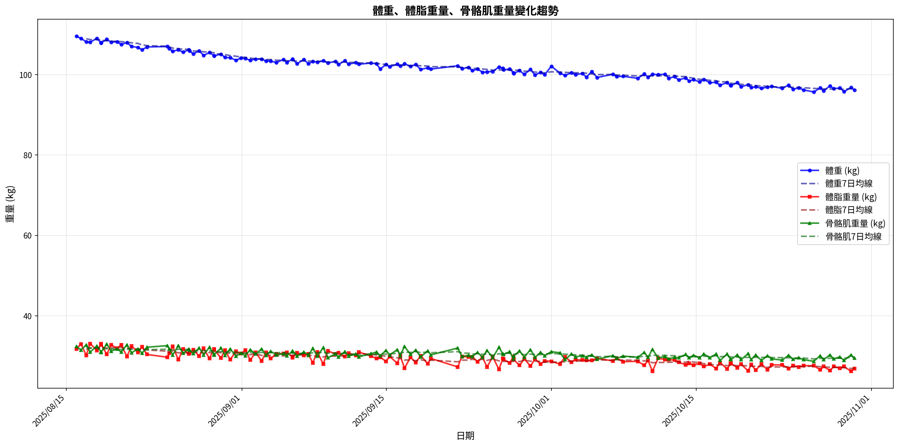
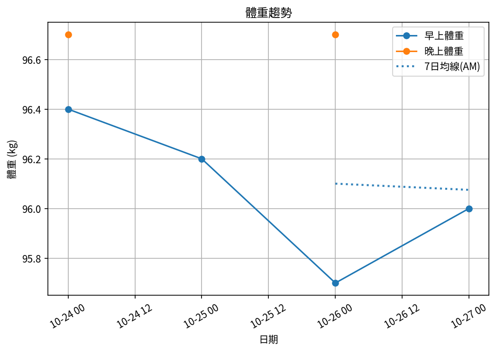
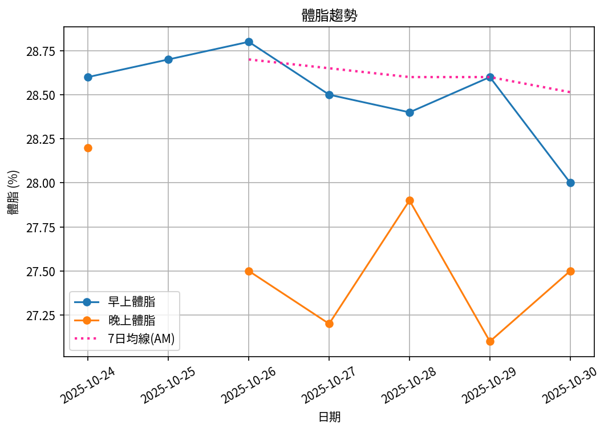
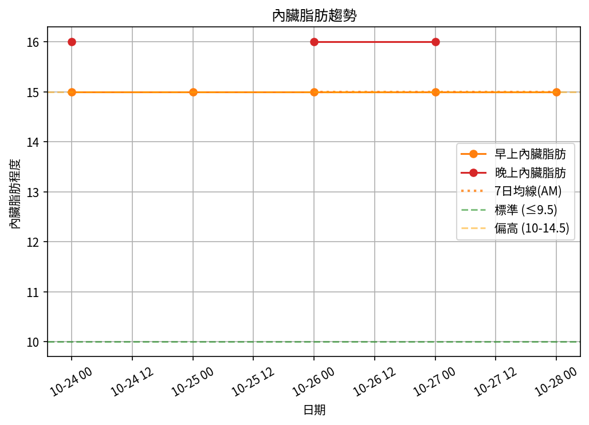
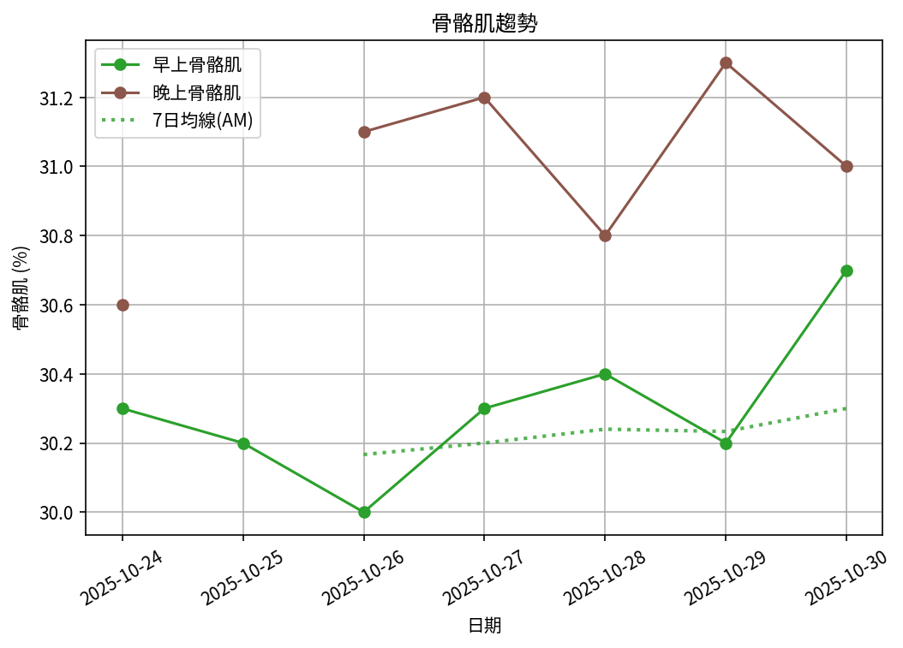

# 📊 減重週報（2025-CW11)

**週期：2025/10/24 ～ 2025/10/30**  

---

## 📈 體重與體脂紀錄

| 日期         |   早上體重 (kg) |   晚上體重 (kg) |   早上體脂 (%) |   晚上體脂 (%) |   早上內臟脂肪 |   晚上內臟脂肪 |   早上骨骼肌 (%) |   晚上骨骼肌 (%) |
|:-------------|----------------:|----------------:|---------------:|---------------:|---------------:|---------------:|-----------------:|-----------------:|
| 10/24 (週五) |            96.4 |            96.7 |           28.6 |           28.2 |             15 |             16 |             30.3 |             30.6 |
| 10/25 (週六) |            96.2 |           nan   |           28.7 |          nan   |             15 |            nan |             30.2 |            nan   |
| 10/26 (週日) |            95.7 |            96.7 |           28.8 |           27.5 |             15 |             16 |             30   |             31.1 |
| 10/27 (週一) |            96   |            97.2 |           28.5 |           27.2 |             15 |             16 |             30.3 |             31.2 |
| 10/28 (週二) |            96.5 |            96.7 |           28.4 |           27.9 |             15 |             16 |             30.4 |             30.8 |
| 10/29 (週三) |            95.8 |           nan   |           28.6 |          nan   |             15 |            nan |             30.2 |            nan   |

---

## 📊 趨勢圖

---

## 📌 本週統計

- 體重（AM）：96.4 → 95.8 kg  (**-0.6 kg**), 週平均 96.1 kg  
- 體重（PM）：96.7 → 96.7 kg  (**0.0 kg**), 週平均 96.8 kg  
- 體重（AM+PM 平均）：96.5 kg  

- 體脂（AM）：28.6% → 28.6%  (**0.0%**), 週平均 28.6%  
- 體脂（PM 對照）：28.2% → 27.9%  (**-0.3%**), 週平均 27.7%  
- 體脂（AM+PM 平均）：28.1%  

- 內臟脂肪（AM）：15.0 → 15.0  (**0.0**), 週平均 15.0  
- 內臟脂肪（PM）：16.0 → 16.0  (**0.0**), 週平均 16.0  
- 內臟脂肪（AM+PM 平均）：15.5  
  💡 *標準：≤9.5，偏高：10-14.5，過高：≥15*  

- 骨骼肌（AM）：30.3% → 30.2%  (**-0.1%**), 週平均 30.2%  
- 骨骼肌（PM）：30.6% → 30.8%  (**0.2%**), 週平均 30.9%  
- 骨骼肌（AM+PM 平均）：30.6%  

- 脂肪重量（AM）：27.6 → 27.4 kg  (**-0.2 kg**), 週平均 27.5 kg  
- 脂肪重量（PM）：27.3 → 27.0 kg  (**-0.3 kg**), 週平均 26.8 kg  
- 脂肪重量（AM+PM 平均）：27.2 kg  

- 骨骼肌重量（AM）：29.2 → 28.9 kg  (**-0.3 kg**), 週平均 29.1 kg  
- 骨骼肌重量（PM）：29.6 → 29.8 kg  (**0.2 kg**), 週平均 29.9 kg  
- 骨骼肌重量（AM+PM 平均）：29.5 kg  

- 紀錄天數：6 天

---

## ✅ 建議
- 維持 **高蛋白 (每公斤 1.6–2.0 g)** 與 **每週 2–3 次阻力訓練**  
- 飲水 **≥ 3 L/天**（依活動量調整）  
- 若每週下降 > 2.5 kg，建議微調熱量或與醫師討論  

---

## 🧪 組成品質（近28天）

- 脂肪/體重 下降比例：33%（需留意）  
- 體重變化：-0.6 kg，脂肪重量變化：-0.2 kg（AM）  

---

## 🧭 本期狀態解析

| 指標 | 變化量 | 對照門檻 | 判定 |
|:--|:--:|:--|:--|
| 脂肪重量 (AM) | -0.2 kg | 有效下降 ≥ 0.3 kg／週 | ⚖️ 波動/停滯 |
| 骨骼肌重量 (AM) | -0.3 kg | 有效上升 ≥ 0.2 kg／週（±0.2 kg 為誤差範圍） | ⚠️ 肌肉有效下降 |

### 🔍 綜合判定

🟡 分類：**脂肪停滯**
建議檢查總熱量赤字與日常活動量，並持續追蹤 1–2 週。

---

## 🎯 KPI 目標與進度 (本週)

- 體重：目標 -0.8 kg  
  - 由 96.4 → 目標 95.6 kg  | 進度 [███████████████░░░░░] 75%  
- 體脂率（AM）：目標 -0.4 個百分點  
  - 由 28.6% → 目標 28.2%  | 進度 [███████████████░░░░░] 75%  
- 內臟脂肪（AM）：目標 -0.5  
  - 由 15.0 → 目標 14.5  | 進度 [░░░░░░░░░░░░░░░░░░░░] 0%  
- 骨骼肌重量（AM）：目標 ≥ 持平  | 變化 -0.3 kg  | 進度 [░░░░░░░░░░░░░░░░░░░░] 0%  
- 體重達標 ETA：~20.0 週（2026-03-18）  
- 體脂率達標 ETA（AM）：~88.7 週（2027-07-12）  
- 脂肪重量達標 ETA：~64.0 週（2027-01-20）  

---

## 🧠 本期數據分析與總結

- ✅ 體重：0.6 kg 下降（AM）
- ✅ 脂肪重量：-0.2 kg（AM）
- ⚠️ 骨骼肌重量下降：0.3 kg，建議調整赤字與訓練恢復。
- ⚠️ 組成品質偏低（脂肪/體重 < 40%），建議提高蛋白與阻力訓練，減少過大赤字。

- 下一步：蛋白 1.8–2.2 g/kg、每週 3–4 次阻力訓練、穩定睡眠與步數，維持每週 -0.5～-0.8 kg。
