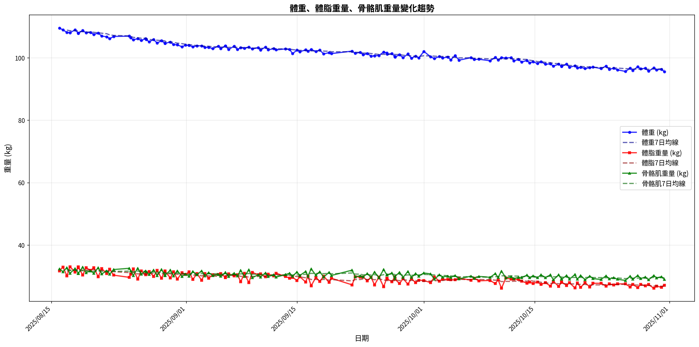
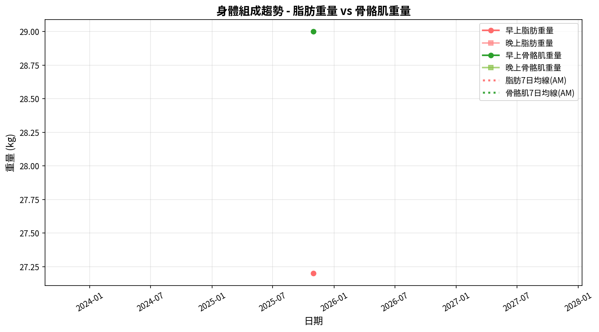
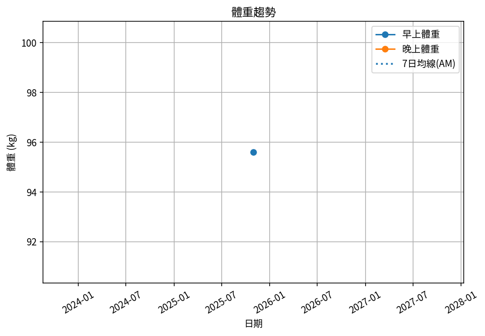
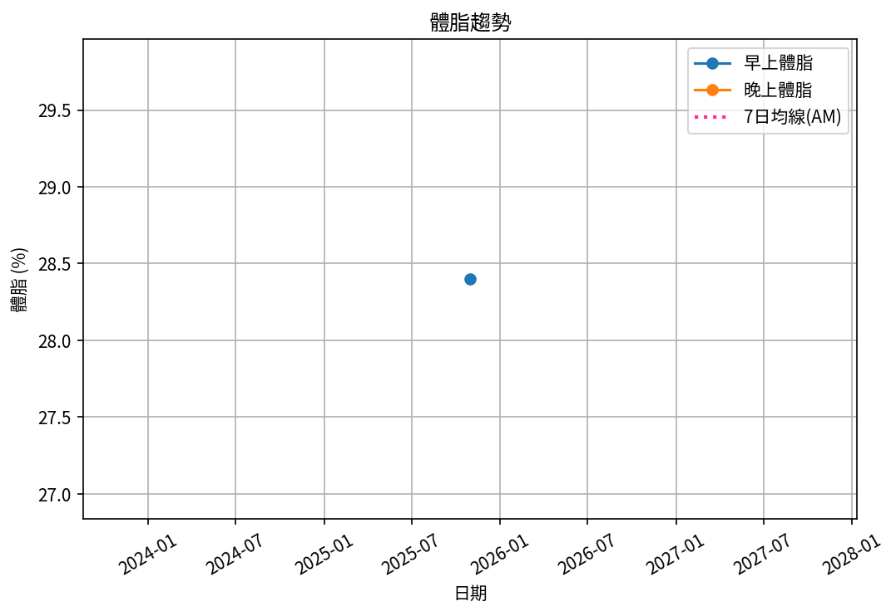
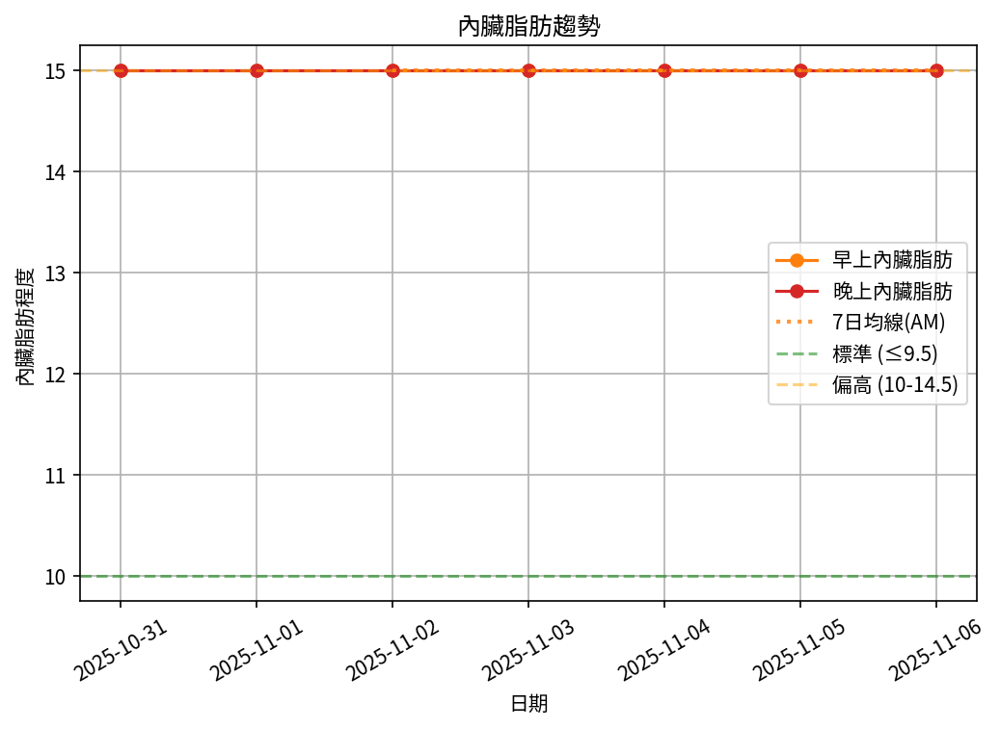
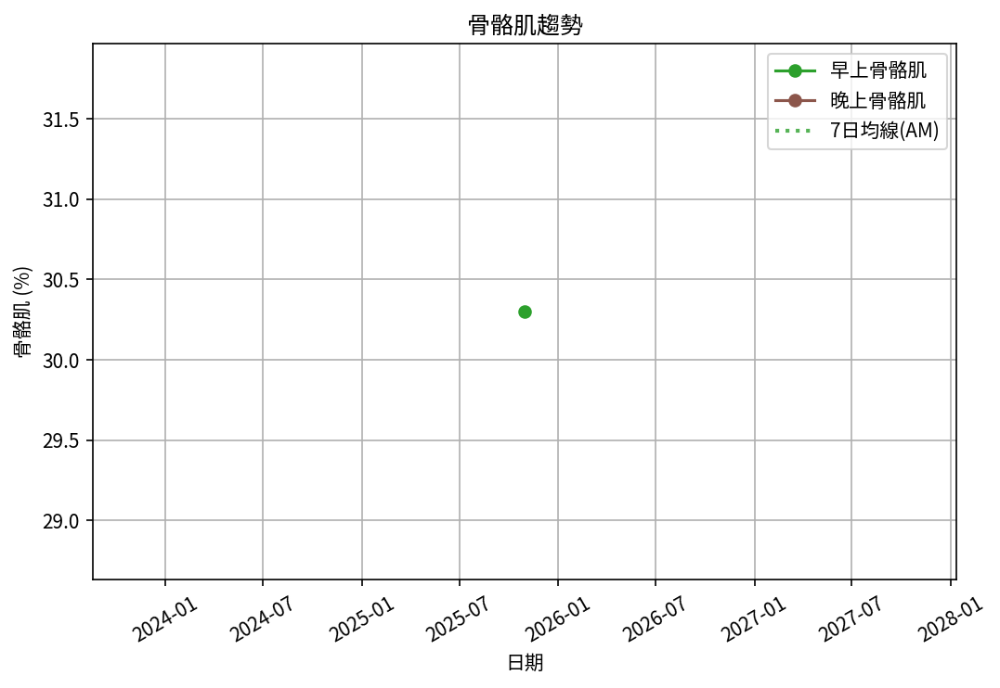

# 📊 減重週報（2025-CW12)

**週期：2025/10/31 ～ 2025/11/06**  

---

## 📈 體重與體脂紀錄

| 日期         |   早上體重 (kg) |   晚上體重 (kg) |   早上體脂 (%) |   晚上體脂 (%) |   早上內臟脂肪 |   晚上內臟脂肪 |   早上骨骼肌 (%) |   晚上骨骼肌 (%) |
|:-------------|----------------:|----------------:|---------------:|---------------:|---------------:|---------------:|-----------------:|-----------------:|
| 10/31 (週五) |            95.6 |            96.1 |           28.4 |           27.5 |             15 |             15 |             30.3 |             31.1 |
| 11/01 (週六) |            95.3 |            94.8 |           28.6 |           27.6 |             15 |             15 |             30.2 |             31   |
| 11/02 (週日) |            94.7 |            95.6 |           28   |           28   |             15 |             15 |             30.7 |             30.7 |
| 11/03 (週一) |            95   |            95.2 |           28   |           27.2 |             15 |             15 |             30.7 |             31.3 |
| 11/04 (週二) |            94.9 |            95.1 |           28.3 |           27.2 |             15 |             15 |             30.4 |             31.2 |
| 11/05 (週三) |            94.4 |            95   |           28.4 |           27.7 |             15 |             15 |             30.3 |             30.9 |
| 11/06 (週四) |            94.3 |            94.9 |           28.5 |           26.9 |             15 |             15 |             30.2 |             31.4 |

---

## 📊 趨勢圖

---

## 📌 本週統計

- 體重（AM）：95.6 → 94.3 kg  (**-1.3 kg**), 週平均 94.9 kg  
- 體重（PM）：96.1 → 94.9 kg  (**-1.2 kg**), 週平均 95.2 kg  
- 體重（AM+PM 平均）：95.1 kg  

- 體脂（AM）：28.4% → 28.5%  (**0.1%**), 週平均 28.3%  
- 體脂（PM 對照）：27.5% → 26.9%  (**-0.6%**), 週平均 27.4%  
- 體脂（AM+PM 平均）：27.9%  

- 內臟脂肪（AM）：15.0 → 15.0  (**0.0**), 週平均 15.0  
- 內臟脂肪（PM）：15.0 → 15.0  (**0.0**), 週平均 15.0  
- 內臟脂肪（AM+PM 平均）：15.0  
  💡 *標準：≤9.5，偏高：10-14.5，過高：≥15*  

- 骨骼肌（AM）：30.3% → 30.2%  (**-0.1%**), 週平均 30.4%  
- 骨骼肌（PM）：31.1% → 31.4%  (**0.3%**), 週平均 31.1%  
- 骨骼肌（AM+PM 平均）：30.7%  

- 脂肪重量（AM）：27.2 → 26.9 kg  (**-0.3 kg**), 週平均 26.9 kg  
- 脂肪重量（PM）：26.4 → 25.5 kg  (**-0.9 kg**), 週平均 26.1 kg  
- 脂肪重量（AM+PM 平均）：26.5 kg  

- 骨骼肌重量（AM）：29.0 → 28.5 kg  (**-0.5 kg**), 週平均 28.9 kg  
- 骨骼肌重量（PM）：29.9 → 29.8 kg  (**-0.1 kg**), 週平均 29.6 kg  
- 骨骼肌重量（AM+PM 平均）：29.2 kg  

- 紀錄天數：7 天

---

## ✅ 建議
- 維持 **高蛋白 (每公斤 1.6–2.0 g)** 與 **每週 2–3 次阻力訓練**  
- 飲水 **≥ 3 L/天**（依活動量調整）  
- 若每週下降 > 2.5 kg，建議微調熱量或與醫師討論  

---

## 🧪 組成品質（近28天）

- 脂肪/體重 下降比例：23%（需留意）  
- 體重變化：-1.3 kg，脂肪重量變化：-0.3 kg（AM）  

---

## 🧭 本期狀態解析

| 指標 | 變化量 | 對照門檻 | 判定 |
|:--|:--:|:--|:--|
| 脂肪重量 (AM) | -0.3 kg | 有效下降 ≥ 0.3 kg／週 | ⚖️ 脂肪下降（尚未達顯著） |
| 骨骼肌重量 (AM) | -0.5 kg | 有效上升 ≥ 0.2 kg／週（±0.2 kg 為誤差範圍） | ⚠️ 肌肉顯著下降 |

### 🔍 綜合判定

🔵 分類：**其他**
本期變化方向不明顯或存在相反趨勢，建議以 4 週趨勢為準。

---

## 🎯 KPI 目標與進度 (本週)

- 體重：目標 -0.8 kg  
  - 由 95.6 → 目標 94.8 kg  | 進度 [████████████████████] 100%  
- 體脂率（AM）：目標 -0.4 個百分點  
  - 由 28.4% → 目標 28.0%  | 進度 [████████████████████] 100%  
- 內臟脂肪（AM）：目標 -0.5  
  - 由 15.0 → 目標 14.5  | 進度 [░░░░░░░░░░░░░░░░░░░░] 0%  
- 骨骼肌重量（AM）：目標 ≥ 持平  | 變化 -0.5 kg  | 進度 [░░░░░░░░░░░░░░░░░░░░] 0%  
- 體重達標 ETA：~10.1 週（2026-01-16）  
- 體脂率達標 ETA（AM）：~92.7 週（2027-08-17）  
- 脂肪重量達標 ETA：~49.7 週（2026-10-20）  

---

## 🧠 本期數據分析與總結

- ✅ 體重：1.3 kg 下降（AM）
- ✅ 脂肪重量：-0.3 kg（AM）
- ⚠️ 骨骼肌重量下降：0.5 kg，建議調整赤字與訓練恢復。
- ⚠️ 組成品質偏低（脂肪/體重 < 40%），建議提高蛋白與阻力訓練，減少過大赤字。

- 下一步：蛋白 1.8–2.2 g/kg、每週 3–4 次阻力訓練、穩定睡眠與步數，維持每週 -0.5～-0.8 kg。
