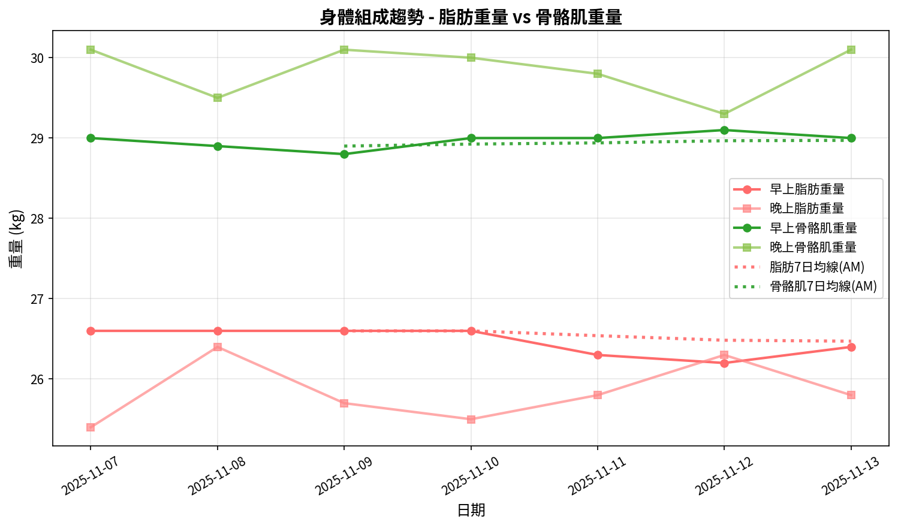
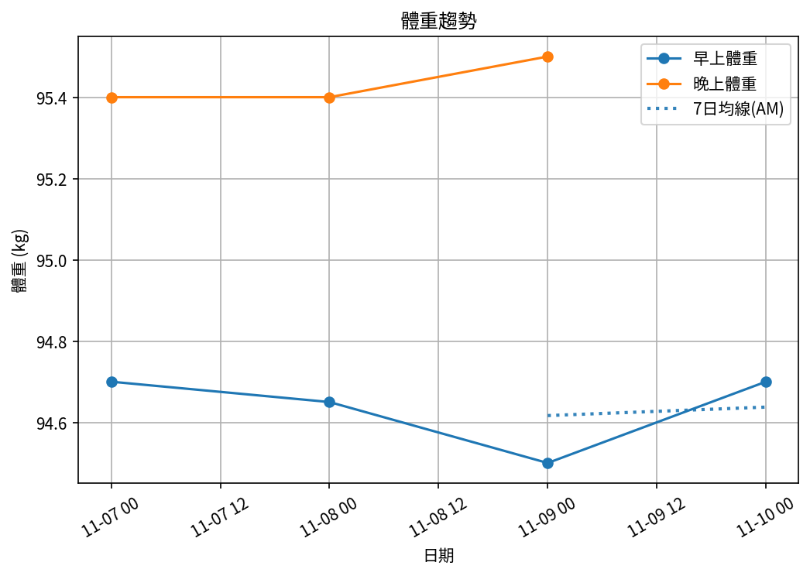
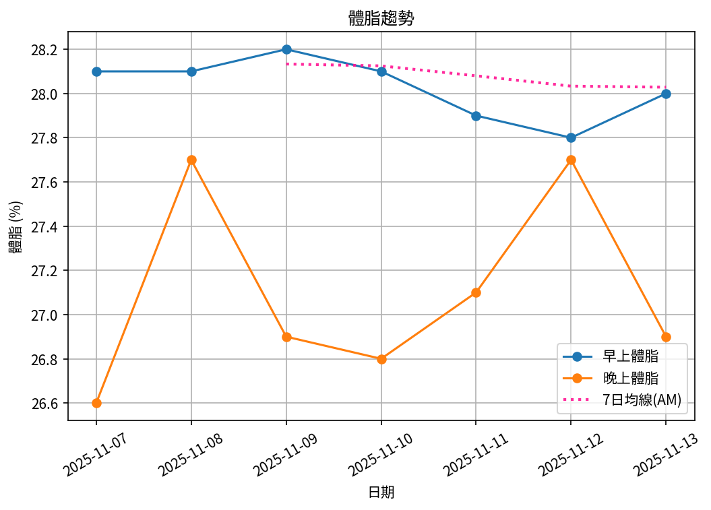
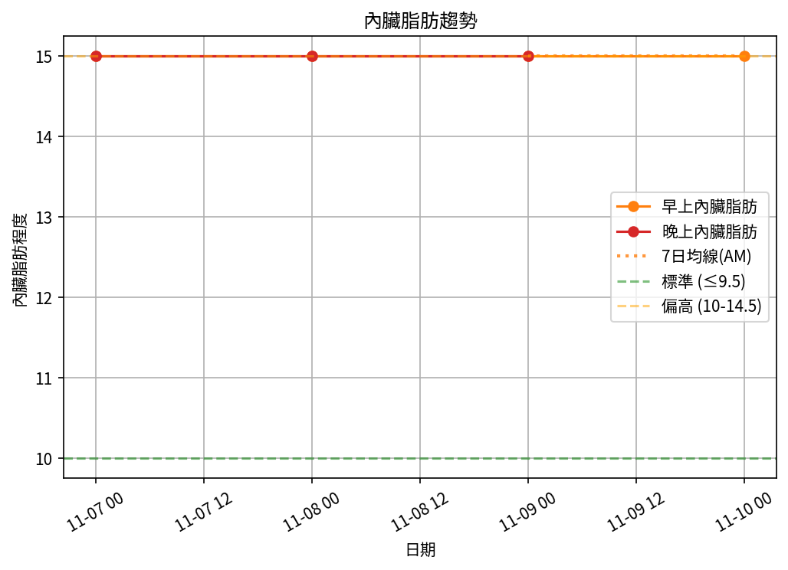
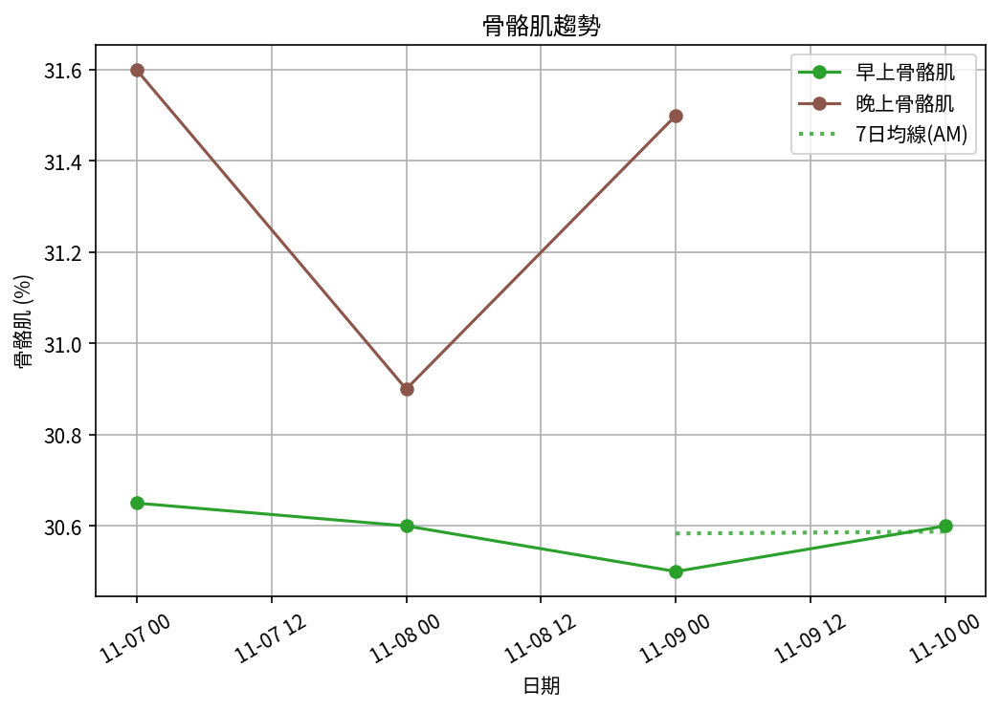

# 📊 減重週報（2025-CW13)

**週期：2025/11/07 ～ 2025/11/13**  

---

## 📈 體重與體脂紀錄

| 日期         |   早上體重 (kg) |   晚上體重 (kg) |   早上體脂 (%) |   晚上體脂 (%) |   早上內臟脂肪 |   晚上內臟脂肪 |   早上骨骼肌 (%) |   晚上骨骼肌 (%) |
|:-------------|----------------:|----------------:|---------------:|---------------:|---------------:|---------------:|-----------------:|-----------------:|
| 11/07 (週五) |            94.7 |            95.4 |           28.1 |           26.6 |             15 |             15 |             30.6 |             31.6 |
| 11/08 (週六) |            94.6 |            95.4 |           28.1 |           27.7 |             15 |             15 |             30.6 |             30.9 |
| 11/09 (週日) |            94.5 |            95.5 |           28.2 |           26.9 |             15 |             15 |             30.5 |             31.5 |
| 11/10 (週一) |            94.7 |            95.3 |           28.1 |           26.8 |             15 |             15 |             30.6 |             31.5 |
| 11/11 (週二) |            94.4 |            95.2 |           27.9 |           27.1 |             15 |             15 |             30.7 |             31.3 |
| 11/12 (週三) |            94.4 |            95.1 |           27.8 |           27.7 |             15 |             15 |             30.8 |             30.8 |
| 11/13 (週四) |            94.4 |            95.8 |           28   |           26.9 |             15 |             15 |             30.7 |             31.4 |

---

## 📊 趨勢圖

---

## 📌 本週統計

- 體重（AM）：94.7 → 94.4 kg  (**-0.3 kg**), 週平均 94.5 kg  
- 體重（PM）：95.4 → 95.8 kg  (**0.4 kg**), 週平均 95.4 kg  
- 體重（AM+PM 平均）：95.0 kg  

- 體脂（AM）：28.1% → 28.0%  (**-0.1%**), 週平均 28.0%  
- 體脂（PM 對照）：26.6% → 26.9%  (**0.3%**), 週平均 27.1%  
- 體脂（AM+PM 平均）：27.6%  

- 內臟脂肪（AM）：15.0 → 15.0  (**0.0**), 週平均 15.0  
- 內臟脂肪（PM）：15.0 → 15.0  (**0.0**), 週平均 15.0  
- 內臟脂肪（AM+PM 平均）：15.0  
  💡 *標準：≤9.5，偏高：10-14.5，過高：≥15*  

- 骨骼肌（AM）：30.6% → 30.7%  (**0.1%**), 週平均 30.6%  
- 骨骼肌（PM）：31.6% → 31.4%  (**-0.2%**), 週平均 31.3%  
- 骨骼肌（AM+PM 平均）：31.0%  

- 脂肪重量（AM）：26.6 → 26.4 kg  (**-0.2 kg**), 週平均 26.5 kg  
- 脂肪重量（PM）：25.4 → 25.8 kg  (**0.4 kg**), 週平均 25.8 kg  
- 脂肪重量（AM+PM 平均）：26.2 kg  

- 骨骼肌重量（AM）：29.0 → 29.0 kg  (**0.0 kg**), 週平均 29.0 kg  
- 骨骼肌重量（PM）：30.1 → 30.1 kg  (**0.0 kg**), 週平均 29.8 kg  
- 骨骼肌重量（AM+PM 平均）：29.4 kg  

- 紀錄天數：7 天

---

## ✅ 建議
- 維持 **高蛋白 (每公斤 1.6–2.0 g)** 與 **每週 2–3 次阻力訓練**  
- 飲水 **≥ 3 L/天**（依活動量調整）  
- 若每週下降 > 2.5 kg，建議微調熱量或與醫師討論  

---

## 🧪 組成品質（近28天）

- 脂肪/體重 下降比例：67%（良好）  
- 體重變化：-0.3 kg，脂肪重量變化：-0.2 kg（AM）  

---

## 🧭 本期狀態解析

| 指標 | 變化量 | 對照門檻 | 判定 |
|:--|:--:|:--|:--|
| 脂肪重量 (AM) | -0.2 kg | 有效下降 ≥ 0.3 kg／週 | ⚖️ 波動/停滯 |
| 骨骼肌重量 (AM) | ±0.0 kg | 有效上升 ≥ 0.2 kg／週（±0.2 kg 為誤差範圍） | ⚖️ 穩定（在誤差範圍） |

### 🔍 綜合判定

🟡 分類：**脂肪停滯**
建議檢查總熱量赤字與日常活動量，並持續追蹤 1–2 週。

---

## 🎯 KPI 目標與進度 (本週)

- 體重：目標 -0.8 kg  
  - 由 94.7 → 目標 93.9 kg  | 進度 [███████░░░░░░░░░░░░░] 37%  
- 體脂率（AM）：目標 -0.4 個百分點  
  - 由 28.1% → 目標 27.7%  | 進度 [███████████████░░░░░] 75%  
- 內臟脂肪（AM）：目標 -0.5  
  - 由 15.0 → 目標 14.5  | 進度 [░░░░░░░░░░░░░░░░░░░░] 0%  
- 骨骼肌重量（AM）：目標 ≥ 持平  | 變化 +0.0 kg  | 進度 [░░░░░░░░░░░░░░░░░░░░] 0%  
- 體重達標 ETA：~44.0 週（2026-09-17）  
- 體脂率達標 ETA（AM）：~78.7 週（2027-05-18）  
- 脂肪重量達標 ETA：~72.6 週（2027-04-05）  

---

## 🧠 本期數據分析與總結

- ✅ 體重：0.3 kg 下降（AM）
- ✅ 體脂率：0.1 個百分點下降（AM）
- ✅ 骨骼肌率：+0.1 個百分點（AM）
- ✅ 脂肪重量：-0.2 kg（AM）

- 下一步：蛋白 1.8–2.2 g/kg、每週 3–4 次阻力訓練、穩定睡眠與步數，維持每週 -0.5～-0.8 kg。
