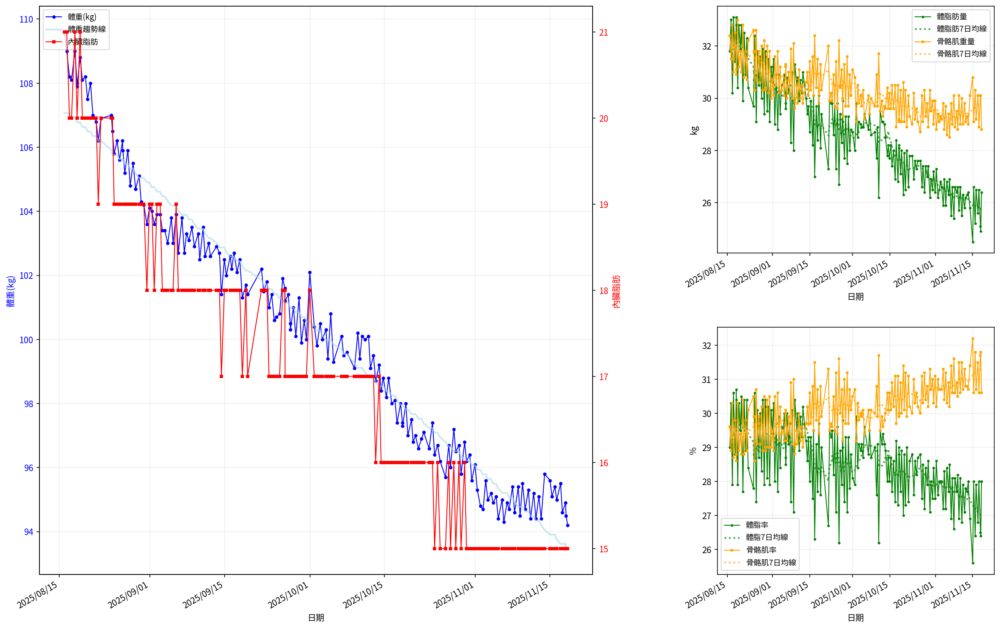
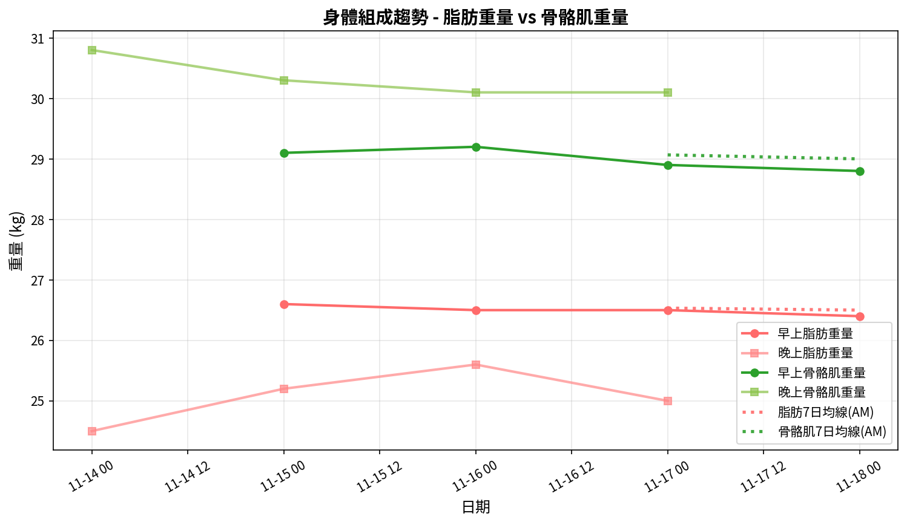
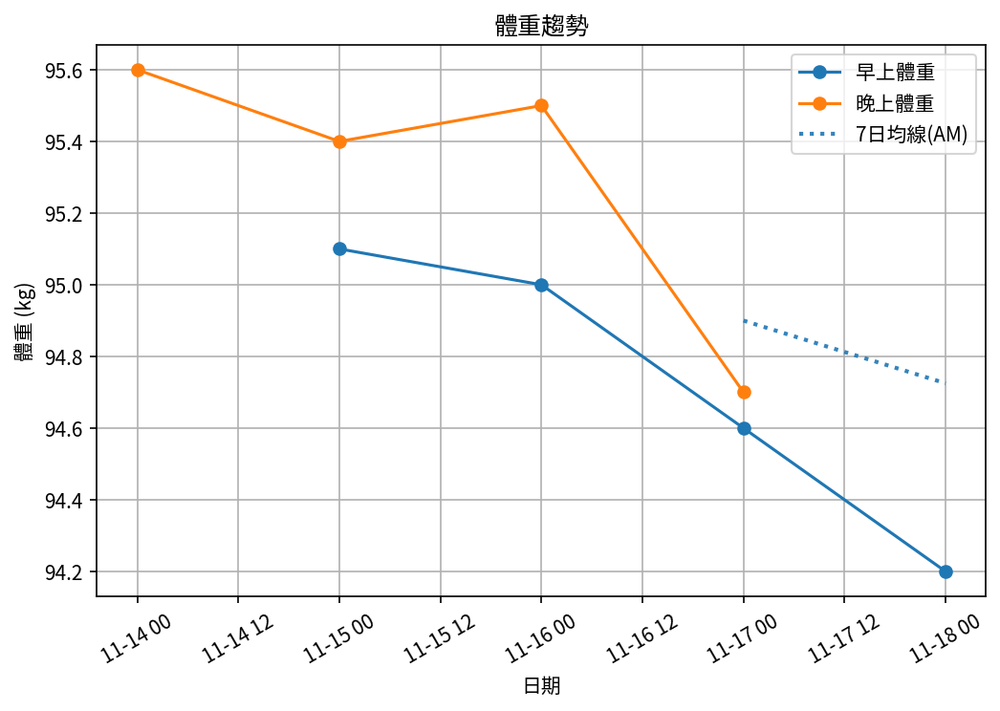
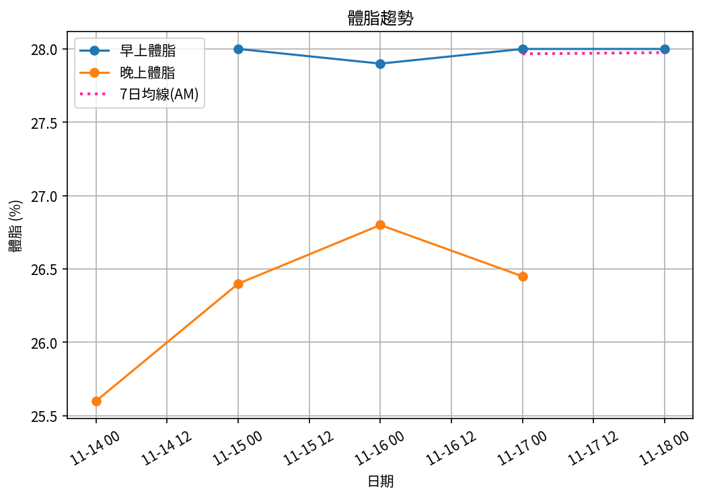
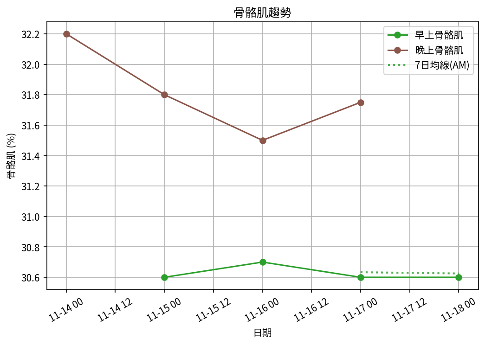

# 📊 減重週報（2025-CW14)

**週期：2025/11/14 ～ 2025/11/20**  

---

## 📈 體重與體脂紀錄

| 日期         |   早上體重 (kg) |   晚上體重 (kg) |   早上體脂 (%) |   晚上體脂 (%) |   早上內臟脂肪 |   晚上內臟脂肪 |   早上骨骼肌 (%) |   晚上骨骼肌 (%) |
|:-------------|----------------:|----------------:|---------------:|---------------:|---------------:|---------------:|-----------------:|-----------------:|
| 11/14 (週五) |           nan   |            95.6 |          nan   |          25.6  |            nan |             15 |            nan   |            32.2  |
| 11/15 (週六) |            95.1 |            95.4 |           28   |          26.4  |             15 |             15 |             30.6 |            31.8  |
| 11/16 (週日) |            95   |            95.5 |           27.9 |          26.8  |             15 |             15 |             30.7 |            31.5  |
| 11/17 (週一) |            94.6 |            94.7 |           28   |          26.45 |             15 |             15 |             30.6 |            31.75 |
| 11/18 (週二) |            94.2 |           nan   |           28   |         nan    |             15 |            nan |             30.6 |           nan    |

---

## 📊 趨勢圖

---

## 📌 本週統計

- 體重（AM）：95.1 → 94.2 kg  (**-0.9 kg**), 週平均 94.7 kg  
- 體重（PM）：95.6 → 94.7 kg  (**-0.9 kg**), 週平均 95.3 kg  
- 體重（AM+PM 平均）：95.0 kg  

- 體脂（AM）：28.0% → 28.0%  (**0.0%**), 週平均 28.0%  
- 體脂（PM 對照）：25.6% → 26.4%  (**0.8%**), 週平均 26.3%  
- 體脂（AM+PM 平均）：27.1%  

- 內臟脂肪（AM）：15.0 → 15.0  (**0.0**), 週平均 15.0  
- 內臟脂肪（PM）：15.0 → 15.0  (**0.0**), 週平均 15.0  
- 內臟脂肪（AM+PM 平均）：15.0  
  💡 *標準：≤9.5，偏高：10-14.5，過高：≥15*  

- 骨骼肌（AM）：30.6% → 30.6%  (**0.0%**), 週平均 30.6%  
- 骨骼肌（PM）：32.2% → 31.8%  (**-0.5%**), 週平均 31.8%  
- 骨骼肌（AM+PM 平均）：31.2%  

- 脂肪重量（AM）：26.6 → 26.4 kg  (**-0.2 kg**), 週平均 26.5 kg  
- 脂肪重量（PM）：24.5 → 25.0 kg  (**0.5 kg**), 週平均 25.1 kg  
- 脂肪重量（AM+PM 平均）：25.8 kg  

- 骨骼肌重量（AM）：29.1 → 28.8 kg  (**-0.3 kg**), 週平均 29.0 kg  
- 骨骼肌重量（PM）：30.8 → 30.1 kg  (**-0.7 kg**), 週平均 30.3 kg  
- 骨骼肌重量（AM+PM 平均）：29.7 kg  

- 紀錄天數：5 天

---

## ✅ 建議
- 維持 **高蛋白 (每公斤 1.6–2.0 g)** 與 **每週 2–3 次阻力訓練**  
- 飲水 **≥ 3 L/天**（依活動量調整）  
- 若每週下降 > 2.5 kg，建議微調熱量或與醫師討論  

---

## 🧪 組成品質（近28天）

- 脂肪/體重 下降比例：22%（需留意）  
- 體重變化：-0.9 kg，脂肪重量變化：-0.2 kg（AM）  

---

## 🧭 本期狀態解析

| 指標 | 變化量 | 對照門檻 | 判定 |
|:--|:--:|:--|:--|
| 脂肪重量 (AM) | -0.2 kg | 有效下降 ≥ 0.3 kg／週 | ⚖️ 波動/停滯 |
| 骨骼肌重量 (AM) | -0.3 kg | 有效上升 ≥ 0.2 kg／週（±0.2 kg 為誤差範圍） | ⚠️ 肌肉有效下降 |

### 🔍 綜合判定

🟡 分類：**脂肪停滯**
建議檢查總熱量赤字與日常活動量，並持續追蹤 1–2 週。

---

## 🎯 KPI 目標與進度 (本週)

- 體重：目標 -0.8 kg  
  - 由 95.1 → 目標 94.3 kg  | 進度 [████████████████████] 100%  
- 體脂率（AM）：目標 -0.4 個百分點  
  - 由 28.0% → 目標 27.6%  | 進度 [████████████████████] 100%  
- 內臟脂肪（AM）：目標 -0.5  
  - 由 15.0 → 目標 14.5  | 進度 [░░░░░░░░░░░░░░░░░░░░] 0%  
- 骨骼肌重量（AM）：目標 ≥ 持平  | 變化 -0.3 kg  | 進度 [░░░░░░░░░░░░░░░░░░░░] 0%  
- 體重達標 ETA：~7.3 週（2026-01-08）  
- 體脂率達標 ETA（AM）：~70.3 週（2027-03-25）  
- 脂肪重量達標 ETA：~36.3 週（2026-07-30）  

---

## 🧠 本期數據分析與總結

- ✅ 體重：0.9 kg 下降（AM）
- ✅ 脂肪重量：-0.2 kg（AM）
- ⚠️ 骨骼肌重量下降：0.3 kg，建議調整赤字與訓練恢復。
- ⚠️ 組成品質偏低（脂肪/體重 < 40%），建議提高蛋白與阻力訓練，減少過大赤字。

- 下一步：蛋白 1.8–2.2 g/kg、每週 3–4 次阻力訓練、穩定睡眠與步數，維持每週 -0.5～-0.8 kg。
