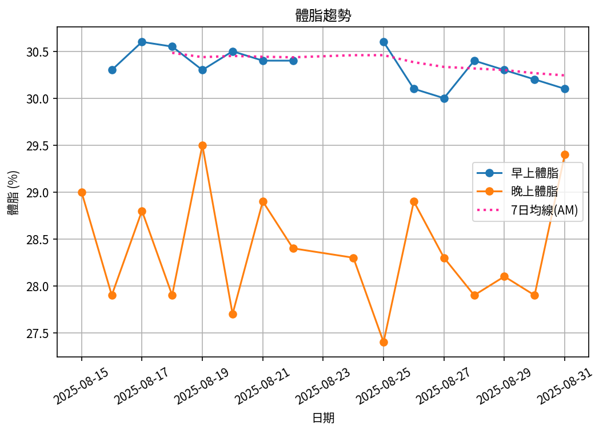

# 📊 減重週報（2025-08 月報)

**週期：2025/08/15 ～ 2025/08/31**  

---

## 📈 體重與體脂紀錄

| 日期         |   早上體重 (kg) |   晚上體重 (kg) |   早上體脂 (%) |   晚上體脂 (%) |   早上內臟脂肪 |   晚上內臟脂肪 |   早上骨骼肌 (%) |   晚上骨骼肌 (%) |
|:-------------|----------------:|----------------:|---------------:|---------------:|---------------:|---------------:|-----------------:|-----------------:|
| 08/15 (週五) |          nan    |          109.6  |         nan    |           29   |            nan |             21 |           nan    |             29.6 |
| 08/16 (週六) |          109    |          108.2  |          30.3  |           27.9 |             21 |             20 |            28.9  |             30.3 |
| 08/17 (週日) |          108.1  |          109    |          30.6  |           28.8 |             20 |             21 |            28.7  |             29.8 |
| 08/18 (週一) |          107.95 |          108.8  |          30.55 |           27.9 |             20 |             21 |            28.7  |             30.3 |
| 08/19 (週二) |          108.1  |          108.2  |          30.3  |           29.5 |             20 |             20 |            28.9  |             29.4 |
| 08/20 (週三) |          107.5  |          108    |          30.5  |           27.7 |             20 |             20 |            28.8  |             30.4 |
| 08/21 (週四) |          107    |          106.8  |          30.4  |           28.9 |             20 |             20 |            28.8  |             29.8 |
| 08/22 (週五) |          106.2  |          106.9  |          30.4  |           28.4 |             19 |             20 |            28.9  |             30.1 |
| 08/24 (週日) |          nan    |          106.75 |         nan    |           28.3 |            nan |             20 |           nan    |             30.2 |
| 08/25 (週一) |          105.8  |          106.2  |          30.6  |           27.4 |             19 |             19 |            28.6  |             30.7 |
| 08/26 (週二) |          105.6  |          106.05 |          30.1  |           28.9 |             19 |             19 |            29.1  |             29.8 |
| 08/27 (週三) |          105.2  |          105.9  |          30    |           28.3 |             19 |             19 |            29.1  |             30.2 |
| 08/28 (週四) |          104.8  |          105.5  |          30.4  |           27.9 |             19 |             19 |            28.9  |             30.5 |
| 08/29 (週五) |          104.7  |          105.1  |          30.3  |           28.1 |             19 |             19 |            28.95 |             30.4 |
| 08/30 (週六) |          104.3  |          104.2  |          30.2  |           27.9 |             19 |             19 |            29    |             30.5 |
| 08/31 (週日) |          103.6  |          104.1  |          30.1  |           29.4 |             18 |             19 |            29    |             29.5 |

---

## 📊 趨勢圖

---

## 📌 本月統計

- 體重（AM）：109.0 → 103.6 kg  (**-5.4 kg**), 月平均 106.3 kg  
- 體重（PM）：109.6 → 104.1 kg  (**-5.5 kg**), 月平均 106.8 kg  
- 體重（AM+PM 平均）：106.6 kg  

- 體脂（AM）：30.3% → 30.1%  (**-0.2%**), 月平均 30.3%  
- 體脂（PM）：29.0% → 29.4%  (**0.4%**), 月平均 28.4%  
- 體脂（AM+PM 平均）：29.4%  

- 內臟脂肪（AM）：21.0 → 18.0  (**-3.0**), 月平均 19.4  
- 內臟脂肪（PM）：21.0 → 19.0  (**-2.0**), 月平均 19.8  
- 內臟脂肪（AM+PM 平均）：19.6  
  💡 *標準：≤9.5，偏高：10-14.5，過高：≥15*  

- 骨骼肌（AM）：28.9% → 29.0%  (**0.1%**), 月平均 28.9%  
- 骨骼肌（PM）：29.6% → 29.5%  (**-0.1%**), 月平均 30.1%  
- 骨骼肌（AM+PM 平均）：29.5%  

- 脂肪重量（AM）：33.0 → 31.2 kg  (**-1.8 kg**), 月平均 32.2 kg  
- 脂肪重量（PM）：31.8 → 30.6 kg  (**-1.2 kg**), 月平均 30.3 kg  
- 脂肪重量（AM+PM 平均）：31.3 kg  

- 骨骼肌重量（AM）：31.5 → 30.0 kg  (**-1.5 kg**), 月平均 30.7 kg  
- 骨骼肌重量（PM）：32.4 → 30.7 kg  (**-1.7 kg**), 月平均 32.1 kg  
- 骨骼肌重量（AM+PM 平均）：31.4 kg  

- 紀錄天數：16 天

---

## ✅ 建議
- 維持 **高蛋白 (每公斤 1.6–2.0 g)** 與 **每週 2–3 次阻力訓練**  
- 飲水 **≥ 3 L/天**（依活動量調整）  
- 若每週下降 > 2.5 kg，建議微調熱量或與醫師討論  

---

## 🧪 組成品質（近28天）

- 脂肪/體重 下降比例：34%（需留意）  
- 體重變化：-5.4 kg，脂肪重量變化：-1.8 kg（AM）  

---

## 🎯 KPI 目標與進度 (本月)

- 體重：目標 -4.0 kg  
  - 由 109.0 → 目標 105.0 kg  | 進度 [████████████████████] 100%  
- 體脂率（AM）：目標 -2.0 個百分點  
  - 由 30.3% → 目標 28.3%  | 進度 [██░░░░░░░░░░░░░░░░░░] 10%  
- 內臟脂肪（AM）：目標 -2.5  
  - 由 21.0 → 目標 18.5  | 進度 [████████████████████] 100%  
- 骨骼肌重量（AM）：目標 ≥ 持平  | 變化 -1.5 kg  | 進度 [░░░░░░░░░░░░░░░░░░░░] 0%  
- 體重達標 ETA：~9.7 週（2025-11-07）  
- 體脂率達標 ETA（AM）：~33.6 週（2026-04-23）  
- 脂肪重量達標 ETA：~25.3 週（2026-02-24）  

---

## 🧠 本期數據分析與總結

- ✅ 體重：5.4 kg 下降（AM）
- ✅ 體脂率：0.2 個百分點下降（AM）
- ✅ 內臟脂肪：3.0 降低（AM）
- ✅ 骨骼肌率：+0.1 個百分點（AM）
- ✅ 脂肪重量：-1.8 kg（AM）
- ⚠️ 骨骼肌重量下降：1.5 kg，建議調整赤字與訓練恢復。
- ⚠️ 組成品質偏低（脂肪/體重 < 40%），建議提高蛋白與阻力訓練，減少過大赤字。

- 下一步：蛋白 1.8–2.2 g/kg、每週 3–4 次阻力訓練、穩定睡眠與步數，維持每週 -0.5～-0.8 kg。
