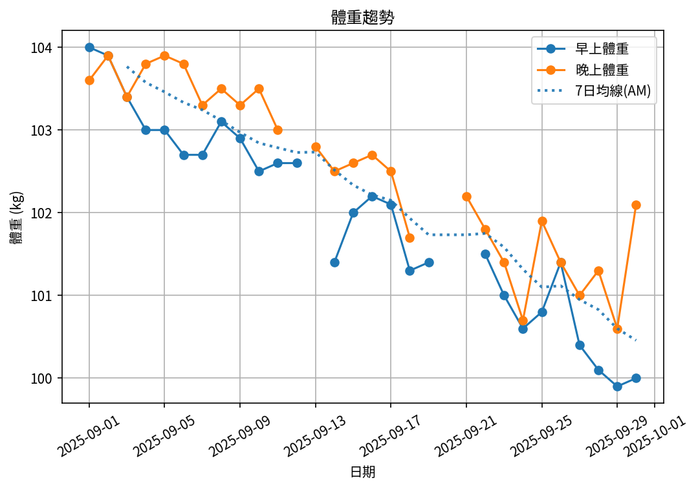
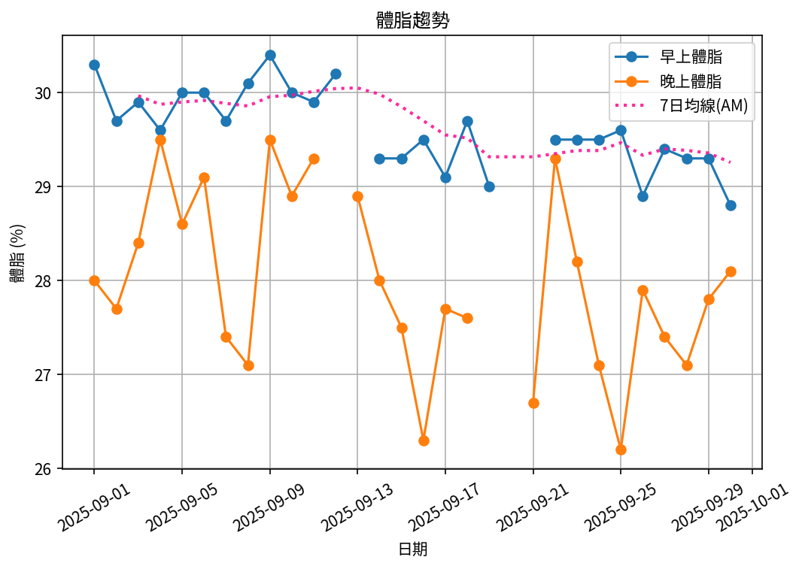
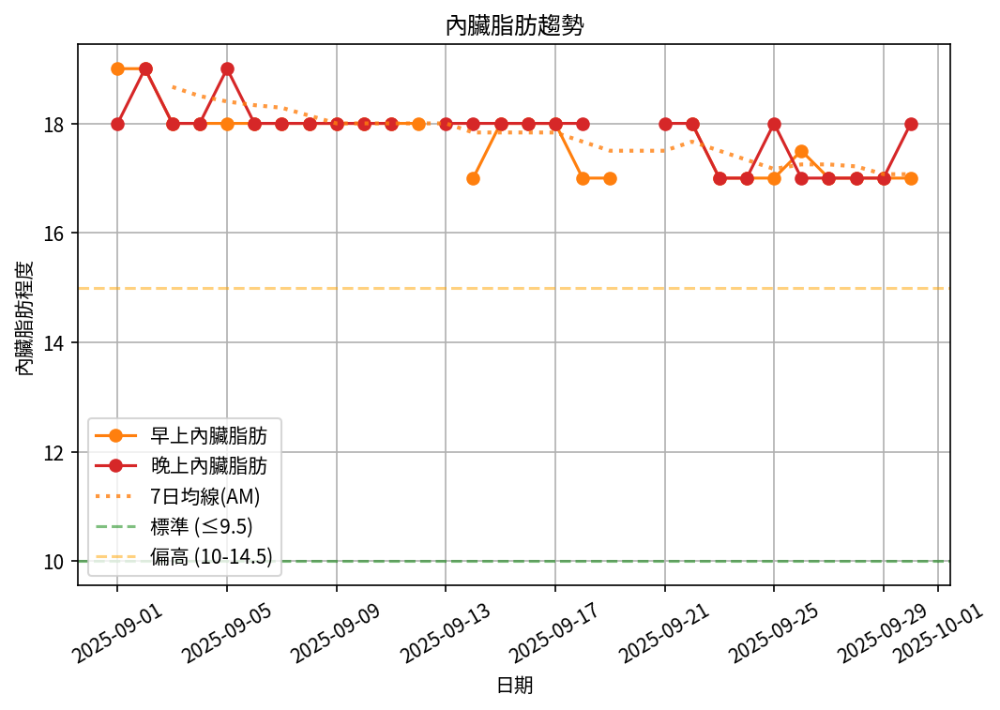
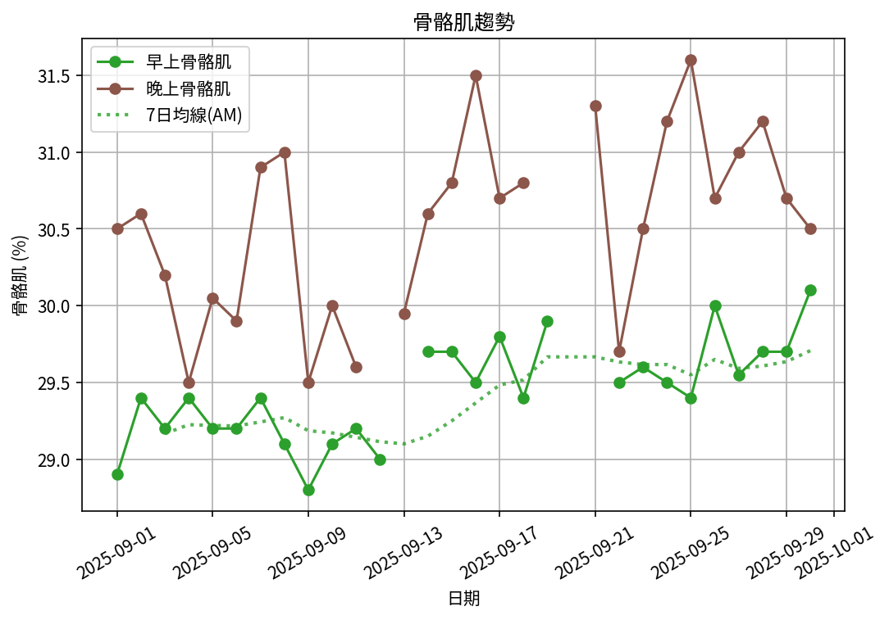

# 📊 減重週報（2025-09 月報)

**週期：2025/09/01 ～ 2025/09/30**  

---

## 📈 體重與體脂紀錄

| 日期         |   早上體重 (kg) |   晚上體重 (kg) |   早上體脂 (%) |   晚上體脂 (%) |   早上內臟脂肪 |   晚上內臟脂肪 |   早上骨骼肌 (%) |   晚上骨骼肌 (%) |
|:-------------|----------------:|----------------:|---------------:|---------------:|---------------:|---------------:|-----------------:|-----------------:|
| 09/01 (週一) |           104   |           103.6 |           30.3 |           28   |           19   |             18 |            28.9  |            30.5  |
| 09/02 (週二) |           103.9 |           103.9 |           29.7 |           27.7 |           19   |             19 |            29.4  |            30.6  |
| 09/03 (週三) |           103.4 |           103.4 |           29.9 |           28.4 |           18   |             18 |            29.2  |            30.2  |
| 09/04 (週四) |           103   |           103.8 |           29.6 |           29.5 |           18   |             18 |            29.4  |            29.5  |
| 09/05 (週五) |           103   |           103.9 |           30   |           28.6 |           18   |             19 |            29.2  |            30.05 |
| 09/06 (週六) |           102.7 |           103.8 |           30   |           29.1 |           18   |             18 |            29.2  |            29.9  |
| 09/07 (週日) |           102.7 |           103.3 |           29.7 |           27.4 |           18   |             18 |            29.4  |            30.9  |
| 09/08 (週一) |           103.1 |           103.5 |           30.1 |           27.1 |           18   |             18 |            29.1  |            31    |
| 09/09 (週二) |           102.9 |           103.3 |           30.4 |           29.5 |           18   |             18 |            28.8  |            29.5  |
| 09/10 (週三) |           102.5 |           103.5 |           30   |           28.9 |           18   |             18 |            29.1  |            30    |
| 09/11 (週四) |           102.6 |           103   |           29.9 |           29.3 |           18   |             18 |            29.2  |            29.6  |
| 09/12 (週五) |           102.6 |           nan   |           30.2 |          nan   |           18   |            nan |            29    |           nan    |
| 09/13 (週六) |           nan   |           102.8 |          nan   |           28.9 |          nan   |             18 |           nan    |            29.95 |
| 09/14 (週日) |           101.4 |           102.5 |           29.3 |           28   |           17   |             18 |            29.7  |            30.6  |
| 09/15 (週一) |           102   |           102.6 |           29.3 |           27.5 |           18   |             18 |            29.7  |            30.8  |
| 09/16 (週二) |           102.2 |           102.7 |           29.5 |           26.3 |           18   |             18 |            29.5  |            31.5  |
| 09/17 (週三) |           102.1 |           102.5 |           29.1 |           27.7 |           18   |             18 |            29.8  |            30.7  |
| 09/18 (週四) |           101.3 |           101.7 |           29.7 |           27.6 |           17   |             18 |            29.4  |            30.8  |
| 09/19 (週五) |           101.4 |           nan   |           29   |          nan   |           17   |            nan |            29.9  |           nan    |
| 09/21 (週日) |           nan   |           102.2 |          nan   |           26.7 |          nan   |             18 |           nan    |            31.3  |
| 09/22 (週一) |           101.5 |           101.8 |           29.5 |           29.3 |           18   |             18 |            29.5  |            29.7  |
| 09/23 (週二) |           101   |           101.4 |           29.5 |           28.2 |           17   |             17 |            29.6  |            30.5  |
| 09/24 (週三) |           100.6 |           100.7 |           29.5 |           27.1 |           17   |             17 |            29.5  |            31.2  |
| 09/25 (週四) |           100.8 |           101.9 |           29.6 |           26.2 |           17   |             18 |            29.4  |            31.6  |
| 09/26 (週五) |           101.4 |           101.4 |           28.9 |           27.9 |           17.5 |             17 |            30    |            30.7  |
| 09/27 (週六) |           100.4 |           101   |           29.4 |           27.4 |           17   |             17 |            29.55 |            31    |
| 09/28 (週日) |           100.1 |           101.3 |           29.3 |           27.1 |           17   |             17 |            29.7  |            31.2  |
| 09/29 (週一) |            99.9 |           100.6 |           29.3 |           27.8 |           17   |             17 |            29.7  |            30.7  |
| 09/30 (週二) |           100   |           102.1 |           28.8 |           28.1 |           17   |             18 |            30.1  |            30.5  |

---

## 📊 趨勢圖

---

## 📌 本週統計

- 體重（AM）：104.0 → 100.0 kg  (**-4.0 kg**), 週平均 101.9 kg  
- 體重（PM）：103.6 → 102.1 kg  (**-1.5 kg**), 週平均 102.5 kg  
- 體重（AM+PM 平均）：102.2 kg  

- 體脂（AM）：30.3% → 28.8%  (**-1.5%**), 週平均 29.6%  
- 體脂（PM）：28.0% → 28.1%  (**0.1%**), 週平均 28.0%  
- 體脂（AM+PM 平均）：28.8%  

- 內臟脂肪（AM）：19.0 → 17.0  (**-2.0**), 週平均 17.7  
- 內臟脂肪（PM）：18.0 → 18.0  (**0.0**), 週平均 17.9  
- 內臟脂肪（AM+PM 平均）：17.8  
  💡 *標準：≤9.5，偏高：10-14.5，過高：≥15*  

- 骨骼肌（AM）：28.9% → 30.1%  (**1.2%**), 週平均 29.4%  
- 骨骼肌（PM）：30.5% → 30.5%  (**0.0%**), 週平均 30.5%  
- 骨骼肌（AM+PM 平均）：30.0%  

- 脂肪重量（AM）：31.5 → 28.8 kg  (**-2.7 kg**), 週平均 30.2 kg  
- 脂肪重量（PM）：29.0 → 28.7 kg  (**-0.3 kg**), 週平均 28.7 kg  
- 脂肪重量（AM+PM 平均）：29.4 kg  

- 骨骼肌重量（AM）：30.1 → 30.1 kg  (**0.0 kg**), 週平均 30.0 kg  
- 骨骼肌重量（PM）：31.6 → 31.1 kg  (**-0.5 kg**), 週平均 31.3 kg  
- 骨骼肌重量（AM+PM 平均）：30.7 kg  

- 紀錄天數：29 天

---

## ✅ 建議
- 維持 **高蛋白 (每公斤 1.6–2.0 g)** 與 **每週 2–3 次阻力訓練**  
- 飲水 **≥ 3 L/天**（依活動量調整）  
- 若每週下降 > 2.5 kg，建議微調熱量或與醫師討論  

---

## 🧪 組成品質（近28天）

- 脂肪/體重 下降比例：62%（良好）  
- 體重變化：-3.4 kg，脂肪重量變化：-2.1 kg（AM）  

---

## 🎯 KPI 目標與進度 (本月)

- 體重：目標 -0.8 kg  
  - 由 104.0 → 目標 103.2 kg  | 進度 [████████████████████] 100%  
- 體脂率（AM）：目標 -0.4 個百分點  
  - 由 30.3% → 目標 29.9%  | 進度 [████████████████████] 100%  
- 內臟脂肪（AM）：目標 -0.5  
  - 由 19.0 → 目標 18.5  | 進度 [████████████████████] 100%  
- 骨骼肌重量（AM）：目標 ≥ 持平  | 變化 +0.0 kg  | 進度 [████████████████████] 100%  
- 體重達標 ETA：~21.7 週（2026-03-01）  
- 體脂率達標 ETA（AM）：~46.4 週（2026-08-21）  
- 脂肪重量達標 ETA：~29.6 週（2026-04-25）  

---

## 🧠 本期數據分析與總結

- ✅ 體重：4.0 kg 下降（AM）
- ✅ 體脂率：1.5 個百分點下降（AM）
- ✅ 內臟脂肪：2.0 降低（AM）
- ✅ 骨骼肌率：+1.2 個百分點（AM）
- ✅ 脂肪重量：-2.7 kg（AM）

- 下一步：蛋白 1.8–2.2 g/kg、每週 3–4 次阻力訓練、穩定睡眠與步數，維持每週 -0.5～-0.8 kg。
