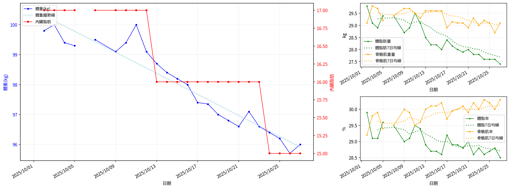
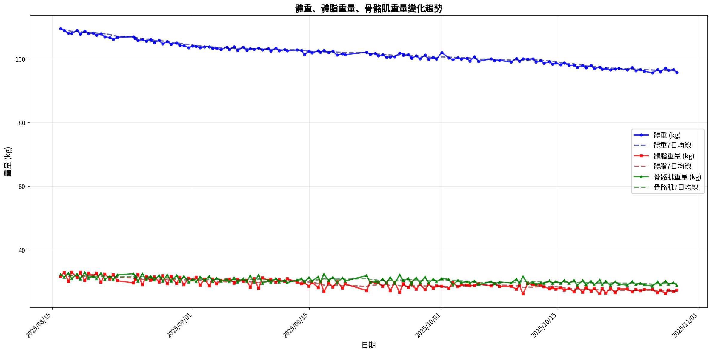

# 📊 減重週報（2025-10 月報)

**週期：2025/10/01 ～ 2025/10/28**  

---

## 📈 體重與體脂紀錄

| 日期         |   早上體重 (kg) |   晚上體重 (kg) |   早上體脂 (%) |   晚上體脂 (%) |   早上內臟脂肪 |   晚上內臟脂肪 |   早上骨骼肌 (%) |   晚上骨骼肌 (%) |
|:-------------|----------------:|----------------:|---------------:|---------------:|---------------:|---------------:|-----------------:|-----------------:|
| 10/01 (週三) |          nan    |           100.4 |          nan   |           27.9 |            nan |             17 |           nan    |             30.7 |
| 10/02 (週四) |           99.8  |           100.5 |           29.9 |           28.4 |             17 |             17 |            29.2  |             30.3 |
| 10/03 (週五) |          100    |           100.3 |           29.1 |           28.9 |             17 |             17 |            29.8  |             30   |
| 10/04 (週六) |           99.4  |           100.8 |           29.1 |           28.7 |             17 |             17 |            29.9  |             30.1 |
| 10/05 (週日) |           99.3  |           nan   |           29.6 |          nan   |             17 |            nan |            29.4  |            nan   |
| 10/06 (週一) |          nan    |           100.1 |          nan   |           28.8 |            nan |             17 |           nan    |             30.1 |
| 10/07 (週二) |           99.5  |            99.6 |           29.5 |           28.7 |             17 |             17 |            29.5  |             30.1 |
| 10/09 (週四) |           99.1  |           100.2 |           29   |           27.6 |             17 |             17 |            30    |             30.8 |
| 10/10 (週五) |           99.4  |           100.1 |           29.1 |           26.2 |             17 |             17 |            29.9  |             31.7 |
| 10/11 (週六) |          100    |           100.1 |           29.5 |           29.1 |             17 |             17 |            29.5  |             29.9 |
| 10/12 (週日) |           99.1  |            99.5 |           29.4 |           29.1 |             17 |             17 |            29.6  |             29.8 |
| 10/13 (週一) |           98.7  |            99.2 |           28.9 |           28   |             16 |             17 |            30    |             30.6 |
| 10/14 (週二) |           98.4  |            98.8 |           28.7 |           28   |             16 |             16 |            30.1  |             30.6 |
| 10/15 (週三) |           98.2  |            98.8 |           28.7 |           27.7 |             16 |             16 |            30.1  |             30.9 |
| 10/16 (週四) |           98    |            98.1 |           28.6 |           27.4 |             16 |             16 |            30.2  |             31.1 |
| 10/17 (週五) |           97.4  |            98   |           29.2 |           27.3 |             16 |             16 |            29.7  |             31.1 |
| 10/18 (週六) |           97.35 |            98   |           28.9 |           27.7 |             16 |             16 |            29.95 |             30.9 |
| 10/19 (週日) |           97    |            97.5 |           28.9 |           27   |             16 |             16 |            30    |             31.4 |
| 10/20 (週一) |           96.8  |            97   |           28.8 |           27.3 |             16 |             16 |            30.1  |             31.2 |
| 10/21 (週二) |           96.6  |            96.9 |           29   |           27.4 |             16 |             16 |            29.9  |             31.1 |
| 10/22 (週三) |           97.1  |           nan   |           28.6 |          nan   |             16 |            nan |            30.2  |            nan   |
| 10/23 (週四) |           96.6  |            97.4 |           28.8 |           27.6 |             16 |             16 |            30    |             31   |
| 10/24 (週五) |           96.4  |            96.7 |           28.6 |           28.2 |             15 |             16 |            30.3  |             30.6 |
| 10/25 (週六) |           96.2  |           nan   |           28.7 |          nan   |             15 |            nan |            30.2  |            nan   |
| 10/26 (週日) |           95.7  |            96.7 |           28.8 |           27.5 |             15 |             16 |            30    |             31.1 |
| 10/27 (週一) |           96    |            97.2 |           28.5 |           27.2 |             15 |             16 |            30.3  |             31.2 |
| 10/28 (週二) |           96.5  |           nan   |           28.4 |          nan   |             15 |            nan |            30.4  |            nan   |

---

## 📊 趨勢圖

---

## 📌 本月統計

- 體重（AM）：99.8 → 96.5 kg  (**-3.3 kg**), 月平均 97.9 kg  
- 體重（PM）：100.4 → 97.2 kg  (**-3.2 kg**), 月平均 98.8 kg  
- 體重（AM+PM 平均）：98.4 kg  

- 體脂（AM）：29.9% → 28.4%  (**-1.5%**), 月平均 29.0%  
- 體脂（PM 對照）：27.9% → 27.2%  (**-0.7%**), 月平均 27.9%  
- 體脂（AM+PM 平均）：28.4%  

- 內臟脂肪（AM）：17.0 → 15.0  (**-2.0**), 月平均 16.2  
- 內臟脂肪（PM）：17.0 → 16.0  (**-1.0**), 月平均 16.5  
- 內臟脂肪（AM+PM 平均）：16.3  
  💡 *標準：≤9.5，偏高：10-14.5，過高：≥15*  

- 骨骼肌（AM）：29.2% → 30.4%  (**1.2%**), 月平均 29.9%  
- 骨骼肌（PM）：30.7% → 31.2%  (**0.5%**), 月平均 30.7%  
- 骨骼肌（AM+PM 平均）：30.3%  

- 脂肪重量（AM）：29.8 → 27.4 kg  (**-2.4 kg**), 月平均 28.4 kg  
- 脂肪重量（PM）：28.0 → 26.4 kg  (**-1.6 kg**), 月平均 27.6 kg  
- 脂肪重量（AM+PM 平均）：28.0 kg  

- 骨骼肌重量（AM）：29.1 → 29.3 kg  (**0.2 kg**), 月平均 29.3 kg  
- 骨骼肌重量（PM）：30.8 → 30.3 kg  (**-0.5 kg**), 月平均 30.3 kg  
- 骨骼肌重量（AM+PM 平均）：29.8 kg  

- 紀錄天數：27 天

---

## ✅ 建議
- 維持 **高蛋白 (每公斤 1.6–2.0 g)** 與 **每週 2–3 次阻力訓練**  
- 飲水 **≥ 3 L/天**（依活動量調整）  
- 若每週下降 > 2.5 kg，建議微調熱量或與醫師討論  

---

## 🧪 組成品質（近28天）

- 脂肪/體重 下降比例：73%（良好）  
- 體重變化：-3.3 kg，脂肪重量變化：-2.4 kg（AM）  

---

## 🧭 本期狀態解析

*註：27天期間數據已標準化至30天以便與月度門檻比較*

| 指標 | 變化量 | 對照門檻 | 判定 |
|:--|:--:|:--|:--|
| 脂肪重量 (AM) | -2.4 kg → -2.7 kg (30天標準) | 有效下降 ≥ 0.8 kg／月 | ✅ 脂肪明顯下降 |
| 骨骼肌重量 (AM) | +0.2 kg → +0.2 kg (30天標準) | 有效上升 ≥ 0.5 kg／月（±0.2 kg 為誤差範圍） | ⚖️ 穩定或微幅上升 |

### 🔍 綜合判定

🟢 分類：**體態重組（Recomposition）**
這表示你目前正處於理想的「脂肪減少＋肌肉維持或略增」階段。

這種情況的特徵：

- 體重變化不一定大，但腰圍、體態、線條會顯著改善。
- 代謝效率正在提升（BMR 通常會微升）。

## 🔬 代謝分析（本月）

- 代謝分類：**體態重組**
- 每週速率：脂肪 -0.62 kg/週、肌肉 +0.05 kg/週
- 折合月速率（30天）：脂肪 -2.67 kg/月、肌肉 +0.22 kg/月

- 代謝靈活度（MF）：**58**（尚未穩定｜需留意）
  子分項（F1–F6）：
  - F1 脂肪週斜率：14.0/20（脂肪週斜率 -0.59 kg/週（Sigmoid：中心 -0.45，k=6））
  - F2 肌肉週斜率：3.6/20（肌肉週斜率 -0.16 kg/週（Sigmoid：中心 +0.10，k=6））
  - F3 AM/PM 體重差 CV：10.0/10（CV 0.38%（4.0%→0分，0.5%→滿分））
  - F4 內臟脂肪變化：10.0/10（內臟脂肪變化 -2.00（+1→0分，-1→滿分））
  - F5 週期穩定度：0.0/20（脂肪週期穩定度：週差標準差 2.29 kg/週（≤0.2→滿分，≥0.8→0分））
  - F6 趨勢一致性：20.0/20（脂肪週斜率 -0.59 kg/週（負向=得分））
- AM/PM 體重差變異係數（CV）：0.38%（優）
---

---

## 🎯 KPI 目標與進度 (本月)

- 體重：目標 -4.0 kg  
  - 由 99.8 → 目標 95.8 kg  | 進度 [████████████████░░░░] 82%  
- 體脂率（AM）：目標 -2.0 個百分點  
  - 由 29.9% → 目標 27.9%  | 進度 [███████░░░░░░░░░░░░░] 35%  
- 內臟脂肪（AM）：目標 -2.5  
  - 由 17.0 → 目標 14.5  | 進度 [████████████████░░░░] 80%  
- 骨骼肌重量（AM）：目標 ≥ 持平  | 變化 +0.2 kg  | 進度 [████████████████████] 100%  
- 體重達標 ETA：~19.7 週（2026-03-15）  
- 體脂率達標 ETA（AM）：~29.3 週（2026-05-21）  
- 脂肪重量達標 ETA：~27.7 週（2026-05-10）  

---

## 🧠 本期數據分析與總結

- ✅ 體重：3.3 kg 下降（AM）
- ✅ 體脂率：1.5 個百分點下降（AM）
- ✅ 內臟脂肪：2.0 降低（AM）
- ✅ 骨骼肌率：+1.2 個百分點（AM）
- ✅ 脂肪重量：-2.4 kg（AM）

- 下一步：蛋白 1.8–2.2 g/kg、每週 3–4 次阻力訓練、穩定睡眠與步數，維持每週 -0.5～-0.8 kg。
