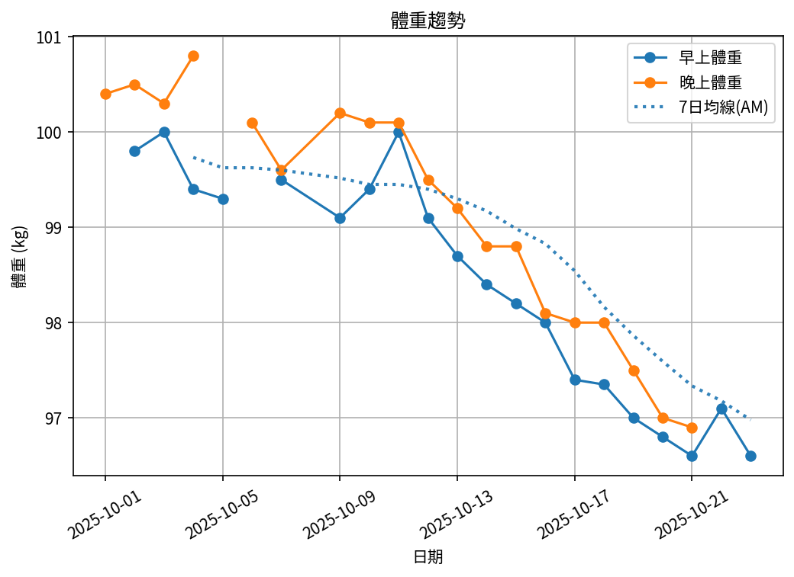
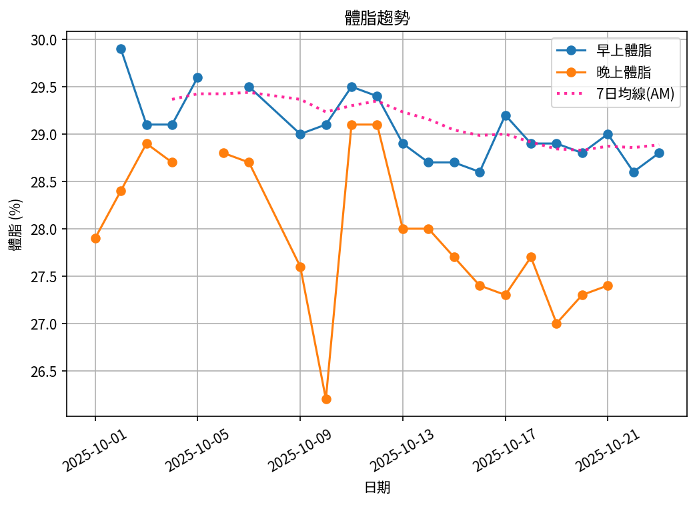
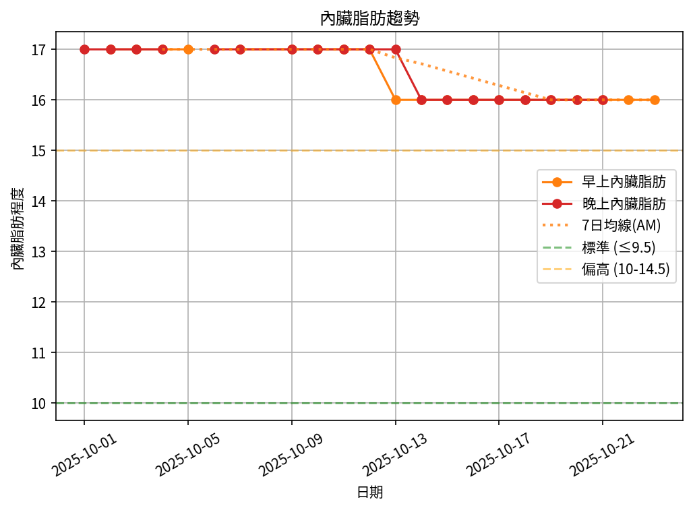
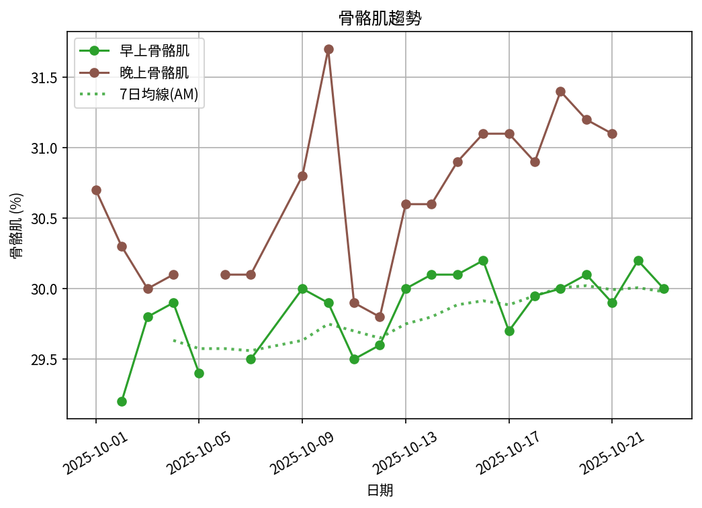

# 📊 減重週報（2025-10 月報)

**週期：2025/10/01 ～ 2025/10/14**  

---

## 📈 體重與體脂紀錄

| 日期         |   早上體重 (kg) |   晚上體重 (kg) |   早上體脂 (%) |   晚上體脂 (%) |   早上內臟脂肪 |   晚上內臟脂肪 |   早上骨骼肌 (%) |   晚上骨骼肌 (%) |
|:-------------|----------------:|----------------:|---------------:|---------------:|---------------:|---------------:|-----------------:|-----------------:|
| 10/01 (週三) |           nan   |           100.4 |          nan   |           27.9 |            nan |             17 |            nan   |             30.7 |
| 10/02 (週四) |            99.8 |           100.5 |           29.9 |           28.4 |             17 |             17 |             29.2 |             30.3 |
| 10/03 (週五) |           100   |           100.3 |           29.1 |           28.9 |             17 |             17 |             29.8 |             30   |
| 10/04 (週六) |            99.4 |           100.8 |           29.1 |           28.7 |             17 |             17 |             29.9 |             30.1 |
| 10/05 (週日) |            99.3 |           nan   |           29.6 |          nan   |             17 |            nan |             29.4 |            nan   |
| 10/06 (週一) |           nan   |           100.1 |          nan   |           28.8 |            nan |             17 |            nan   |             30.1 |
| 10/07 (週二) |            99.5 |            99.6 |           29.5 |           28.7 |             17 |             17 |             29.5 |             30.1 |
| 10/09 (週四) |            99.1 |           100.2 |           29   |           27.6 |             17 |             17 |             30   |             30.8 |
| 10/10 (週五) |            99.4 |           100.1 |           29.1 |           26.2 |             17 |             17 |             29.9 |             31.7 |
| 10/11 (週六) |           100   |           100.1 |           29.5 |           29.1 |             17 |             17 |             29.5 |             29.9 |
| 10/12 (週日) |            99.1 |            99.5 |           29.4 |           29.1 |             17 |             17 |             29.6 |             29.8 |
| 10/13 (週一) |            98.7 |            99.2 |           28.9 |           28   |             16 |             17 |             30   |             30.6 |
| 10/14 (週二) |            98.4 |           nan   |           28.7 |          nan   |             16 |            nan |             30.1 |            nan   |

---

## 📊 趨勢圖

---

## 📌 本週統計

- 體重（AM）：99.8 → 98.4 kg  (**-1.4 kg**), 週平均 99.3 kg  
- 體重（PM）：100.4 → 99.2 kg  (**-1.2 kg**), 週平均 100.1 kg  
- 體重（AM+PM 平均）：99.7 kg  

- 體脂（AM）：29.9% → 28.7%  (**-1.2%**), 週平均 29.3%  
- 體脂（PM）：27.9% → 28.0%  (**0.1%**), 週平均 28.3%  
- 體脂（AM+PM 平均）：28.8%  

- 內臟脂肪（AM）：17.0 → 16.0  (**-1.0**), 週平均 16.8  
- 內臟脂肪（PM）：17.0 → 17.0  (**0.0**), 週平均 17.0  
- 內臟脂肪（AM+PM 平均）：16.9  
  💡 *標準：≤9.5，偏高：10-14.5，過高：≥15*  

- 骨骼肌（AM）：29.2% → 30.1%  (**0.9%**), 週平均 29.7%  
- 骨骼肌（PM）：30.7% → 30.6%  (**-0.1%**), 週平均 30.4%  
- 骨骼肌（AM+PM 平均）：30.0%  

- 脂肪重量（AM）：29.8 → 28.2 kg  (**-1.6 kg**), 週平均 29.1 kg  
- 脂肪重量（PM）：28.0 → 27.8 kg  (**-0.2 kg**), 週平均 28.3 kg  
- 脂肪重量（AM+PM 平均）：28.7 kg  

- 骨骼肌重量（AM）：29.1 → 29.6 kg  (**0.5 kg**), 週平均 29.5 kg  
- 骨骼肌重量（PM）：30.8 → 30.4 kg  (**-0.5 kg**), 週平均 30.4 kg  
- 骨骼肌重量（AM+PM 平均）：30.0 kg  

- 紀錄天數：13 天

---

## ✅ 建議
- 維持 **高蛋白 (每公斤 1.6–2.0 g)** 與 **每週 2–3 次阻力訓練**  
- 飲水 **≥ 3 L/天**（依活動量調整）  
- 若每週下降 > 2.5 kg，建議微調熱量或與醫師討論  

---

## 🧪 組成品質（近28天）

- 脂肪/體重 下降比例：114%（良好）  
- 體重變化：-1.4 kg，脂肪重量變化：-1.6 kg（AM）  

---

## 🎯 KPI 目標與進度 (本月)

- 體重：目標 -0.8 kg  
  - 由 99.8 → 目標 99.0 kg  | 進度 [████████████████████] 100%  
- 體脂率（AM）：目標 -0.4 個百分點  
  - 由 29.9% → 目標 29.5%  | 進度 [████████████████████] 100%  
- 內臟脂肪（AM）：目標 -0.5  
  - 由 17.0 → 目標 16.5  | 進度 [████████████████████] 100%  
- 骨骼肌重量（AM）：目標 ≥ 持平  | 變化 +0.5 kg  | 進度 [████████████████████] 100%  
- 體重達標 ETA：~23.7 週（2026-03-29）  
- 體脂率達標 ETA（AM）：~23.9 週（2026-03-30）  
- 脂肪重量達標 ETA：~20.1 週（2026-03-04）  

---

## 🧠 本期數據分析與總結

- ✅ 體重：1.4 kg 下降（AM）
- ✅ 體脂率：1.2 個百分點下降（AM）
- ✅ 內臟脂肪：1.0 降低（AM）
- ✅ 骨骼肌率：+0.9 個百分點（AM）
- ✅ 脂肪重量：-1.6 kg（AM）

- 下一步：蛋白 1.8–2.2 g/kg、每週 3–4 次阻力訓練、穩定睡眠與步數，維持每週 -0.5～-0.8 kg。
