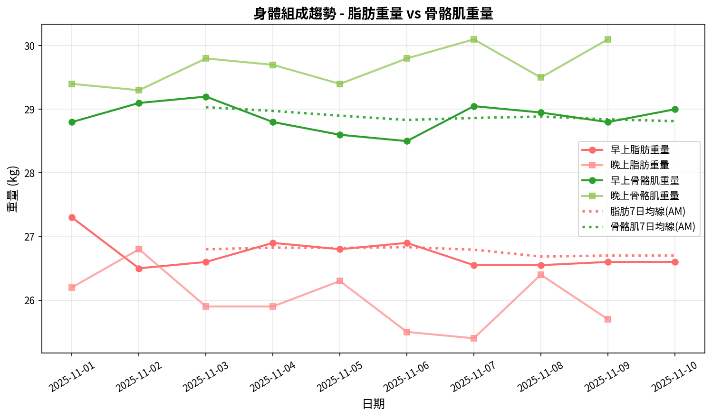
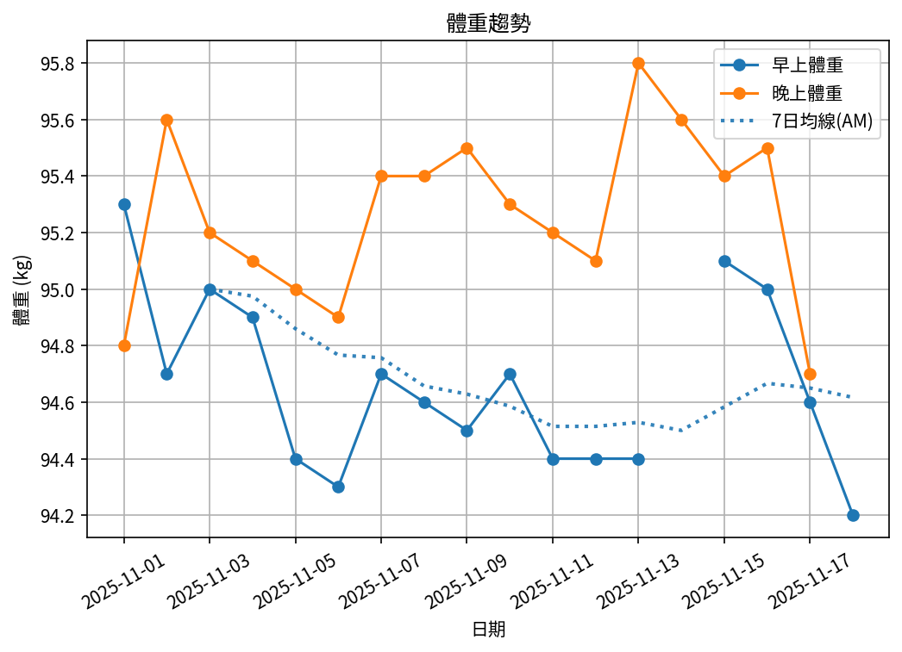
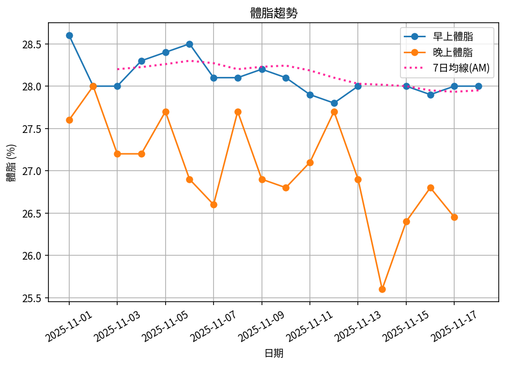
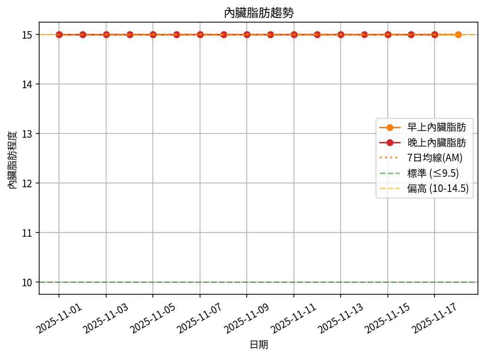
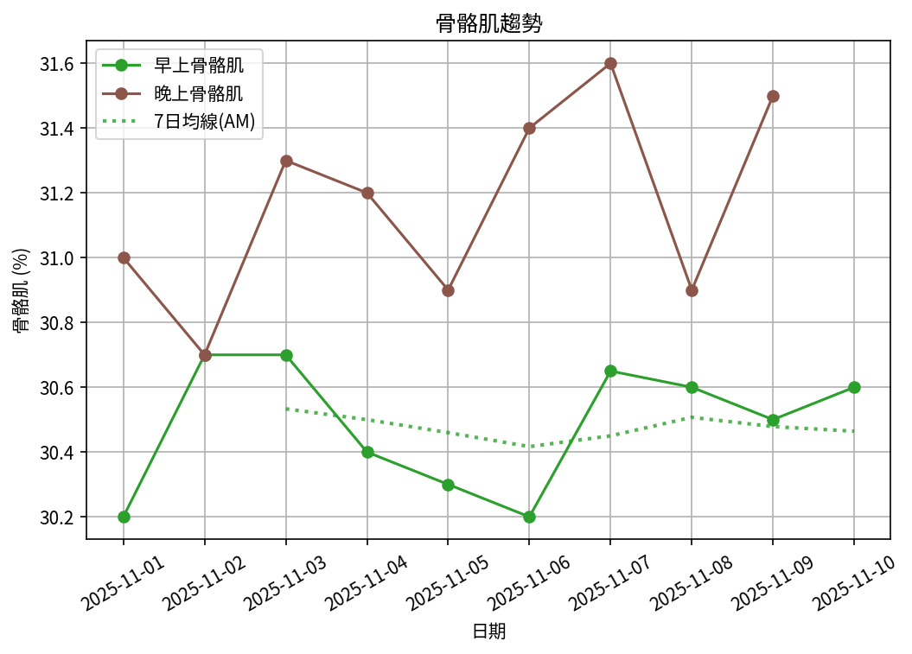

# 📊 減重週報（2025-11 月報)

**週期：2025/11/01 ～ 2025/11/10**  

---

## 📈 體重與體脂紀錄

| 日期         |   早上體重 (kg) |   晚上體重 (kg) |   早上體脂 (%) |   晚上體脂 (%) |   早上內臟脂肪 |   晚上內臟脂肪 |   早上骨骼肌 (%) |   晚上骨骼肌 (%) |
|:-------------|----------------:|----------------:|---------------:|---------------:|---------------:|---------------:|-----------------:|-----------------:|
| 11/01 (週六) |           95.3  |            94.8 |          28.6  |           27.6 |             15 |             15 |            30.2  |             31   |
| 11/02 (週日) |           94.7  |            95.6 |          28    |           28   |             15 |             15 |            30.7  |             30.7 |
| 11/03 (週一) |           95    |            95.2 |          28    |           27.2 |             15 |             15 |            30.7  |             31.3 |
| 11/04 (週二) |           94.9  |            95.1 |          28.3  |           27.2 |             15 |             15 |            30.4  |             31.2 |
| 11/05 (週三) |           94.4  |            95   |          28.4  |           27.7 |             15 |             15 |            30.3  |             30.9 |
| 11/06 (週四) |           94.3  |            94.9 |          28.5  |           26.9 |             15 |             15 |            30.2  |             31.4 |
| 11/07 (週五) |           94.7  |            95.4 |          28.05 |           26.6 |             15 |             15 |            30.65 |             31.6 |
| 11/08 (週六) |           94.65 |            95.4 |          28.05 |           27.7 |             15 |             15 |            30.6  |             30.9 |
| 11/09 (週日) |           94.5  |            95.5 |          28.2  |           26.9 |             15 |             15 |            30.5  |             31.5 |
| 11/10 (週一) |           94.7  |           nan   |          28.1  |          nan   |             15 |            nan |            30.6  |            nan   |

---

## 📊 趨勢圖

---

## 📌 本月統計

- 體重（AM）：95.3 → 94.7 kg  (**-0.6 kg**), 月平均 94.7 kg  
- 體重（PM）：94.8 → 95.5 kg  (**0.7 kg**), 月平均 95.2 kg  
- 體重（AM+PM 平均）：95.0 kg  

- 體脂（AM）：28.6% → 28.1%  (**-0.5%**), 月平均 28.2%  
- 體脂（PM 對照）：27.6% → 26.9%  (**-0.7%**), 月平均 27.3%  
- 體脂（AM+PM 平均）：27.8%  

- 內臟脂肪（AM）：15.0 → 15.0  (**0.0**), 月平均 15.0  
- 內臟脂肪（PM）：15.0 → 15.0  (**0.0**), 月平均 15.0  
- 內臟脂肪（AM+PM 平均）：15.0  
  💡 *標準：≤9.5，偏高：10-14.5，過高：≥15*  

- 骨骼肌（AM）：30.2% → 30.6%  (**0.4%**), 月平均 30.5%  
- 骨骼肌（PM）：31.0% → 31.5%  (**0.5%**), 月平均 31.2%  
- 骨骼肌（AM+PM 平均）：30.8%  

- 脂肪重量（AM）：27.3 → 26.6 kg  (**-0.7 kg**), 月平均 26.7 kg  
- 脂肪重量（PM）：26.2 → 25.7 kg  (**-0.5 kg**), 月平均 26.0 kg  
- 脂肪重量（AM+PM 平均）：26.4 kg  

- 骨骼肌重量（AM）：28.8 → 29.0 kg  (**0.2 kg**), 月平均 28.9 kg  
- 骨骼肌重量（PM）：29.4 → 30.1 kg  (**0.7 kg**), 月平均 29.7 kg  
- 骨骼肌重量（AM+PM 平均）：29.3 kg  

- 紀錄天數：10 天

---

## ✅ 建議
- 維持 **高蛋白 (每公斤 1.6–2.0 g)** 與 **每週 2–3 次阻力訓練**  
- 飲水 **≥ 3 L/天**（依活動量調整）  
- 若每週下降 > 2.5 kg，建議微調熱量或與醫師討論  

---

## 🧪 組成品質（近28天）

- 脂肪/體重 下降比例：117%（良好）  
- 體重變化：-0.6 kg，脂肪重量變化：-0.7 kg（AM）  

---

## 🧭 本期狀態解析

*註：10天期間數據已標準化至30天以便與月度門檻比較*

| 指標 | 變化量 | 對照門檻 | 判定 |
|:--|:--:|:--|:--|
| 脂肪重量 (AM) | -0.7 kg → -2.1 kg (30天標準) | 有效下降 ≥ 0.8 kg／月 | ✅ 脂肪明顯下降 |
| 骨骼肌重量 (AM) | +0.2 kg → +0.6 kg (30天標準) | 有效上升 ≥ 0.5 kg／月（±0.2 kg 為誤差範圍） | ✅ 肌肉有效上升 |

### 🔍 綜合判定

🔵 分類：**其他**
本期變化方向不明顯或存在相反趨勢，建議以 4 週趨勢為準。

## 🔬 代謝分析（本月）

- 代謝分類：**其他**
- 每週速率：脂肪 -0.54 kg/週、肌肉 +0.16 kg/週
- 折合月速率（30天）：脂肪 -2.33 kg/月、肌肉 +0.67 kg/月

- 代謝靈活度（MF）：**47**（尚未穩定｜需留意）
  子分項（F1–F6）：
  - F1 脂肪週斜率：5.5/20（脂肪週斜率 -0.29 kg/週（Sigmoid：中心 -0.45，k=6））
  - F2 肌肉週斜率：6.1/20（肌肉週斜率 -0.04 kg/週（Sigmoid：中心 +0.10，k=6））
  - F3 AM/PM 體重差 CV：10.0/10（CV 0.49%（4.0%→0分，0.5%→滿分））
  - F4 內臟脂肪變化：5.0/10（內臟脂肪變化 +0.00（+1→0分，-1→滿分））
  - F5 週期穩定度：0.0/20（脂肪週期穩定度：週差標準差 2.26 kg/週（≤0.2→滿分，≥0.8→0分））
  - F6 趨勢一致性：20.0/20（脂肪週斜率 -0.29 kg/週（負向=得分））
- AM/PM 體重差變異係數（CV）：0.49%（優）
---

---

## 🎯 KPI 目標與進度 (本月)

- 體重：目標 -4.0 kg  
  - 由 95.3 → 目標 91.3 kg  | 進度 [███░░░░░░░░░░░░░░░░░] 15%  
- 體脂率（AM）：目標 -2.0 個百分點  
  - 由 28.6% → 目標 26.6%  | 進度 [███████░░░░░░░░░░░░░] 35%  
- 內臟脂肪（AM）：目標 -2.5  
  - 由 15.0 → 目標 12.5  | 進度 [░░░░░░░░░░░░░░░░░░░░] 0%  
- 骨骼肌重量（AM）：目標 ≥ 持平  | 變化 +0.2 kg  | 進度 [████████████████████] 100%  
- 體重達標 ETA：~33.7 週（2026-07-04）  
- 體脂率達標 ETA（AM）：~31.1 週（2026-06-16）  
- 脂肪重量達標 ETA：~31.4 週（2026-06-18）  

---

## 🧠 本期數據分析與總結

- ✅ 體重：0.6 kg 下降（AM）
- ✅ 體脂率：0.5 個百分點下降（AM）
- ✅ 骨骼肌率：+0.4 個百分點（AM）
- ✅ 脂肪重量：-0.7 kg（AM）

- 下一步：蛋白 1.8–2.2 g/kg、每週 3–4 次阻力訓練、穩定睡眠與步數，維持每週 -0.5～-0.8 kg。
