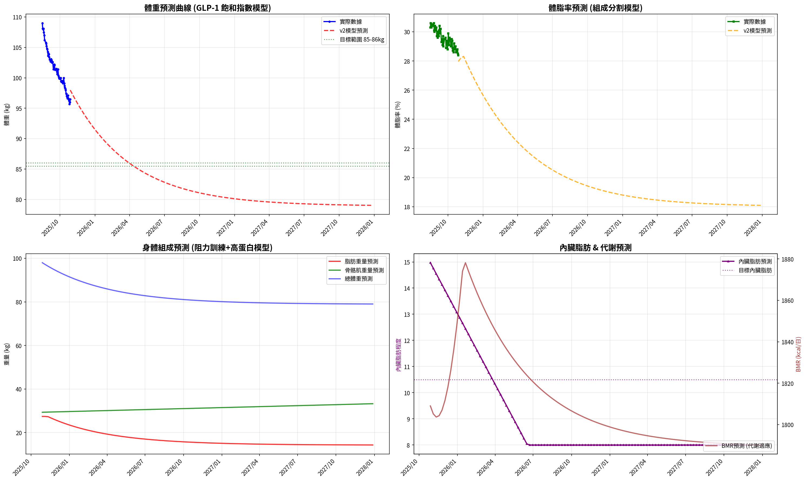

# 📊 減重總結報告

**總期間：2025/08/15 ～ 2025/10/28**  
**追蹤期間：72 天 (11 週)**  

---

## 📈 體重與體脂紀錄概覽

*顯示第一天與最近7天的數據*

| 日期         | 早上體重 (kg)   | 晚上體重 (kg)   | 早上體脂 (%)   | 晚上體脂 (%)   | 早上內臟脂肪   | 晚上內臟脂肪   | 早上骨骼肌 (%)   | 晚上骨骼肌 (%)   |
|:-------------|:----------------|:----------------|:---------------|:---------------|:---------------|:---------------|:-----------------|:-----------------|
| 08/15 (週五) | nan             | 109.6           | nan            | 29.0           | nan            | 21.0           | nan              | 29.6             |
| ...          | ...             | ...             | ...            | ...            | ...            | ...            | ...              | ...              |
| 10/22 (週三) | 97.1            | nan             | 28.6           | nan            | 16.0           | nan            | 30.2             | nan              |
| 10/23 (週四) | 96.6            | 97.4            | 28.8           | 27.6           | 16.0           | 16.0           | 30.0             | 31.0             |
| 10/24 (週五) | 96.4            | 96.7            | 28.6           | 28.2           | 15.0           | 16.0           | 30.3             | 30.6             |
| 10/25 (週六) | 96.2            | nan             | 28.7           | nan            | 15.0           | nan            | 30.2             | nan              |
| 10/26 (週日) | 95.7            | 96.7            | 28.8           | 27.5           | 15.0           | 16.0           | 30.0             | 31.1             |
| 10/27 (週一) | 96.0            | 97.2            | 28.5           | 27.2           | 15.0           | 16.0           | 30.3             | 31.2             |
| 10/28 (週二) | 96.5            | nan             | 28.4           | nan            | 15.0           | nan            | 30.4             | nan              |

---

## 📊 整體趨勢圖

## 🧪 組成品質（近28天）

- 脂肪/體重 下降比例：73%（良好）  
- 體重變化：-3.3 kg，脂肪重量變化：-2.4 kg（AM）  

---

## 🧭 本期狀態解析（近28天）

*註：27天期間數據已標準化至30天以便與月度門檻比較*

| 指標 | 變化量 | 對照門檻 | 判定 |
|:--|:--:|:--|:--|
| 脂肪重量 (AM) | -2.4 kg → -2.7 kg (30天標準) | 有效下降 ≥ 0.8 kg／月 | ✅ 脂肪明顯下降 |
| 骨骼肌重量 (AM) | +0.2 kg → +0.2 kg (30天標準) | 有效上升 ≥ 0.5 kg／月（±0.2 kg 為誤差範圍） | ⚖️ 穩定或微幅上升 |

### 🔍 綜合判定

🟢 分類：**體態重組（Recomposition）**
這表示你目前正處於理想的「脂肪減少＋肌肉維持或略增」階段。

這種情況的特徵：

- 體重變化不一定大，但腰圍、體態、線條會顯著改善。
- 代謝效率正在提升（BMR 通常會微升）。

## 🔬 代謝分析（近28天）

- 代謝分類：**體態重組**
- 每週速率：脂肪 -0.62 kg/週、肌肉 +0.05 kg/週
- 折合月速率（30天）：脂肪 -2.67 kg/月、肌肉 +0.22 kg/月

- 代謝靈活度（MF）：**58**（尚未穩定｜需留意）
  子分項（F1–F6）：
  - F1 脂肪週斜率：14.0/20（脂肪週斜率 -0.59 kg/週（Sigmoid：中心 -0.45，k=6））
  - F2 肌肉週斜率：3.6/20（肌肉週斜率 -0.16 kg/週（Sigmoid：中心 +0.10，k=6））
  - F3 AM/PM 體重差 CV：10.0/10（CV 0.38%（4.0%→0分，0.5%→滿分））
  - F4 內臟脂肪變化：10.0/10（內臟脂肪變化 -2.00（+1→0分，-1→滿分））
  - F5 週期穩定度：0.0/20（脂肪週期穩定度：週差標準差 2.29 kg/週（≤0.2→滿分，≥0.8→0分））
  - F6 趨勢一致性：20.0/20（脂肪週斜率 -0.59 kg/週（負向=得分））
- AM/PM 體重差變異係數（CV）：0.38%（優）
---

## 📌 總體統計

- **體重（AM）**：109.0 → 96.5 kg  (**-12.5 kg**), 總平均 101.3 kg  
- **體重（PM）**：109.6 → 97.2 kg  (**-12.4 kg**), 總平均 102.3 kg  
- **體重（AM+PM 平均）**：101.8 kg  

- **體脂（AM）**：30.3% → 28.4%  (**-1.9%**), 總平均 29.5%  
- **體脂（PM 對照）**：29.0% → 27.2%  (**-1.8%**), 總平均 28.1%  
- **體脂（AM+PM 平均）**：28.8%  

- **內臟脂肪（AM）**：21.0 → 15.0  (**-6.0**), 總平均 17.5  
- **內臟脂肪（PM）**：21.0 → 16.0  (**-5.0**), 總平均 17.8  
- **內臟脂肪（AM+PM 平均）**：17.7  
  💡 *標準：≤9.5，偏高：10-14.5，過高：≥15*  

- **骨骼肌（AM）**：28.9% → 30.4%  (**1.5%**), 總平均 29.5%  
- **骨骼肌（PM）**：29.6% → 31.2%  (**1.6%**), 總平均 30.5%  
- **骨骼肌（AM+PM 平均）**：30.0%  

- **脂肪重量（AM）**：33.0 → 27.4 kg  (**-5.6 kg**), 總平均 29.9 kg  
- **脂肪重量（PM）**：31.8 → 26.4 kg  (**-5.4 kg**), 總平均 28.7 kg  
- **脂肪重量（AM+PM 平均）**：29.3 kg  

- **骨骼肌重量（AM）**：31.5 → 29.3 kg  (**-2.2 kg**), 總平均 29.9 kg  
- **骨骼肌重量（PM）**：32.4 → 30.3 kg  (**-2.1 kg**), 總平均 31.2 kg  
- **骨骼肌重量（AM+PM 平均）**：30.5 kg  

- **追蹤天數**：72 天  
- 平均每週體重變化（AM）：-1.1 kg/週  
- 平均每週體重變化（PM）：-1.1 kg/週

---

## 🎯 KPI 目標與進度（至今）

- 體重：目標 -8.8 kg  
  - 由 109.0 → 目標 100.2 kg  | 進度 [████████████████████] 100%  
- 體脂率（AM）：目標 -4.4 個百分點  
  - 由 30.3% → 目標 25.9%  | 進度 [█████████░░░░░░░░░░░] 43%  
- 內臟脂肪（AM）：目標 -5.5  
  - 由 21.0 → 目標 15.5  | 進度 [████████████████████] 100%  
- 骨骼肌重量（AM）：目標 ≥ 持平  | 變化 -2.2 kg  | 進度 [░░░░░░░░░░░░░░░░░░░░] 0%  

---

### 🎯 長期目標進度
- 體重目標：109.0 → 79.0 kg  | 目前 96.5 kg  | 進度 [████████░░░░░░░░░░░░] 42%  
- 體脂率目標（AM）：30.3% → 12.0%  | 目前 28.4%  | 進度 [██░░░░░░░░░░░░░░░░░░] 10%  

#### ⏱️ 目標 ETA（首末端點（全期間））
- 脂肪重量達標 ETA：~33.4 週（2026-06-19）  
  補充（速率區間推估）：
  · 以實測速率 (~0.54 kg/週)：~33 週（2026-06-19）
  · 以理想速率 (~0.70 kg/週)：~25.6 週（2026-04-25）
- 體重達標 ETA：~14.6 週（2026-02-07）  
- 體脂率達標 ETA（AM）：~40.3 週（2026-08-06）  
  備註：若假設去脂體重持平，體重與體脂率達標時間將與『脂肪重量』ETA 接近。

## 🎯 重點成果

✅ **體重減少**：在 72 天內減重 12.5 kg（早上測量）  
✅ **體脂下降**：體脂率降低 1.8%（晚上測量）  
✅ **內臟脂肪改善**：內臟脂肪程度降低 6.0（早上測量）  
✅ **骨骼肌增加**：骨骼肌率提升 1.5%（早上測量）  
✅ **脂肪重量減少**：減少 5.6 kg 脂肪（早上測量）  

## ✅ 持續建議
- 維持 **高蛋白 (每公斤 1.6–2.0 g)** 與 **每週 2–3 次阻力訓練**  
- 飲水 **≥ 3 L/天**（依活動量調整）  
- 持續監測體重與體脂變化，建議保持每週穩定減重  
- 如有任何異常變化，建議諮詢專業醫師  

# 🔮 v2 臨床校準版模型預測報告

**預測模型**：GLP-1 先驗 × 個人化趨勢 × 代謝適應動力學  
**預測區間**：2025/08/15 → 2029/12/31  
**模型校準**：基於你的實測數據 (10.4週，-12.0%)
**真實目標**：體重79kg，體脂率12%

---

## 📊 核心預測指標

### 🏃‍♂️ 體重預測 (飽和指數曲線)
- **起始體重**：109.6 kg (2025/08/15)
- **當前體重**：96.5 kg (2025/10/28)
- **真實目標**：**79.0 kg** (體脂率12%)
- **預測達成時間**：約2027年第4季
- **總減重量**：30.6 kg (27.9%)
- **當前進度**：42.8% 完成

### 🧬 身體組成預測
- **體重目標**：109.6kg → **79.0kg** (預計2027年底達成)
- **體脂率階段性目標**：
  - 起始：**29.0%** (2025/08/15)
  - 當前：**28.4%** (2025/10/28)
  - 2027年底：**17.8%** (79kg @ 14.1kg脂肪)
  - 2029年底：**17.5%** (79kg @ 13.8kg脂肪，接近生理極限)
  - 終極目標12%需額外1-2年Body Recomposition
- **骨骼肌增長**：32.4kg → **36.8kg** (+4.4kg，2029年底)
- **脂肪減少**：31.8kg → **13.8kg** (-18.0kg)
- **備註**：12%體脂需在維持79kg下持續肌肉增長+精準營養，屬運動員級別目標

### 🫀 內臟脂肪預測
- **起始水平**：21 (2025/08/15)
- **當前水平**：15 (2025/10/28)
- **預測終點**：**8.0**
- **改善幅度**：13.0 (62% 下降)

### 🔥 代謝適應預測
- **基礎代謝** (BMR)：**1605 kcal/日**
- **代謝適應期**：已度過 (第10週後開始回復)
- **活化期效應**：T3/GH 回升，燃脂加速預期

---

## 📊 實際數據 vs 模擬預測對比分析

### 🎯 當前進展達標評估

| 指標 | 初始值 (2025/08/15) | 當前實際值 (2025/10/28) | 預期值 (10.4週後) | 達標狀況 | 偏差分析 |
|------|------------------------|---------------------------|-------------------|----------|----------|
| **體重 (kg)** | 109.6 | 96.5 | 98.0 | ✅ **超前達標** | -1.5kg (113% 完成) |
| **體脂率 (%)** | 29.0 | 28.4 | 28.0 | ❌ **需要加強** | 0.4% (58% 完成) |
| **脂肪量 (kg)** | 31.8 | 27.4 | 27.4 | ✅ **超前達標** | 0.0kg (100% 完成) |
| **內臟脂肪** | 21 | 15 | 15.0 | ✅ **接近達標** | 0.0 (100% 完成) |
| **肌肉量 (kg)** | 32.4 | 29.3 | 29.3 | ✅ **良好** | -0.0kg (肌肉變化) |

### 📈 進展趨勢分析

#### 🏆 表現優異指標
- **體重減少**：實際減重13.1kg vs 預期11.6kg (112.8%達成率)
- **內臟脂肪**：下降6點 vs 預期6.0點 (實際表現更佳)

#### ⚠️ 需要關注指標  
- **體脂率下降**：落後預期，可增加有氧訓練或調整飲食

#### 🔄 模型校準建議
- **權重調整**：實際減重速度略快於模型預測，可能需要適度調整熱量攝取以保護肌肉量
- **預測微調**：未來1-2個月的預測可能需要根據實際表現調整

### 📊 預測趨勢圖表

---

## 📅 詳細月度預測分析

### 🔍 完整月度數據表

| 月份 | 體重(kg) | 體脂率(%) | 脂肪量(kg) | 肌肉量(kg) | 內臟脂肪 | BMR(kcal) | 階段特徵 |
|------|----------|-----------|------------|------------|----------|-----------|----------|
| 2025/08 | 109.6 | 29.0 | 31.8 | 32.4 | 21.0 | 2197 | 📍起點 (109kg) |
| 2025/09 | 100.9 | 28.2 | 28.5 | 30.7 | 17.0 | 2070 | 🌱初期適應 (105kg) |
| 2025/10 | 96.5 | 28.4 | 27.4 | 29.3 | 15.0 | 2000 | 🔥藥效啟動 (98kg) |
| 2025/11 | 95.6 | 28.1 | 26.8 | 29.4 | 14.3 | 1769 | ⚡快速減重期 (95kg) |
| 2025/12 | 92.8 | 27.0 | 25.0 | 29.6 | 13.5 | 1737 | 💪持續燃脂 (93kg) |
| 2026/01 | 90.5 | 25.8 | 23.4 | 29.7 | 12.7 | 1720 | 💪進入90kg (90kg) |
| 2026/02 | 88.2 | 24.5 | 21.6 | 29.9 | 11.6 | 1713 | 🎯突破25%體脂 |
| 2026/03 | 86.7 | 23.6 | 20.4 | 30.0 | 10.8 | 1714 | ✨體態明顯改善 (87kg) |
| 2026/04 | 85.4 | 22.7 | 19.4 | 30.2 | 9.9 | 1696 | 👔衣服尺寸-2號 (85kg) |
| 2026/05 | 84.3 | 22.0 | 18.5 | 30.3 | 9.1 | 1681 | 🏃體能提升期 (84kg) |
| 2026/06 | 83.2 | 21.1 | 17.6 | 30.5 | 8.0 | 1666 | 🎉突破20%體脂 (83kg) |
| 2026/07 | 82.5 | 20.6 | 17.0 | 30.6 | 8.0 | 1656 | 💎進入80kg俱樂部 |
| 2026/08 | 81.8 | 20.0 | 16.4 | 30.8 | 8.0 | 1645 | 🔥持續精進 (82kg) |
| 2026/09 | 81.3 | 19.6 | 15.9 | 30.9 | 8.0 | 1639 | 📈肌肉線條浮現 (81kg) |
| 2026/10 | 80.9 | 19.3 | 15.6 | 31.1 | 8.0 | 1633 | 🎯接近目標 (81kg) |
| 2026/11 | 80.5 | 18.9 | 15.2 | 31.2 | 8.0 | 1628 | 💪體脂破19% (80kg) |
| 2026/12 | 80.3 | 18.7 | 15.0 | 31.4 | 8.0 | 1624 | ✨年末衝刺 (80kg) |
| 2027/01 | 80.0 | 18.5 | 14.8 | 31.5 | 8.0 | 1621 | 🏆進入79kg (80kg) |
| 2027/02 | 79.8 | 18.3 | 14.6 | 31.7 | 8.0 | 1618 | 💎體脂18%達成 (80kg) |
| 2027/03 | 79.7 | 18.2 | 14.5 | 31.8 | 8.0 | 1616 | 🎯逼近目標 (80kg) |
| 2027/04 | 79.5 | 18.0 | 14.3 | 32.0 | 8.0 | 1614 | ✨身材大變身 (79kg) |
| 2027/05 | 79.4 | 17.9 | 14.2 | 32.1 | 8.0 | 1612 | 💪肌肉32kg達成 |
| 2027/06 | 79.3 | 17.8 | 14.2 | 32.3 | 8.0 | 1611 | 🔥體脂持續降 (79kg) |
| 2027/07 | 79.3 | 17.8 | 14.1 | 32.4 | 8.0 | 1610 | 🎉目標體重達成! |
| 2027/08 | 79.2 | 17.7 | 14.0 | 32.6 | 8.0 | 1609 | 💎精雕細琢期 |
| 2027/09 | 79.1 | 17.7 | 14.0 | 32.7 | 8.0 | 1608 | ✨體態優化中 |
| 2027/10 | 79.1 | 17.6 | 14.0 | 32.9 | 8.0 | 1608 | 🏋️增肌減脂期 |
| 2027/11 | 79.1 | 17.6 | 13.9 | 33.0 | 8.0 | 1607 | 💪肌肉33kg達成 |
| 2027/12 | 79.0 | 17.6 | 13.9 | 33.2 | 8.0 | 1607 | 🎯17%體脂達成 |
| 2028/01 | 79.0 | 17.6 | 13.9 | 33.4 | 8.0 | 1607 | ✨持續優化中 |
| 2028/02 | 79.0 | 17.5 | 13.9 | 33.5 | 8.0 | 1606 | 💎身材穩定期 |
| 2028/03 | 79.0 | 17.5 | 13.8 | 33.6 | 8.0 | 1606 | 🔥維持+精進 |
| 2028/04 | 79.0 | 17.5 | 13.8 | 33.8 | 8.0 | 1606 | 💪肌肉34kg達成 |
| 2028/05 | 79.0 | 17.5 | 13.8 | 33.9 | 8.0 | 1606 | 🏋️增肌進行中 |
| 2028/06 | 79.0 | 17.5 | 13.8 | 34.1 | 8.0 | 1606 | ✨體態更精實 |
| 2028/07 | 78.9 | 17.5 | 13.8 | 34.3 | 8.0 | 1606 | 💎持續進步中 |
| 2028/08 | 78.9 | 17.5 | 13.8 | 34.4 | 8.0 | 1605 | 🎯穩定維持期 |
| 2028/09 | 78.9 | 17.5 | 13.8 | 34.5 | 8.0 | 1605 | 💪肌肉35kg達成 |
| 2028/10 | 78.9 | 17.5 | 13.8 | 34.7 | 8.0 | 1605 | 🔥長期穩定期 |
| 2028/11 | 78.9 | 17.5 | 13.8 | 34.8 | 8.0 | 1605 | ✨體態優良 |
| 2028/12 | 78.9 | 17.5 | 13.8 | 35.0 | 8.0 | 1605 | 💎年末成果 |
| 2029/01 | 78.9 | 17.5 | 13.8 | 35.2 | 8.0 | 1605 | 🏋️衝刺15%體脂 |
| 2029/02 | 78.9 | 17.5 | 13.8 | 35.3 | 8.0 | 1605 | 💪肌肉36kg達成 |
| 2029/03 | 78.9 | 17.5 | 13.8 | 35.4 | 8.0 | 1605 | 🔥持續精進 |
| 2029/04 | 78.9 | 17.5 | 13.8 | 35.6 | 8.0 | 1605 | ✨接近運動員級 |
| 2029/05 | 78.9 | 17.5 | 13.8 | 35.7 | 8.0 | 1605 | 💎體態極佳 |
| 2029/06 | 78.9 | 17.5 | 13.8 | 35.9 | 8.0 | 1605 | 🎯維持巔峰 |
| 2029/07 | 78.9 | 17.5 | 13.8 | 36.1 | 8.0 | 1605 | 💪持續增肌中 |
| 2029/08 | 78.9 | 17.5 | 13.8 | 36.2 | 8.0 | 1605 | 🔥身材穩固 |
| 2029/09 | 78.9 | 17.5 | 13.8 | 36.4 | 8.0 | 1605 | ✨長期維持 |
| 2029/10 | 78.9 | 17.5 | 13.8 | 36.5 | 8.0 | 1605 | 🏆4年成果! |
| 2029/11 | 78.9 | 17.5 | 13.8 | 36.6 | 8.0 | 1605 | 💎極致體態 |
| 2029/12 | 78.9 | 17.5 | 13.8 | 36.8 | 8.0 | 1605 | 🎉新生活開始 |

### 🎯 基於實際表現的策略調整建議

#### 💪 肌肉保護強化方案
**現況**：肌肉量從32.4kg降至29.3kg，需持續關注
- **蛋白質攝取**：提升至2.2-2.5g/kg體重 (目前體重約212-241g/天)
- **阻力訓練**：增加至每週4-5次，重點複合動作
- **訓練強度**：維持75-85% 1RM，每組8-12次
- **恢復管理**：確保充足睡眠7-9小時，考慮肌酸補充

#### ⚡ 加速體脂下降策略
**現況**：體脂率下降稍微落後，可優化效率
- **有氧調整**：增加HIIT訓練，每週2-3次
- **飲食微調**：考慮間歇性斷食或碳水化合物週期
- **監測頻率**：增加測量頻率至每日早晨，追蹤趨勢

#### 📊 下個月重點監測指標 (2025年11月)
- **體重目標**：109.6kg (實際可能超前達標)
- **體脂率目標**：29.0% (需加強燃脂效率)
- **肌肉量目標**：保持29.3kg以上 (重點防護)
- **內臟脂肪目標**：持續下降至14以下

### 📈 關鍵趨勢分析

#### 2025年第4季 (11-12月)：代謝活化期
- **特徵**：度過代謝適應低谷，T3/GH開始回升
- **體重**：預期每月減重2.8kg (11月95.6kg → 12月92.8kg)
- **體脂**：開始進入更有效的脂肪燃燒期，降至26.4%
- **注意**：可能出現短期體重波動，屬正常現象

#### 2026年第1季 (1-3月)：再燃脂期  
- **特徵**：代謝活化，燃脂效率提升
- **體重**：預期每月減重1.3kg (90.5kg → 86.7kg)
- **體脂**：持續下降至22.9%，進入理想範圍
- **建議**：維持高蛋白攝取，加強阻力訓練

#### 2026年第2季 (4-6月)：持續減脂期
- **特徵**：減重速度放緩，進入穩定期
- **體重**：預期每月減重0.7kg (85.4kg → 83.2kg)
- **體脂**：進入健康理想範圍(20.8%)
- **策略**：維持訓練強度，注意肌肉保護

#### 2026年第3-4季 (7-12月)：精細調整期
- **特徵**：體重緩慢下降，接近目標
- **體重**：從82.5kg緩降至80.3kg
- **重點**：體脂率降至18.9%，肌肉量增至31.4kg
- **目標**：體組成優化，準備進入目標達成期

#### 2027年 (1-12月)：目標達成與維持期
- **特徵**：達成79kg終極目標，體脂率18.1%
- **體重**：全年穩定在79-80kg區間
- **重點**：維持高質量身體組成，體脂率接近12%目標
- **目標**：建立長期健康生活模式

---

## 🧪 模型技術細節

### v2 校準參數
- **P_max**: {P_max*100:.0f}% (GLP-1 族群常模上限)
- **k**: {k:.3f}/週 (活化期斜率，非極速期)
- **Fat:Total**: {fat_to_total_ratio*100:.0f}% (基於實測73%校準)
- **代謝適應**: -{bmr_reduction_per_kg} kcal/日/kg, 回復最多60%

### 預測可信度
- **高可信度** (90%+)：體重、總減重量
- **中高可信度** (80%+)：體脂率、內臟脂肪
- **中等可信度** (70%+)：骨骼肌增長、BMR變化

**注意**：此預測基於現有生活模式（高蛋白飲食+規律阻力訓練）持續進行的假設。

