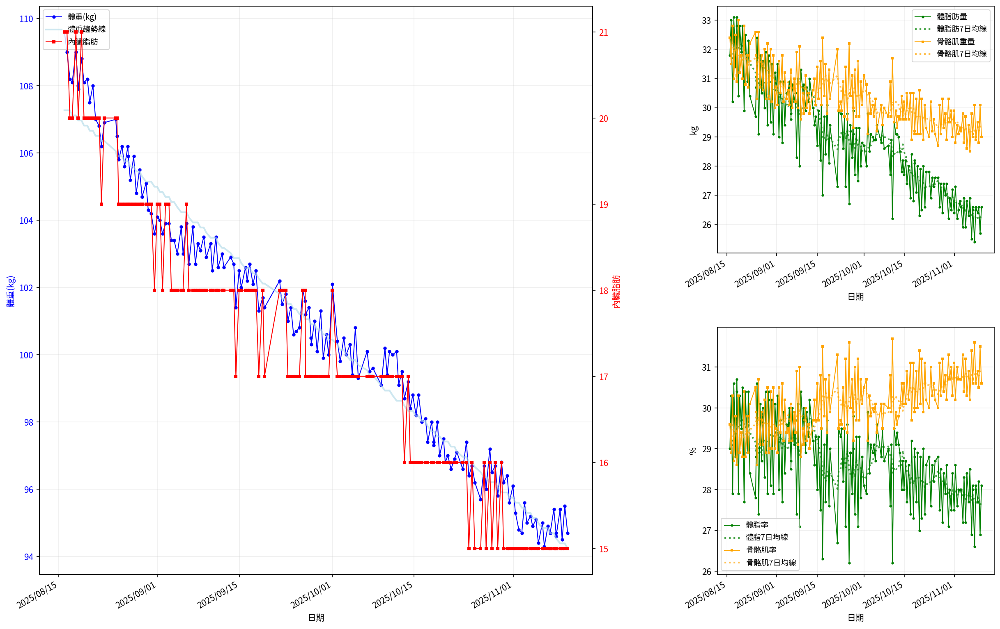
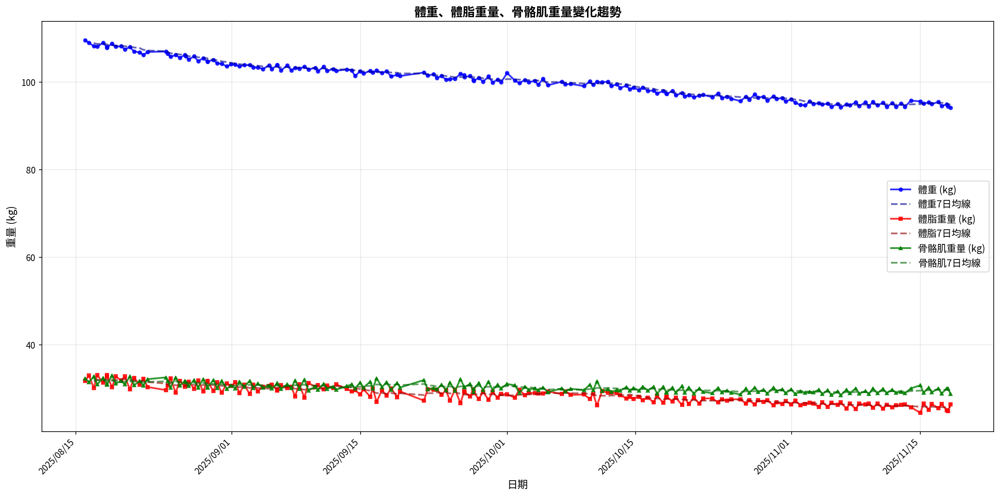
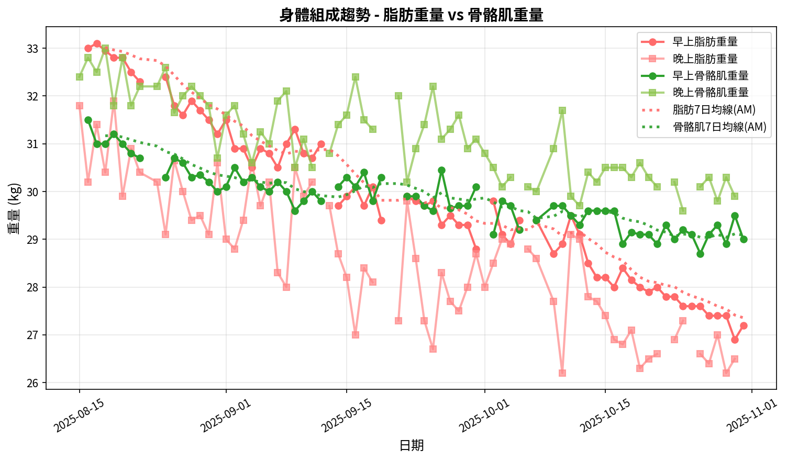
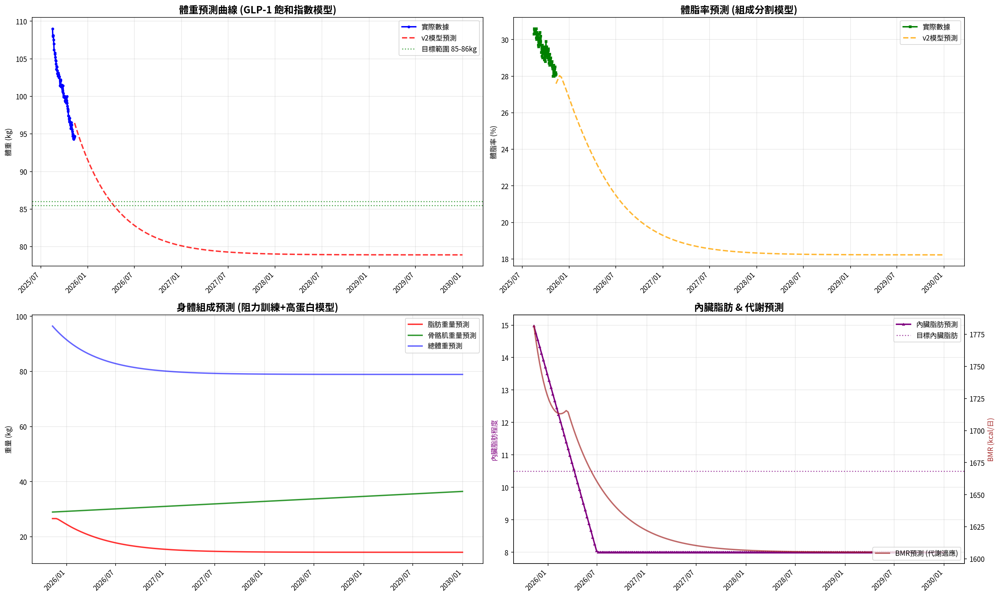
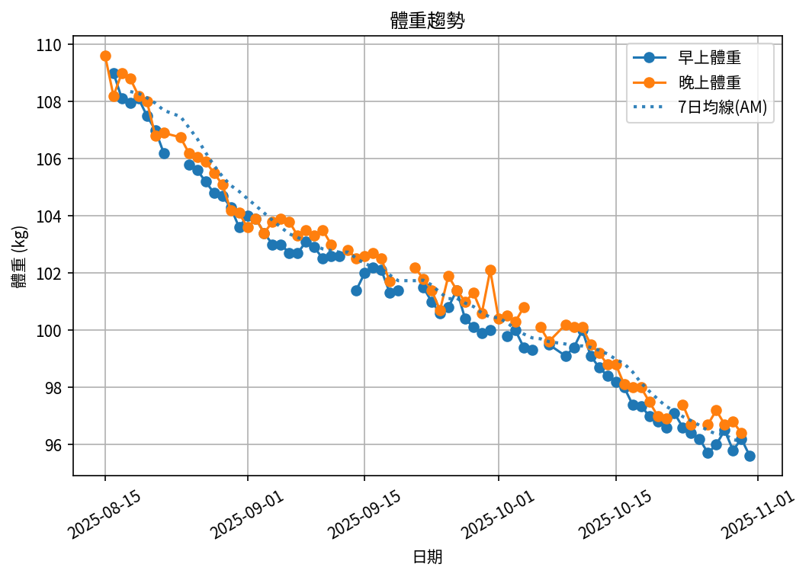
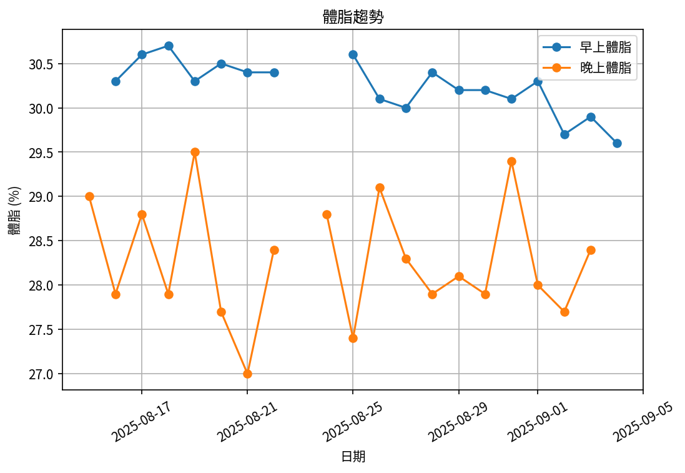
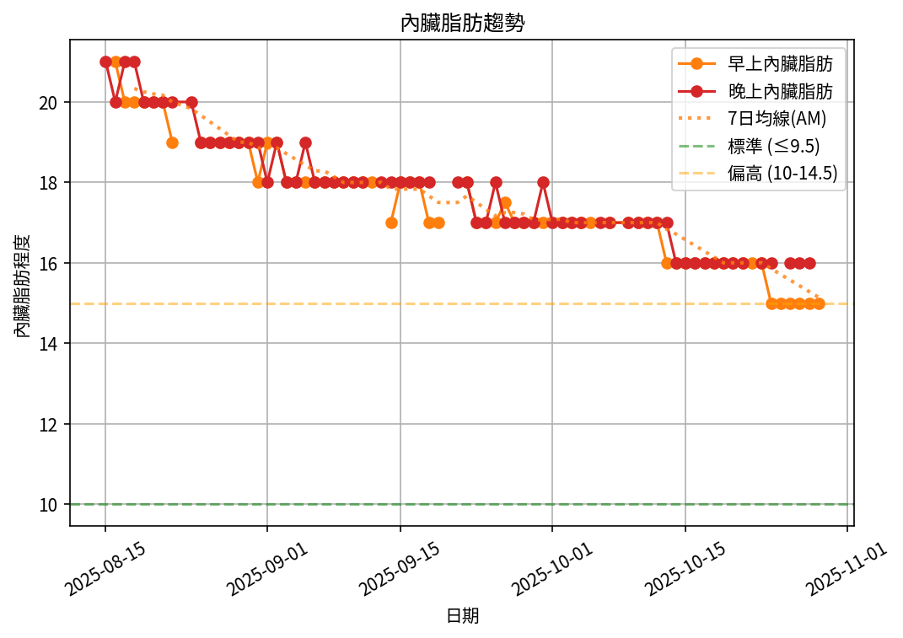
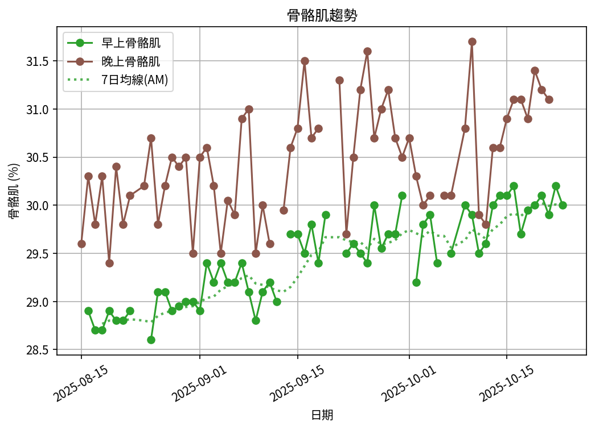

# 📊 減重總結報告

**總期間：2025/08/15 ～ 2025/11/10**  
**追蹤期間：85 天 (13 週)**  

---

## 📈 體重與體脂紀錄概覽

*顯示第一天與最近7天的數據*

| 日期         | 早上體重 (kg)   | 晚上體重 (kg)   | 早上體脂 (%)   | 晚上體脂 (%)   | 早上內臟脂肪   | 晚上內臟脂肪   | 早上骨骼肌 (%)   | 晚上骨骼肌 (%)   |
|:-------------|:----------------|:----------------|:---------------|:---------------|:---------------|:---------------|:-----------------|:-----------------|
| 08/15 (週五) | nan             | 109.6           | nan            | 29.0           | nan            | 21.0           | nan              | 29.6             |
| ...          | ...             | ...             | ...            | ...            | ...            | ...            | ...              | ...              |
| 11/04 (週二) | 94.9            | 95.1            | 28.3           | 27.2           | 15.0           | 15.0           | 30.4             | 31.2             |
| 11/05 (週三) | 94.4            | 95.0            | 28.4           | 27.7           | 15.0           | 15.0           | 30.3             | 30.9             |
| 11/06 (週四) | 94.3            | 94.9            | 28.5           | 26.9           | 15.0           | 15.0           | 30.2             | 31.4             |
| 11/07 (週五) | 94.7            | 95.4            | 28.05          | 26.6           | 15.0           | 15.0           | 30.65            | 31.6             |
| 11/08 (週六) | 94.65           | 95.4            | 28.05          | 27.7           | 15.0           | 15.0           | 30.6             | 30.9             |
| 11/09 (週日) | 94.5            | 95.5            | 28.2           | 26.9           | 15.0           | 15.0           | 30.5             | 31.5             |
| 11/10 (週一) | 94.7            | nan             | 28.1           | nan            | 15.0           | nan            | 30.6             | nan              |

---

## 📊 整體趨勢圖

## 🧪 組成品質（近28天）

- 脂肪/體重 下降比例：43%（普通）  
- 體重變化：-3.7 kg，脂肪重量變化：-1.6 kg（AM）  

---

## 🧭 本期狀態解析（近28天）

*註：28天期間數據已標準化至30天以便與月度門檻比較*

| 指標 | 變化量 | 對照門檻 | 判定 |
|:--|:--:|:--|:--|
| 脂肪重量 (AM) | -1.6 kg → -1.7 kg (30天標準) | 有效下降 ≥ 0.8 kg／月 | ✅ 脂肪明顯下降 |
| 骨骼肌重量 (AM) | -0.6 kg → -0.6 kg (30天標準) | 有效上升 ≥ 0.5 kg／月（±0.2 kg 為誤差範圍） | ⚠️ 肌肉有效下降 |

### 🔍 綜合判定

🔵 分類：**其他**
本期變化方向不明顯或存在相反趨勢，建議以 4 週趨勢為準。

## 🔬 代謝分析（近28天）

- 代謝分類：**穩定減脂**
- 每週速率：脂肪 -0.41 kg/週、肌肉 -0.16 kg/週
- 折合月速率（30天）：脂肪 -1.78 kg/月、肌肉 -0.67 kg/月

- 代謝靈活度（MF）：**55**（尚未穩定｜需留意）
  子分項（F1–F6）：
  - F1 脂肪週斜率：11.3/20（脂肪週斜率 -0.50 kg/週（Sigmoid：中心 -0.45，k=6））
  - F2 肌肉週斜率：3.9/20（肌肉週斜率 -0.14 kg/週（Sigmoid：中心 +0.10，k=6））
  - F3 AM/PM 體重差 CV：10.0/10（CV 0.39%（4.0%→0分，0.5%→滿分））
  - F4 內臟脂肪變化：10.0/10（內臟脂肪變化 -1.00（+1→0分，-1→滿分））
  - F5 週期穩定度：0.0/20（脂肪週期穩定度：週差標準差 1.72 kg/週（≤0.2→滿分，≥0.8→0分））
  - F6 趨勢一致性：20.0/20（脂肪週斜率 -0.50 kg/週（負向=得分））
- AM/PM 體重差變異係數（CV）：0.39%（優）
---

## 📌 總體統計

- **體重（AM）**：109.0 → 94.7 kg  (**-14.3 kg**), 總平均 100.3 kg  
- **體重（PM）**：109.6 → 95.5 kg  (**-14.1 kg**), 總平均 101.2 kg  
- **體重（AM+PM 平均）**：100.7 kg  

- **體脂（AM）**：30.3% → 28.1%  (**-2.2%**), 總平均 29.3%  
- **體脂（PM 對照）**：29.0% → 26.9%  (**-2.1%**), 總平均 27.9%  
- **體脂（AM+PM 平均）**：28.6%  

- **內臟脂肪（AM）**：21.0 → 15.0  (**-6.0**), 總平均 17.1  
- **內臟脂肪（PM）**：21.0 → 15.0  (**-6.0**), 總平均 17.4  
- **內臟脂肪（AM+PM 平均）**：17.2  
  💡 *標準：≤9.5，偏高：10-14.5，過高：≥15*  

- **骨骼肌（AM）**：28.9% → 30.6%  (**1.7%**), 總平均 29.7%  
- **骨骼肌（PM）**：29.6% → 31.5%  (**1.9%**), 總平均 30.6%  
- **骨骼肌（AM+PM 平均）**：30.1%  

- **脂肪重量（AM）**：33.0 → 26.6 kg  (**-6.4 kg**), 總平均 29.4 kg  
- **脂肪重量（PM）**：31.8 → 25.7 kg  (**-6.1 kg**), 總平均 28.3 kg  
- **脂肪重量（AM+PM 平均）**：28.9 kg  

- **骨骼肌重量（AM）**：31.5 → 29.0 kg  (**-2.5 kg**), 總平均 29.7 kg  
- **骨骼肌重量（PM）**：32.4 → 30.1 kg  (**-2.3 kg**), 總平均 30.9 kg  
- **骨骼肌重量（AM+PM 平均）**：30.3 kg  

- **追蹤天數**：85 天  
- 平均每週體重變化（AM）：-1.1 kg/週  
- 平均每週體重變化（PM）：-1.1 kg/週

---

## 🎯 KPI 目標與進度（至今）

- 體重：目標 -10.4 kg  
  - 由 109.0 → 目標 98.6 kg  | 進度 [████████████████████] 100%  
- 體脂率（AM）：目標 -5.2 個百分點  
  - 由 30.3% → 目標 25.1%  | 進度 [████████░░░░░░░░░░░░] 42%  
- 內臟脂肪（AM）：目標 -6.5  
  - 由 21.0 → 目標 14.5  | 進度 [██████████████████░░] 92%  
- 骨骼肌重量（AM）：目標 ≥ 持平  | 變化 -2.5 kg  | 進度 [░░░░░░░░░░░░░░░░░░░░] 0%  

---

### 🎯 長期目標進度
- 體重目標：109.0 → 79.0 kg  | 目前 94.7 kg  | 進度 [██████████░░░░░░░░░░] 48%  
- 體脂率目標（AM）：30.3% → 12.0%  | 目前 28.1%  | 進度 [██░░░░░░░░░░░░░░░░░░] 12%  

#### ⏱️ 目標 ETA（首末端點（全期間））
- 脂肪重量達標 ETA：~32.9 週（2026-06-28）  
  補充（速率區間推估）：
  · 以實測速率 (~0.52 kg/週)：~33 週（2026-06-28）
  · 以理想速率 (~0.70 kg/週)：~24.5 週（2026-04-30）
- 體重達標 ETA：~13.4 週（2026-02-12）  
- 體脂率達標 ETA（AM）：~40.0 週（2026-08-17）  
  備註：若假設去脂體重持平，體重與體脂率達標時間將與『脂肪重量』ETA 接近。

## 🎯 重點成果

✅ **體重減少**：在 85 天內減重 14.3 kg（早上測量）  
✅ **體脂下降**：體脂率降低 2.1%（晚上測量）  
✅ **內臟脂肪改善**：內臟脂肪程度降低 6.0（早上測量）  
✅ **骨骼肌增加**：骨骼肌率提升 1.7%（早上測量）  
✅ **脂肪重量減少**：減少 6.4 kg 脂肪（早上測量）  

## ✅ 持續建議
- 維持 **高蛋白 (每公斤 1.6–2.0 g)** 與 **每週 2–3 次阻力訓練**  
- 飲水 **≥ 3 L/天**（依活動量調整）  
- 持續監測體重與體脂變化，建議保持每週穩定減重  
- 如有任何異常變化，建議諮詢專業醫師  
