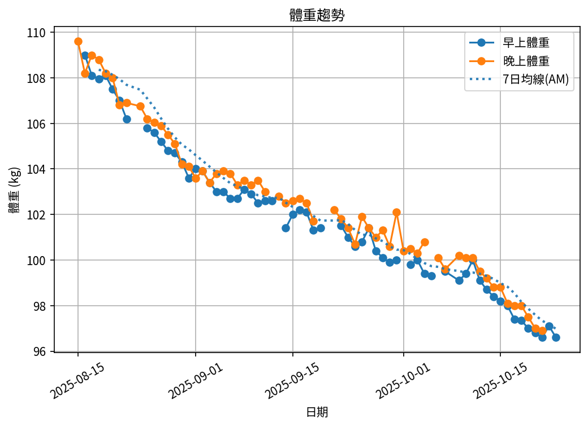

# 📊 減重總結報告

**總期間：2025/08/15 ～ 2025/10/23**  
**追蹤期間：67 天 (10 週)**  

---

## 📈 體重與體脂紀錄概覽

*顯示第一天與最近7天的數據*

| 日期         | 早上體重 (kg)   | 晚上體重 (kg)   | 早上體脂 (%)   | 晚上體脂 (%)   | 早上內臟脂肪   | 晚上內臟脂肪   | 早上骨骼肌 (%)   | 晚上骨骼肌 (%)   |
|:-------------|:----------------|:----------------|:---------------|:---------------|:---------------|:---------------|:-----------------|:-----------------|
| 08/15 (週五) | nan             | 109.6           | nan            | 29.0           | nan            | 21.0           | nan              | 29.6             |
| ...          | ...             | ...             | ...            | ...            | ...            | ...            | ...              | ...              |
| 10/17 (週五) | 97.4            | 98.0            | 29.2           | 27.3           | 16.0           | 16.0           | 29.7             | 31.1             |
| 10/18 (週六) | 97.35           | 98.0            | 28.9           | 27.7           | 16.0           | 16.0           | 29.95            | 30.9             |
| 10/19 (週日) | 97.0            | 97.5            | 28.9           | 27.0           | 16.0           | 16.0           | 30.0             | 31.4             |
| 10/20 (週一) | 96.8            | 97.0            | 28.8           | 27.3           | 16.0           | 16.0           | 30.1             | 31.2             |
| 10/21 (週二) | 96.6            | 96.9            | 29.0           | 27.4           | 16.0           | 16.0           | 29.9             | 31.1             |
| 10/22 (週三) | 97.1            | nan             | 28.6           | nan            | 16.0           | nan            | 30.2             | nan              |
| 10/23 (週四) | 96.6            | nan             | 28.8           | nan            | 16.0           | nan            | 30.0             | nan              |

---

## 📊 整體趨勢圖

## 🧪 組成品質（近28天）

- 脂肪/體重 下降比例：31%（需留意）  
- 體重變化：-4.8 kg，脂肪重量變化：-1.5 kg（AM）  

---

## 🧭 本期狀態解析（近28天）

| 指標 | 變化量 | 對照門檻 | 判定 |
|:--|:--:|:--|:--|
| 脂肪重量 (AM) | -1.5 kg | 有效下降 ≥ 0.8 kg／月 | ✅ 脂肪明顯下降 |
| 骨骼肌重量 (AM) | -1.4 kg | 有效上升 ≥ 0.5 kg／月（±0.2 kg 為誤差範圍） | ⚠️ 肌肉顯著下降 |

### 🔍 綜合判定

🔵 分類：**其他**
本期變化方向不明顯或存在相反趨勢，建議以 4 週趨勢為準。

## 🔬 代謝分析（近28天）

- 代謝分類：**過度赤字**
- 每週速率：脂肪 -0.39 kg/週、肌肉 -0.38 kg/週
- 折合月速率：脂肪 -1.56 kg/月、肌肉 -1.50 kg/月

- 代謝靈活度（MF）：**53**（尚未穩定｜需留意）
  子分項（F1–F6）：
  - F1 脂肪週斜率：9.9/20（脂肪週斜率 -0.45 kg/週（Sigmoid：中心 -0.45，k=6））
  - F2 肌肉週斜率：2.6/20（肌肉週斜率 -0.21 kg/週（Sigmoid：中心 +0.10，k=6））
  - F3 AM/PM 體重差 CV：10.0/10（CV 0.50%（4.0%→0分，0.5%→滿分））
  - F4 內臟脂肪變化：10.0/10（內臟脂肪變化 -1.50（+1→0分，-1→滿分））
  - F6 趨勢一致性：20.0/20（脂肪週斜率 -0.45 kg/週（負向=得分））
- AM/PM 體重差變異係數（CV）：0.50%（優）
---

## 📌 總體統計

- **體重（AM）**：109.0 → 96.6 kg  (**-12.4 kg**), 總平均 101.8 kg  
- **體重（PM）**：109.6 → 96.9 kg  (**-12.7 kg**), 總平均 102.6 kg  
- **體重（AM+PM 平均）**：102.2 kg  

- **體脂（AM）**：30.3% → 28.8%  (**-1.5%**), 總平均 29.6%  
- **體脂（PM）**：29.0% → 27.4%  (**-1.6%**), 總平均 28.1%  
- **體脂（AM+PM 平均）**：28.8%  

- **內臟脂肪（AM）**：21.0 → 16.0  (**-5.0**), 總平均 17.7  
- **內臟脂肪（PM）**：21.0 → 16.0  (**-5.0**), 總平均 18.0  
- **內臟脂肪（AM+PM 平均）**：17.8  
  💡 *標準：≤9.5，偏高：10-14.5，過高：≥15*  

- **骨骼肌（AM）**：28.9% → 30.0%  (**1.1%**), 總平均 29.4%  
- **骨骼肌（PM）**：29.6% → 31.1%  (**1.5%**), 總平均 30.5%  
- **骨骼肌（AM+PM 平均）**：30.0%  

- **脂肪重量（AM）**：33.0 → 27.8 kg  (**-5.2 kg**), 總平均 30.1 kg  
- **脂肪重量（PM）**：31.8 → 26.6 kg  (**-5.2 kg**), 總平均 28.8 kg  
- **脂肪重量（AM+PM 平均）**：29.5 kg  

- **骨骼肌重量（AM）**：31.5 → 29.0 kg  (**-2.5 kg**), 總平均 30.0 kg  
- **骨骼肌重量（PM）**：32.4 → 30.1 kg  (**-2.3 kg**), 總平均 31.2 kg  
- **骨骼肌重量（AM+PM 平均）**：30.6 kg  

- **追蹤天數**：67 天  
- 平均每週體重變化（AM）：-1.2 kg/週  
- 平均每週體重變化（PM）：-1.3 kg/週

---

## 🎯 KPI 目標與進度（至今）

- 體重：目標 -8.0 kg  
  - 由 109.0 → 目標 101.0 kg  | 進度 [████████████████████] 100%  
- 體脂率（AM）：目標 -4.0 個百分點  
  - 由 30.3% → 目標 26.3%  | 進度 [████████░░░░░░░░░░░░] 38%  
- 內臟脂肪（AM）：目標 -5.0  
  - 由 21.0 → 目標 16.0  | 進度 [████████████████████] 100%  
- 骨骼肌重量（AM）：目標 ≥ 持平  | 變化 -2.5 kg  | 進度 [░░░░░░░░░░░░░░░░░░░░] 0%  

---

### 🎯 長期目標進度
- 體重目標：109.0 → 79.0 kg  | 目前 96.6 kg  | 進度 [████████░░░░░░░░░░░░] 41%  
- 體脂率目標（AM）：30.3% → 12.0%  | 目前 28.8%  | 進度 [██░░░░░░░░░░░░░░░░░░] 8%  

#### ⏱️ 目標 ETA（首末端點（全期間））
- 脂肪重量達標 ETA：~34.3 週（2026-06-20）  
  補充（速率區間推估）：
  · 以實測速率 (~0.54 kg/週)：~34 週（2026-06-20）
  · 以理想速率 (~0.70 kg/週)：~26.2 週（2026-04-24）
- 體重達標 ETA：~13.9 週（2026-01-28）  
- 體脂率達標 ETA（AM）：~42.4 週（2026-08-16）  
  備註：若假設去脂體重持平，體重與體脂率達標時間將與『脂肪重量』ETA 接近。

## 🎯 重點成果

✅ **體重減少**：在 67 天內減重 12.4 kg（早上測量）  
✅ **體脂下降**：體脂率降低 1.6%（晚上測量）  
✅ **內臟脂肪改善**：內臟脂肪程度降低 5.0（早上測量）  
✅ **骨骼肌增加**：骨骼肌率提升 1.1%（早上測量）  
✅ **脂肪重量減少**：減少 5.2 kg 脂肪（早上測量）  

## ✅ 持續建議
- 維持 **高蛋白 (每公斤 1.6–2.0 g)** 與 **每週 2–3 次阻力訓練**  
- 飲水 **≥ 3 L/天**（依活動量調整）  
- 持續監測體重與體脂變化，建議保持每週穩定減重  
- 如有任何異常變化，建議諮詢專業醫師  
