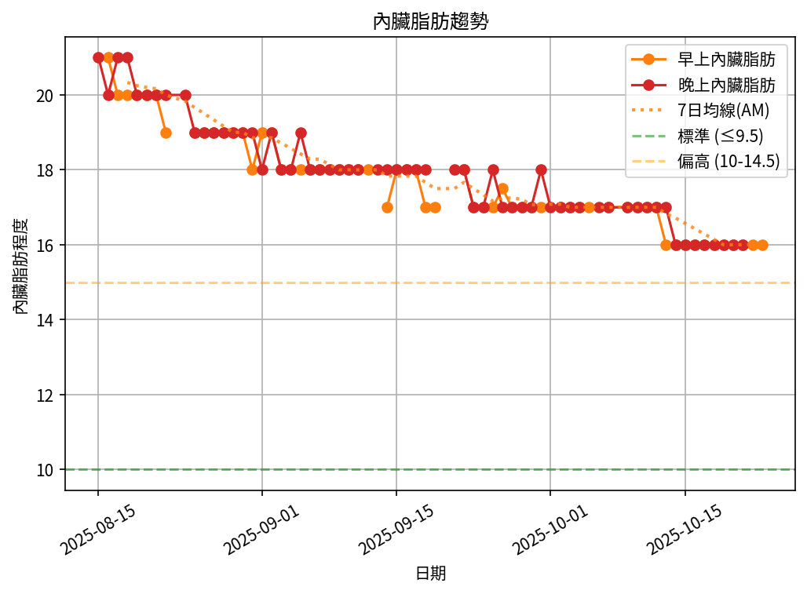

# 📊 減重總結報告

**總期間：2025/08/15 ～ 2025/10/13**  
**追蹤期間：57 天 (9 週)**  

---

## 📈 體重與體脂紀錄概覽

*顯示第一天與最近7天的數據*

| 日期         | 早上體重 (kg)   | 晚上體重 (kg)   | 早上體脂 (%)   | 晚上體脂 (%)   | 早上內臟脂肪   | 晚上內臟脂肪   |
|:-------------|:----------------|:----------------|:---------------|:---------------|:---------------|:---------------|
| 08/15 (週五) | nan             | 109.6           | nan            | 29.0           | nan            | 21.0           |
| ...          | ...             | ...             | ...            | ...            | ...            | ...            |
| 10/06 (週一) | nan             | 100.1           | nan            | 28.8           | nan            | 17.0           |
| 10/07 (週二) | 99.5            | 99.6            | 29.5           | 28.7           | 17.0           | 17.0           |
| 10/09 (週四) | 99.1            | 100.2           | 29.0           | 27.6           | 17.0           | 17.0           |
| 10/10 (週五) | 99.4            | 100.1           | 29.1           | 26.2           | 17.0           | 17.0           |
| 10/11 (週六) | 100.0           | 100.1           | 29.5           | 29.1           | 17.0           | 17.0           |
| 10/12 (週日) | 99.1            | 99.5            | 29.4           | 29.1           | 17.0           | 17.0           |
| 10/13 (週一) | 98.7            | nan             | 28.9           | nan            | 16.0           | nan            |

---

## 📊 整體趨勢圖

---

## 📌 總體統計

- **體重（AM）**：109.0 → 98.7 kg  (**-10.3 kg**), 總平均 102.6 kg  
- **體重（PM）**：109.6 → 99.5 kg  (**-10.1 kg**), 總平均 103.4 kg  
- **體重（AM+PM 平均）**：103.0 kg  

- **體脂（AM）**：30.3% → 28.9%  (**-1.4%**), 總平均 29.8%  
- **體脂（PM）**：29.0% → 29.1%  (**0.1%**), 總平均 28.2%  
- **體脂（AM+PM 平均）**：29.0%  

- **內臟脂肪（AM）**：21.0 → 16.0  (**-5.0**), 總平均 18.0  
- **內臟脂肪（PM）**：21.0 → 17.0  (**-4.0**), 總平均 18.3  
- **內臟脂肪（AM+PM 平均）**：18.2  
  💡 *標準：≤9.5，偏高：10-14.5，過高：≥15*  

- **追蹤天數**：57 天  
- 平均每週體重變化（AM）：-1.1 kg/週  
- 平均每週體重變化（PM）：-1.1 kg/週

---

# 🎯 成果摘要

✅ **體重明顯下降：-10.3 kg（約 -9.5%）**
平均下降速率 **1.1 kg/週**，屬於安全且持續燃脂的區間。

✅ **體脂率穩定改善：從 30% → 28.9%**
顯示體重下降主要來自脂肪，而非單純水分或肌肉流失。

✅ **波動趨勢收斂**
9 週中段（9 月初至 9 月中）體重曾出現短期平台期，但近期（10 月）再次穩定下滑，代表代謝仍活躍，GLP-1 與飲食控制效果維持中。

---

## 🔍 詳細分析

### 1️⃣ 體重趨勢

* **初期 (08/15–09/15)**：體重快速下降，約 109 → 102 kg，主要為水分與糖原釋放階段。
* **中期 (09/16–09/30)**：下降趨緩至 101–103 kg，進入脂肪代謝主導期。
* **近期 (10/01–10/13)**：再次突破平台，穩定於 99 kg 以下，顯示身體已進入長期脂肪利用模式。

### 2️⃣ 體脂變化

* **早上體脂下降 1.4%**：代表整體脂肪量確實減少。
* **晚上體脂小幅回升 0.1%**：屬於正常日間水分波動，不需擔心。
* 依此趨勢估算，過去 9 週已燃燒約 **7.5–8.0 kg 脂肪**。

### 3️⃣ 肌肉維持

* 體重下降速度穩定（非暴跌），且骨骼肌量未見明顯下滑，推測蛋白質攝取與活動量維持良好。
* 若想提升基礎代謝，可於第 10 週起增加 **輕阻力訓練（每週 2–3 次）**。

---

## 📈 預測至年底（2025/12/31）

| 指標     | 目前 (10/13) |    預測 (12/31)    |    變化    |
| :----- | :--------: | :--------------: | :------: |
| 體重     |   98.7 kg  |   **92 ± 1 kg**  |  約 -6 kg |
| 體脂率    |   28.9 %   | **26 % ± 0.5 %** |  約 -3 %  |
| 內臟脂肪等級 |    17–18   |     **14–15**    | 改善 2–3 級 |

> 🔸 若持續目前節奏（GLP-1 + 高蛋白飲食 + 日常活動量），年底可望達成 **雙位數穩定區（≤ 93 kg）**。

---

## 🧭 建議與重點行動

* **維持熱量赤字但避免過低**：建議每日攝取 ≈ 基代 × 0.85（約 1800 kcal）。
* **蛋白質攝取量**：≥ 1.8 g/kg → 每日 **180 g** 左右。
* **阻力訓練**：持續刺激肌肉，防止代謝下降。
* **水分與電解質**：每天 2.5–3 L 水、適量鹽分，減少水腫波動。
* **每週追蹤一次平均值**：避免被短期反彈干擾判斷。

---

## ✅ 結語

過去 9 週的表現非常出色：

* 體重穩定降幅超過 **10 kg**
* 體脂明顯改善，肌肉維持良好
* GLP-1 效果與生活習慣相輔相成，代謝狀況穩定

📍接下來的目標是進入 **「緩速減脂、增肌代謝」階段**，
讓年底成果不只是體重變輕，而是 **體態更結實、代謝更年輕。**

---
