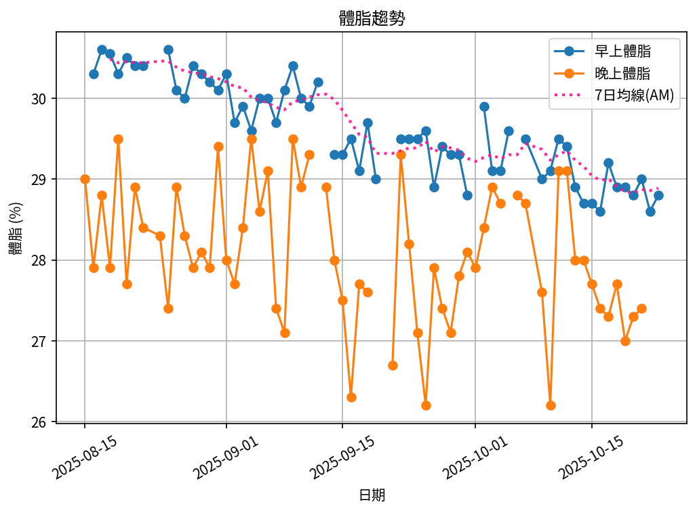

# 📊 減重總結報告

**總期間：2025/08/15 ～ 2025/09/01**  
**追蹤期間：18 天 (3 週)**  

---

## 📈 體重與體脂紀錄概覽

*顯示第一天與最近7天的數據*

| 日期         | 早上體重 (kg)   | 晚上體重 (kg)   | 早上體脂 (%)   | 晚上體脂 (%)   |
|:-----------|:------------|:------------|:-----------|:-----------|
| 08/15 (週五) | 109.0       | 109.8       | nan        | 29.0       |
| ...        | ...         | ...         | ...        | ...        |
| 08/26 (週二) | 105.6       | 105.9       | 30.1       | 29.1       |
| 08/27 (週三) | 105.2       | 105.9       | 30.0       | 28.3       |
| 08/28 (週四) | 104.8       | 105.5       | 30.4       | 27.9       |
| 08/29 (週五) | 105.1       | 104.7       | 30.2       | 28.1       |
| 08/30 (週六) | 104.3       | 104.2       | 30.2       | 27.9       |
| 08/31 (週日) | 103.6       | 104.1       | 30.1       | 29.4       |
| 09/01 (週一) | 104.0       | nan         | 30.3       | nan        |

---

## 📊 整體趨勢圖

---

## 📌 總體統計

- **體重（AM）**：109.0 → 104.0 kg  (**-5.0 kg**), 總平均 106.3 kg  
- **體重（PM）**：109.8 → 104.1 kg  (**-5.7 kg**), 總平均 106.8 kg  
- **體重（AM+PM 平均）**：106.6 kg  

- **體脂（AM）**：30.3% → 30.3%  (**0.0%**), 總平均 30.3%  
- **體脂（PM）**：29.0% → 29.4%  (**0.4%**), 總平均 28.3%  
- **體脂（AM+PM 平均）**：29.3%  

- **追蹤天數**：18 天  
- 平均每週體重變化（AM）：-1.7 kg/週  
- 平均每週體重變化（PM）：-1.9 kg/週

---

## 🎯 重點成果

✅ **體重減少**：在 18 天內減重 5.0 kg（早上測量）  

## ✅ 持續建議
- 維持 **高蛋白 (每公斤 1.6–2.0 g)** 與 **每週 2–3 次阻力訓練**  
- 飲水 **≥ 3 L/天**（依活動量調整）  
- 持續監測體重與體脂變化，建議保持每週穩定減重  
- 如有任何異常變化，建議諮詢專業醫師  
